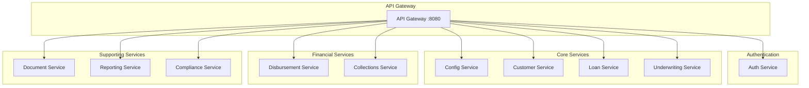
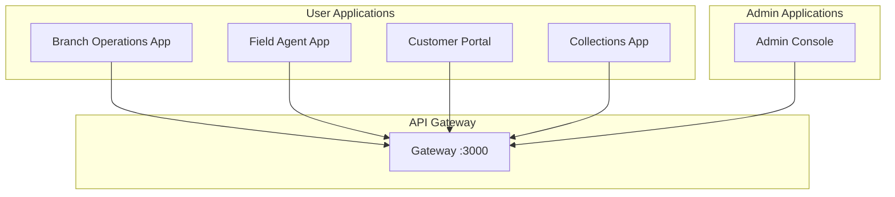

# Multi-App Solution Structure

This solution follows a Microservices Architecture with Micro Frontend patterns for an NBFC SaaS platform.

## Directory Structure

```
nbfc-python/
├── apps/                          # Micro Frontend Applications
│   ├── admin/                     # Admin Console
│   │   ├── app/
│   │   ├── package.json
│   │   └── vite.config.ts
│   ├── branch/                    # Branch Operations
│   │   ├── app/
│   │   ├── package.json
│   │   └── vite.config.ts
│   ├── customer/                  # Customer Portal (PWA)
│   │   ├── app/
│   │   ├── package.json
│   │   └── vite.config.ts
│   ├── field-agent/               # Field Agent App (Mobile)
│   │   ├── app/
│   │   ├── package.json
│   │   └── vite.config.ts
│   └── collections/               # Collections Management
│       ├── app/
│       ├── package.json
│       └── vite.config.ts
│
├── services/                        # Backend Microservices
│   ├── auth/                      # Authentication Service
│   │   ├── src/
│   │   ├── Dockerfile
│   │   ├── package.json
│   │   └── k8s.yaml
│   ├── config/                    # Configuration Service
│   │   ├── src/
│   │   ├── Dockerfile
│   │   ├── package.json
│   │   └── k8s.yaml
│   ├── customer/                  # Customer Service
│   │   ├── src/
│   │   ├── Dockerfile
│   │   ├── package.json
│   │   └── k8s.yaml
│   ├── loan/                      # Loan Service
│   │   ├── src/
│   │   ├── Dockerfile
│   │   ├── package.json
│   │   └── k8s.yaml
│   ├── underwriting/              # Underwriting Service (Python)
│   │   ├── src/
│   │   ├── requirements.txt
│   │   ├── Dockerfile
│   │   └── k8s.yaml
│   ├── disbursement/              # Disbursement Service
│   │   ├── src/
│   │   ├── Dockerfile
│   │   ├── package.json
│   │   └── k8s.yaml
│   ├── document/                  # Document Service (Python)
│   │   ├── src/
│   │   ├── requirements.txt
│   │   ├── Dockerfile
│   │   └── k8s.yaml
│   ├── collections/               # Collections Service
│   │   ├── src/
│   │   ├── Dockerfile
│   │   ├── package.json
│   │   └── k8s.yaml
│   ├── reporting/                 # Reporting Service (Python)
│   │   ├── src/
│   │   ├── requirements.txt
│   │   ├── Dockerfile
│   │   └── k8s.yaml
│   └── compliance/                # Compliance Service (Java)
│       ├── src/
│       ├── Dockerfile
│       ├── pom.xml
│       └── k8s.yaml
│
├── packages/                        # Shared Libraries
│   ├── ui/                        # Shared UI Components
│   │   ├── src/
│   │   │   ├── components/
│   │   │   ├── hooks/
│   │   │   └── utils/
│   │   └── package.json
│   ├── utils/                     # Utility Functions
│   │   ├── src/
│   │   └── package.json
│   ├── types/                     # TypeScript Types
│   │   ├── src/
│   │   └── package.json
│   └── config/                    # Shared Configuration
│       ├── src/
│       └── package.json
│
├── infrastructure/                 # Infrastructure as Code
│   ├── k8s/                      # Kubernetes Manifests
│   ├── terraform/                # Terraform Scripts
│   └── docker-compose.yml        # Local Development
│
├── nginx/                         # API Gateway Config
│
├── docs/                          # Documentation
│   └── README.md
│
├── .env.example                   # Environment Variables
├── .gitignore
├── README.md
└── package.json                   # Monorepo Root Config
```

## Architecture Overview

### Microservices Architecture



### Micro Frontend Applications



## Getting Started

### Prerequisites
- Node.js 20+
- Docker
- Kubernetes (for deployment)
- PostgreSQL
- Redis

### Development Setup
```bash
# Install dependencies
npm install

# Start development servers
npm run dev:all

# Start individual apps
npm run dev:branch
npm run dev:admin
npm run dev:customer
npm run dev:field-agent
npm run dev:collections
```

### Docker Development
```bash
# Start all services locally
docker-compose up -d

# View logs
docker-compose logs -f
```

## Services Overview

| Service | Port | Technology | Purpose |
|---------|------|------------|---------|
| API Gateway | 8080 | Nginx | Route requests |
| Auth Service | 8081 | Node.js | Authentication |
| Config Service | 8082 | Node.js | Configuration |
| Customer Service | 8083 | Node.js | Customer mgmt |
| Loan Service | 8084 | Node.js | Loan processing |
| Underwriting | 8085 | Python | Risk assessment |
| Disbursement | 8086 | Node.js | Payment processing |
| Document | 8087 | Python | OCR & storage |
| Collections | 8088 | Node.js | Recovery mgmt |
| Reporting | 8089 | Python | Analytics |
| Compliance | 8090 | Java | Regulatory |

## Apps Overview

| App | Purpose | Target Users |
|-----|---------|--------------|
| Admin Console | System admin | Super Admin, Admins |
| Branch Operations | Branch staff | Loan Officers, Managers |
| Customer Portal | Self-service | Customers |
| Field Agent | Mobile recovery | Field Agents |
| Collections | Recovery team | Collections Agents |

## License
MIT