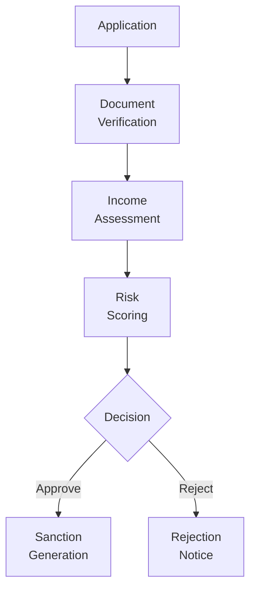

# Branch Operations Application Design

## Application Overview

The Branch Operations Application is the primary web application for branch staff including Loan Officers, Customer Service Executives, and Branch Managers. It provides end-to-end loan processing capabilities.

## Technology Stack

| Component | Technology |
|-----------|------------|
| Framework | React 18 + TypeScript |
| State Management | Redux Toolkit |
| Routing | React Router v6 |
| UI Library | Custom Design System |
| Build Tool | Vite |
| Testing | Jest + React Testing Library |

## Application Shell

### Layout Structure
```tsx
// App Shell Structure
interface AppShellProps {
  header: {
    user: User;
    notifications: Notification[];
    quickActions: QuickAction[];
  };
  sidebar: {
    navigation: NavigationItem[];
    branchInfo: BranchInfo;
  };
  main: {
    content: React.ReactNode;
    shortcuts: Shortcut[];
  };
  footer: {
    version: string;
    status: SystemStatus;
  };
}
```

### Core Components
```
src/
├── app/
│   ├── shell/
│   │   ├── Header.tsx
│   │   ├── Sidebar.tsx
│   │   └── Footer.tsx
│   ├── layouts/
│   │   ├── MainLayout.tsx
│   │   └── AuthLayout.tsx
├── modules/
│   ├── customers/
│   ├── loans/
│   ├── documents/
│   ├── disbursement/
│   └── reports/
├── shared/
│   ├── components/
│   ├── hooks/
│   ├── services/
│   └── utils/
```

## Module Designs

### Module 1: Customer Management

#### Routes
```
/customers              - Customer list
/customers/new          - Create customer
/customers/:id          - Customer details
/customers/:id/edit     - Edit customer
/customers/:id/kyc      - KYC verification
```

#### Key Components
- `CustomerList.tsx` - Searchable table with filters
- `CustomerForm.tsx` - Multi-step form
- `KYCVerification.tsx` - Document upload and verification
- `CustomerProfile.tsx` - View-only profile

#### State Management
```typescript
interface CustomerState {
  customers: Pagination<Customer>;
  currentCustomer: Customer | null;
  kycStatus: KYCStatus;
  filters: CustomerFilters;
  loading: boolean;
  error: string | null;
}
```

### Module 2: Loan Processing

#### Routes
```
/loans                    - Application list
/loans/new                  - New application
/loans/:id                    - Application details
/loans/:id/documents          - Document checklist
/loans/:id/review             - Review and decision
/loans/approved               - Approved loans
/loans/disbursed              - Disbursed loans
```

#### Workflow UI


#### Key Features
- Document checklist with status indicators
- EMI calculator with real-time calculation
- Decision matrix with notes
- Sanction letter generator

### Module 3: Disbursement Center

#### Routes
```
/disbursement             - Disbursement queue
/disbursement/:id         - Disbursement details
/disbursement/completed   - Completed disbursements
```

#### Components
- `DisbursementQueue.tsx` - Priority-based queue
- `BankVerification.tsx` - Account verification
- `FundTransfer.tsx` - Payment initiation
- `Acknowledgment.tsx` - Receipt generation

### Module 4: Reports & Analytics

#### Routes
```
/reports                - Report dashboard
/reports/daily          - Daily reports
/reports/monthly        - Monthly reports
/reports/custom         - Custom report builder
```

#### Charts & Visualizations
- Bar charts for disbursement trends
- Pie charts for loan type distribution
- Line charts for collection efficiency
- Data tables with export options

## Role-Based Views

### Permission Matrix
```typescript
const permissions = {
  customer_manager: [
    'customers:create',
    'customers:read',
    'customers:update',
    'kyc:verify'
  ],
  loan_officer: [
    'loans:create',
    'loans:read',
    'loans:update',
    'documents:upload',
    'sanction:generate'
  ],
  branch_manager: [
    'reports:view',
    'users:manage',
    'settings:update',
    '*:*:*'  // All access
  ]
};
```

## Integration with APIs

### API Client Configuration
```typescript
// api/client.ts
const apiClient = axios.create({
  baseURL: import.meta.env.VITE_API_URL,
  timeout: 10000,
  headers: {
    'Content-Type': 'application/json'
  }
});

// Request interceptor for auth token
apiClient.interceptors.request.use((config) => {
  const token = localStorage.getItem('access_token');
  if (token) {
    config.headers.Authorization = `Bearer ${token}`;
  }
  return config;
});
```

### Service Integration
```typescript
// services/customerService.ts
export const customerService = {
  list: (params) => apiClient.get('/customers', { params }),
  create: (data) => apiClient.post('/customers', data),
  get: (id) => apiClient.get(`/customers/${id}`),
  update: (id, data) => apiClient.put(`/customers/${id}`, data),
  search: (query) => apiClient.post('/customers/search', { query })
};
```

## Offline Capabilities

### Service Worker
```typescript
// public/sw.js
self.addEventListener('fetch', (event) => {
  if (event.request.url.includes('/api/')) {
    event.respondWith(
      fetch(event.request)
        .catch(() => caches.match(event.request))
    );
  }
});
```

### Offline Data Sync
- Customer forms cached locally
- Document uploads queued
- Actions synced when online

## Responsive Design

### Breakpoints
```css
/* Mobile First */
@media (min-width: 768px) { /* Tablet */ }
@media (min-width: 1024px) { /* Desktop */ }
@media (min-width: 1280px) { /* Large Desktop */ }
```

### Mobile Optimizations
- Collapsible sidebar
- Touch-friendly buttons
- Simplified forms
- Quick action menus

## Performance Optimization

### Code Splitting
```typescript
// Lazy loading modules
const CustomerList = lazy(() => import('./modules/customers/CustomerList'));
const LoanProcessing = lazy(() => import('./modules/loans/LoanProcessing'));
```

### Memoization
```typescript
const CustomerCard = memo(({ customer }: { customer: Customer }) => {
  const formattedDate = useMemo(() => 
    formatDate(customer.createdAt), 
    [customer.createdAt]
  );
  
  return (
    <div className="customer-card">
      <h3>{customer.name}</h3>
      <p>{formattedDate}</p>
    </div>
  );
});
```

## Testing Strategy

### Unit Tests
```typescript
describe('CustomerList', () => {
  it('should render customer table', () => {
    render(<CustomerList customers={mockCustomers} />);
    expect(screen.getByText('John Doe')).toBeInTheDocument();
  });
  
  it('should filter customers', () => {
    fireEvent.change(screen.getByPlaceholderText('Search'), {
      target: { value: 'John' }
    });
    expect(screen.getAllByRole('row')).toHaveLength(2);
  });
});
```

### E2E Tests
```typescript
describe('Loan Processing Flow', () => {
  it('should create and approve loan', () => {
    cy.visit('/loans/new');
    cy.get('[data-testid="customer-select"]').select('John Doe');
    cy.get('[data-testid="amount"]').type('100000');
    cy.get('[data-testid="submit"]').click();
    cy.url().should('include', '/loans/');
  });
});
```

## Build Configuration

### Vite Config
```typescript
export default defineConfig({
  server: {
    port: 3000,
    proxy: {
      '/api': {
        target: 'http://localhost:8080',
        changeOrigin: true
      }
    }
  },
  build: {
    outDir: 'dist',
    sourcemap: true,
    rollupOptions: {
      output: {
        manualChunks: {
          vendor: ['react', 'react-dom'],
          utils: ['lodash', 'date-fns']
        }
      }
    }
  }
});
```

## Deployment

### Docker Configuration
```dockerfile
FROM node:20-alpine as builder
WORKDIR /app
COPY package*.json ./
RUN npm ci
COPY . .
RUN npm run build

FROM nginx:alpine
COPY --from=builder /app/dist /usr/share/nginx/html
COPY nginx.conf /etc/nginx/conf.d/default.conf
EXPOSE 80
CMD ["nginx", "-g", "daemon off;"]
```