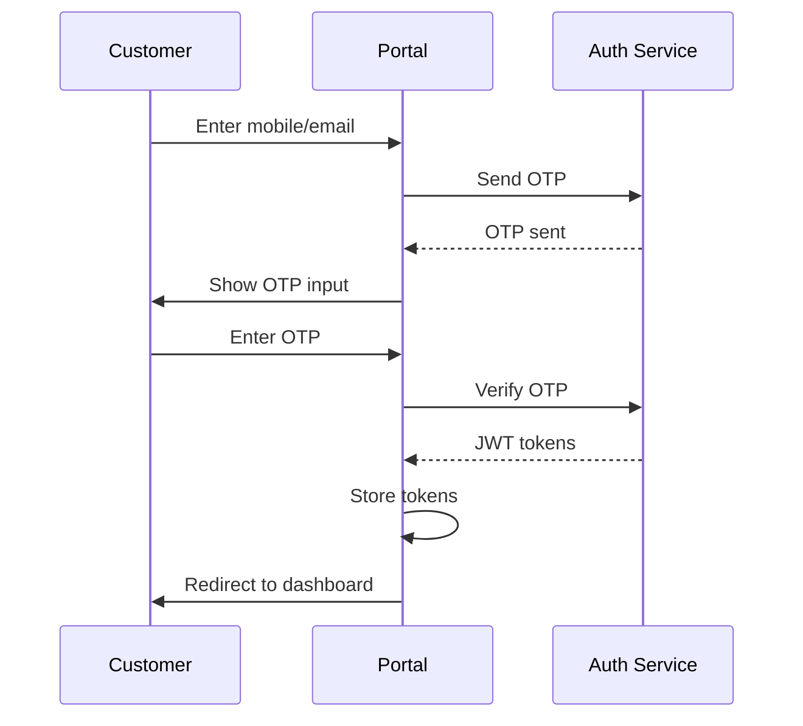
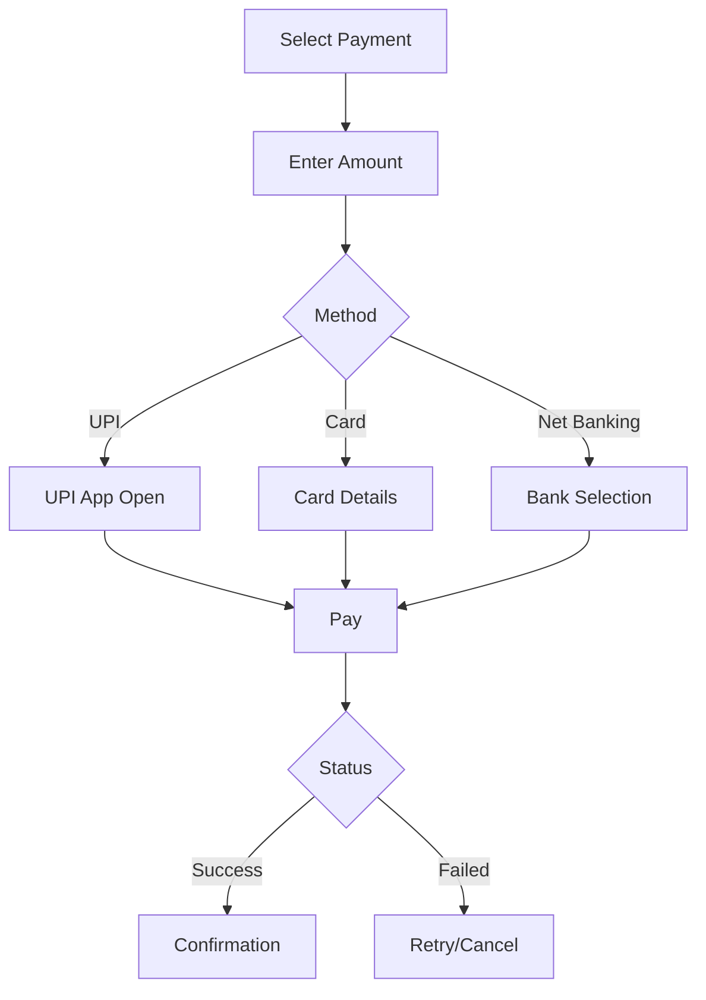

# Customer Portal Design

## Application Overview

The Customer Portal is a Progressive Web App (PWA) that serves as the primary interface for end customers to apply for loans, track applications, manage repayments, and access support.

## Technology Stack

| Component | Technology |
|-----------|------------|
| Framework | React 18 + TypeScript |
| State Management | Redux Toolkit + RTK Query |
| Routing | React Router v6 |
| UI Library | Tailwind CSS + Headless UI |
| PWA | Workbox |
| Build Tool | Vite |

## Application Architecture

### Multi-Tenant Support
```typescript
// Tenant configuration
interface TenantConfig {
  id: string;
  name: string;
  branding: {
    primaryColor: string;
    logoUrl: string;
    fontFamily: string;
  };
  features: string[];
}

const TenantProvider = ({ children }) => {
  const [config, setConfig] = useState<TenantConfig | null>(null);
  
  useEffect(() => {
    // Fetch tenant config based on subdomain
    fetchTenantConfig(window.location.hostname).then(setConfig);
  }, []);
};
```

### Authentication Flow


## Customer Journey Design

### Step 1: Registration & KYC

#### Registration Flow
```typescript
interface RegistrationStep {
  step: 1 | 2 | 3 | 4;
  data: {
    basicInfo: {
      name: string;
      mobile: string;
      email: string;
      dateOfBirth: string;
    };
    kycDocuments: File[];
    otp: string;
    termsAccepted: boolean;
  };
}

const RegistrationWizard = () => {
  const [step, setStep] = useState(1);
  const [data, setData] = useState<RegistrationStep['data']>({});
  
  const steps = [
    { number: 1, title: 'Basic Details', component: BasicInfoForm },
    { number: 2, title: 'KYC Documents', component: KYCUpload },
    { number: 3, title: 'Verification', component: OTPVerification },
    { number: 4, title: 'Complete', component: SuccessScreen }
  ];
};
```

#### KYC Upload
```typescript
const KYCUpload = () => {
  const [documents, setDocuments] = useState<File[]>([]);
  const [previews, setPreviews] = useState<string[]>([]);
  
  const handleDocumentSelect = (e: React.ChangeEvent<HTMLInputElement>) => {
    const files = Array.from(e.target.files || []);
    setDocuments(prev => [...prev, ...files]);
    setPreviews(files.map(file => URL.createObjectURL(file)));
  };
  
  const removeDocument = (index: number) => {
    setDocuments(prev => prev.filter((_, i) => i !== index));
    setPreviews(prev => prev.filter((_, i) => i !== index));
  };
};
```

### Step 2: Loan Application

#### Product Selection
```typescript
interface LoanProduct {
  id: string;
  name: string;
  description: string;
  minAmount: number;
  maxAmount: number;
  interestRate: number;
  tenureOptions: number[];
  features: string[];
}

const ProductSelector = ({ products }) => {
  return (
    <div className="product-grid">
      {products.map(product => (
        <LoanProductCard key={product.id} product={product} />
      ))}
    </div>
  );
};
```

#### Application Form
```typescript
const LoanApplicationForm = () => {
  const form = useForm({
    defaultValues: {
      loanType: '',
      amount: 0,
      tenure: 0,
      purpose: '',
      documents: []
    }
  });
  
  const calculateEMI = (amount: number, interestRate: number, tenure: number) => {
    const monthlyRate = interestRate / 12 / 100;
    return (amount * monthlyRate * Math.pow(1 + monthlyRate, tenure)) / 
           (Math.pow(1 + monthlyRate, tenure) - 1);
  };
};
```

### Step 3: Application Tracking

#### Status Tracker
```typescript
interface ApplicationStatus {
  stage: 'submitted' | 'under_review' | 'documents_verification' | 
         'underwriting' | 'sanctioned' | 'disbursed' | 'rejected';
  progress: number;
  lastUpdated: string;
  nextSteps: string[];
}

const StatusTracker = ({ status }: { status: ApplicationStatus }) => {
  const stages = [
    { id: 'submitted', label: 'Submitted' },
    { id: 'under_review', label: 'Under Review' },
    { id: 'documents_verification', label: 'Document Verification' },
    { id: 'underwriting', label: 'Underwriting' },
    { id: 'sanctioned', label: 'Sanctioned' },
    { id: 'disbursed', label: 'Disbursed' }
  ];
  
  return (
    <div className="status-tracker">
      {stages.map((stage, index) => (
        <div key={stage.id} className={`stage ${status.stage === stage.id ? 'active' : ''}`}>
          <div className="stage-indicator">{index + 1}</div>
          <div className="stage-label">{stage.label}</div>
        </div>
      ))}
    </div>
  );
};
```

### Step 4: Repayment

#### EMI Dashboard
```typescript
interface EMIAccount {
  accountNumber: string;
  loanAmount: number;
  interestRate: number;
  tenure: number;
  emi: number;
  nextDueDate: string;
  outstandingPrincipal: number;
  outstandingInterest: number;
  miniStatement: Installment[];
}

const RepaymentDashboard = ({ account }: { account: EMIAccount }) => {
  return (
    <div className="repayment-dashboard">
      <div className="emi-card">
        <h3>Monthly EMI</h3>
        <p className="amount">₹{account.emi.toLocaleString()}</p>
        <p>Due: {formatDate(account.nextDueDate)}</p>
      </div>
      
      <div className="quick-actions">
        <button onClick={makePayment}>Pay Now</button>
        <button onClick={manageAutoPay}>Auto-Pay Setup</button>
      </div>
      
      <div className="mini-statement">
        <h4>Recent Payments</h4>
        {account.miniStatement.map(payment => (
          <PaymentRow key={payment.id} payment={payment} />
        ))}
      </div>
    </div>
  );
};
```

## UI Components

### Component Library

#### Form Components
```typescript
const InputField = ({ label, name, control, rules }) => {
  return (
    <Controller
      name={name}
      control={control}
      rules={rules}
      render={({ field, fieldState: { error } }) => (
        <div className="form-field">
          <label>{label}</label>
          <input {...field} className={error ? 'error' : ''} />
          {error && <span className="error-message">{error.message}</span>}
        </div>
      )}
    />
  );
};
```

#### Data Display
```typescript
const DataTable = <T,>({ data, columns, actions }) => {
  return (
    <div className="data-table">
      <table>
        <thead>
          <tr>
            {columns.map(col => <th key={col.key}>{col.title}</th>)}
            {actions && <th>Actions</th>}
          </tr>
        </thead>
        <tbody>
          {data.map((row, index) => (
            <tr key={index}>
              {columns.map(col => (
                <td key={col.key}>{row[col.key]}</td>
              ))}
              {actions && <td>{actions(row)}</td>}
            </tr>
          ))}
        </tbody>
      </table>
    </div>
  );
};
```

## Payment Integration

### Payment Methods
```typescript
interface PaymentMethod {
  id: 'upi' | 'neft' | 'rtgs' | 'imps' | 'card';
  name: string;
  icon: string;
  detailsRequired: string[];
}

const paymentMethods: PaymentMethod[] = [
  { id: 'upi', name: 'UPI', icon: 'upi-icon.svg', detailsRequired: ['upi_id'] },
  { id: 'neft', name: 'NEFT', icon: 'neft-icon.svg', detailsRequired: ['account', 'ifsc'] },
  { id: 'card', name: 'Credit/Debit Card', icon: 'card-icon.svg', detailsRequired: ['card_number', 'expiry', 'cvv'] }
];
```

### Payment Flow


## Notification System

### Notification Types
```typescript
interface Notification {
  id: string;
  type: 'info' | 'warning' | 'success' | 'error';
  title: string;
  message: string;
  read: boolean;
  createdAt: string;
}

const NotificationCenter = () => {
  const [notifications, setNotifications] = useState<Notification[]>([]);
  
  return (
    <div className="notification-center">
      {notifications.map(notification => (
        <NotificationItem key={notification.id} notification={notification} />
      ))}
    </div>
  );
};
```

## Security Features

### Session Management
```typescript
const authStorage = {
  getAccessToken: () => localStorage.getItem('access_token'),
  setAccessToken: (token: string) => localStorage.setItem('access_token', token),
  getRefreshToken: () => localStorage.getItem('refresh_token'),
  setRefreshToken: (token: string) => localStorage.setItem('refresh_token', token),
  clearTokens: () => {
    localStorage.removeItem('access_token');
    localStorage.removeItem('refresh_token');
  }
};
```

### OTP Verification
```typescript
const OTPVerification = () => {
  const [otp, setOTP] = useState ['', '', '', '', '', ''];
  const inputRefs = useRef<(HTMLInputElement | null)[]>([]);
  
  const handleOTPChange = (index: number, value: string) => {
    if (/[0-9]/.test(value) && value.length === 1) {
      setOTP(prev => {
        const newOTP = [...prev];
        newOTP[index] = value;
        return newOTP;
      });
      // Focus next input
      inputRefs.current[index + 1]?.focus();
    }
  };
};
```

## Responsive Design

### Breakpoints
```css
/* Mobile First */
.max-w-screen {
  @apply w-full max-w-md mx-auto;
}

/* Tablet */
@media (min-width: 768px) {
  .max-w-screen {
    @apply max-w-2xl px-4;
  }
}

/* Desktop */
@media (min-width: 1024px) {
  .max-w-screen {
    @apply max-w-4xl;
  }
}
```

## Performance Optimizations

### Lazy Loading
```typescript
const LoanDocuments = lazy(() => import('./components/LoanDocuments'));
const PaymentHistory = lazy(() => import('./components/PaymentHistory'));

const Dashboard = () => {
  return (
    <Suspense fallback={<LoadingSpinner />}>
      <LoanDocuments />
      <PaymentHistory />
    </Suspense>
  );
};
```

### Caching Strategy
```typescript
// RTK Query caching
const api = createApi({
  reducerPath: 'customerApi',
  baseQuery: fetchBaseQuery({ baseUrl: '/api' }),
  endpoints: (builder) => ({
    getApplications: builder.query({
      query: () => '/applications',
      staleTime: 5 * 60 * 1000, // 5 minutes
      cacheTime: 10 * 60 * 1000  // 10 minutes
    })
  })
});
```

## Testing Strategy

### E2E Test Examples
```typescript
describe('Customer Portal', () => {
  it('should complete loan application', () => {
    cy.visit('/register');
    cy.get('[data-testid="name"]').type('John Doe');
    cy.get('[data-testid="mobile"]').type('9876543210');
    cy.get('[data-testid="submit"]').click();
    cy.contains('OTP sent').should('be.visible');
  });
  
  it('should make payment', () => {
    cy.login('customer');
    cy.visit('/repayment');
    cy.get('[data-testid="amount"]').type('1000');
    cy.get('[data-testid="pay-button"]').click();
    cy.contains('Payment successful').should('be.visible');
  });
});
```