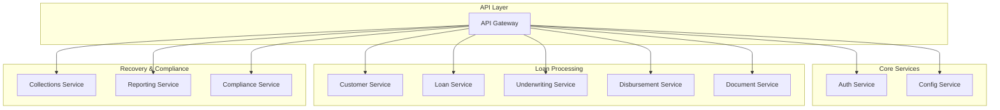
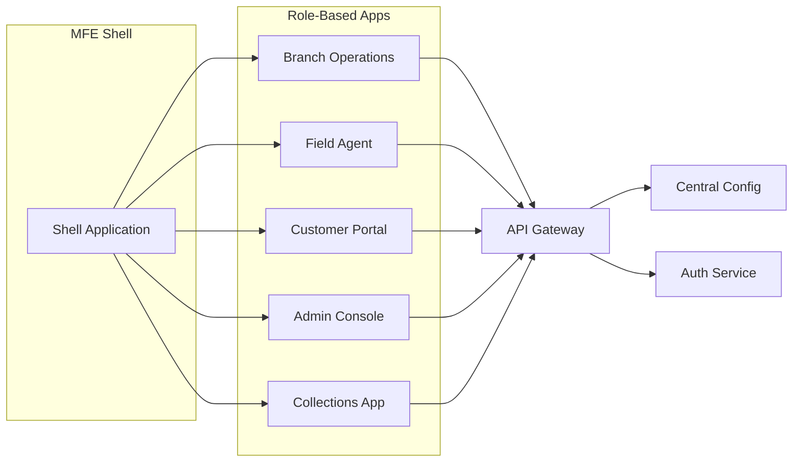
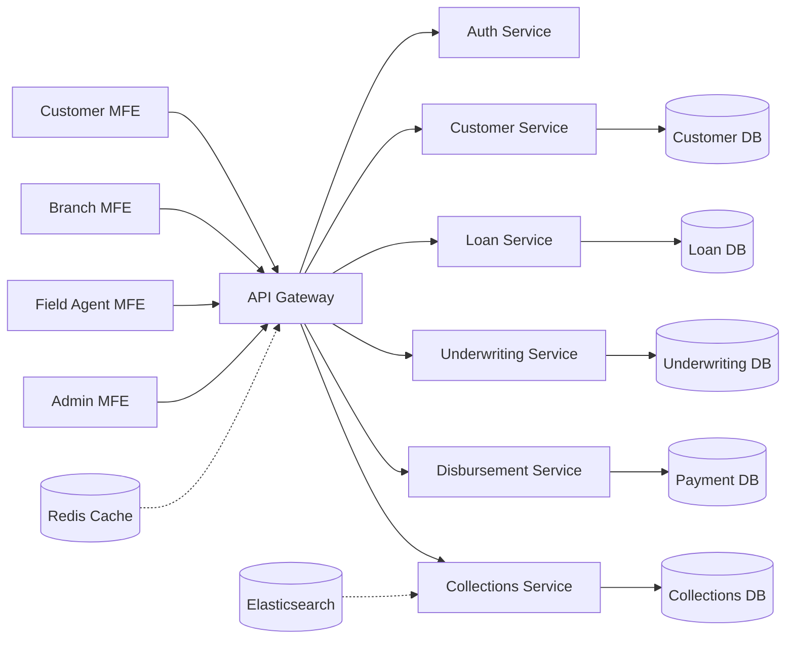
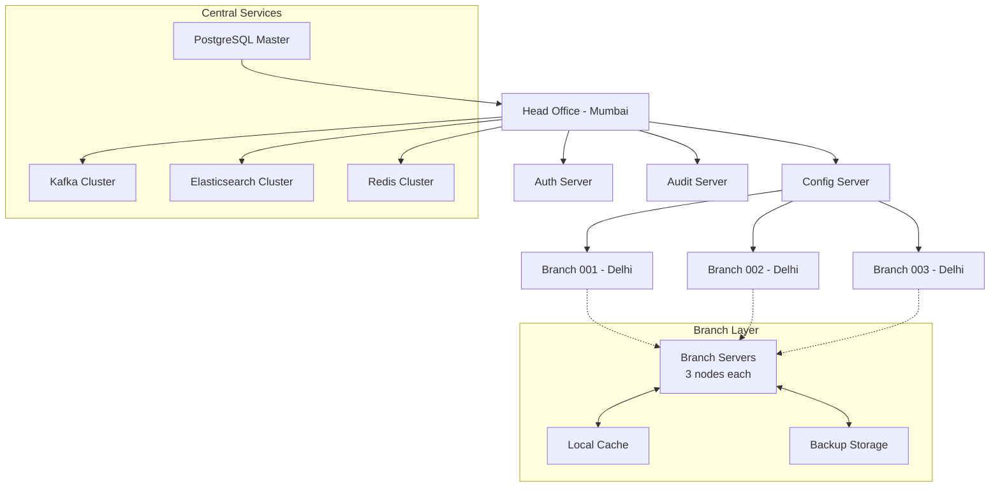
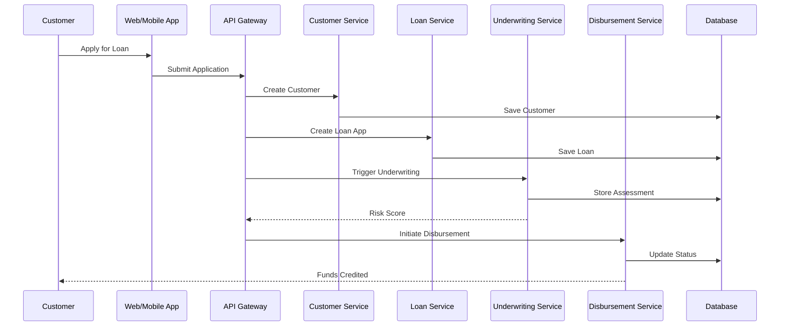
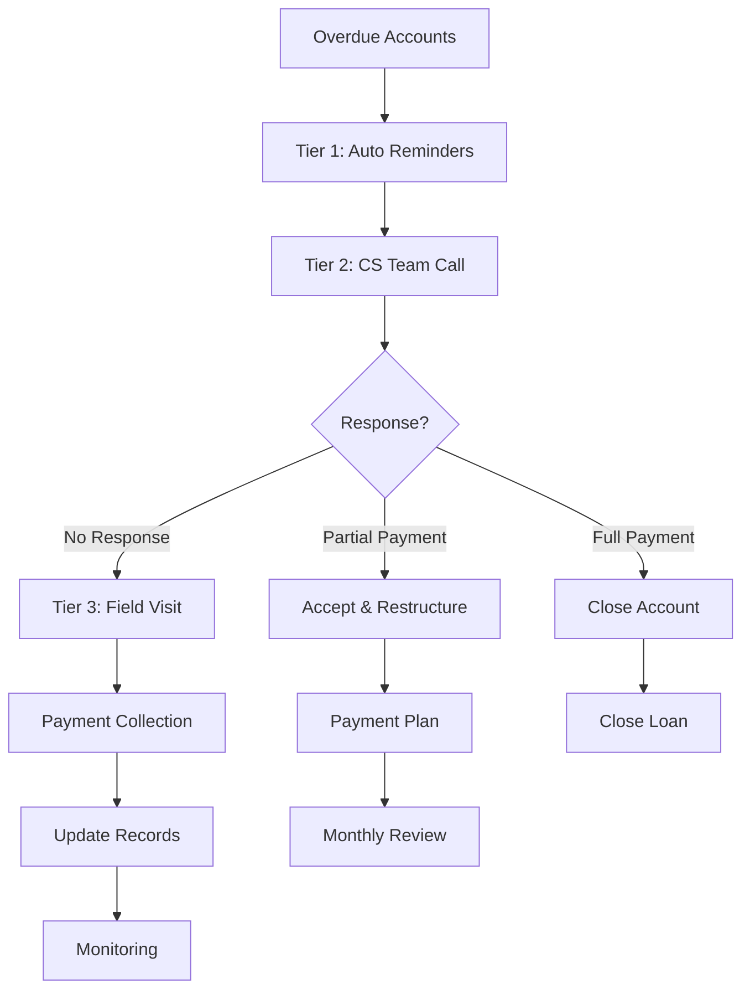
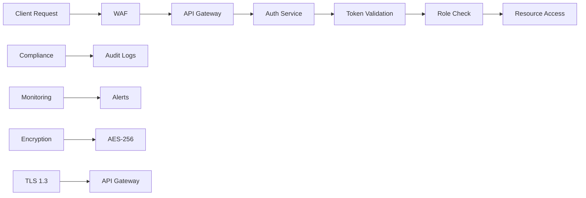
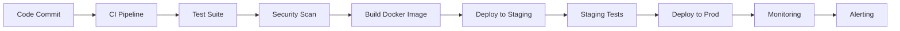

# System Architecture Diagrams

This file contains Mermaid diagrams for the NBFC SaaS Platform architecture.

## 1. Microservices Architecture

## 2. Micro Frontend Applications

## 3. Data Flow Architecture

## 4. Bank-Level Architecture (100 Branches)

## 5. Loan Processing Workflow

## 6. Collections Process Flow

## 7. Security Architecture

## 8. Deployment Pipeline

