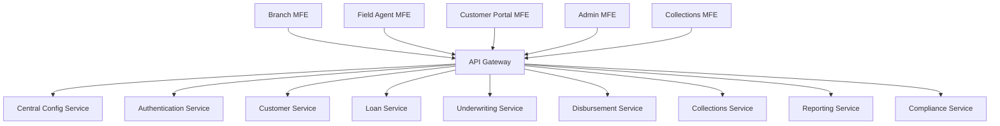
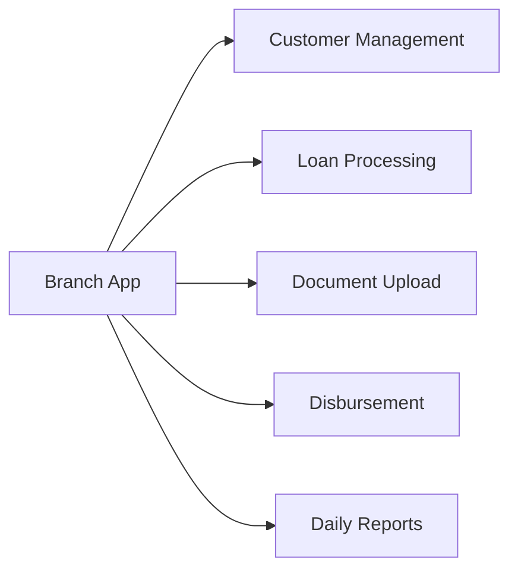
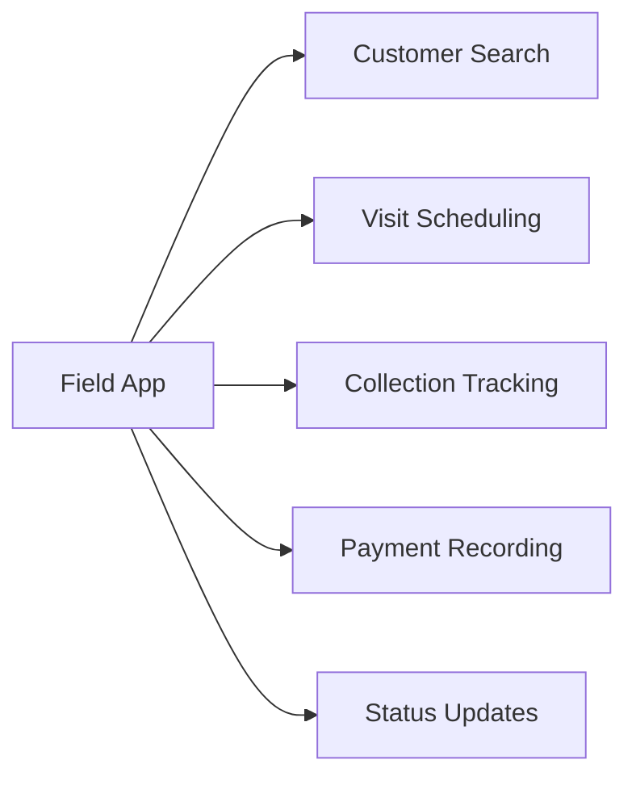
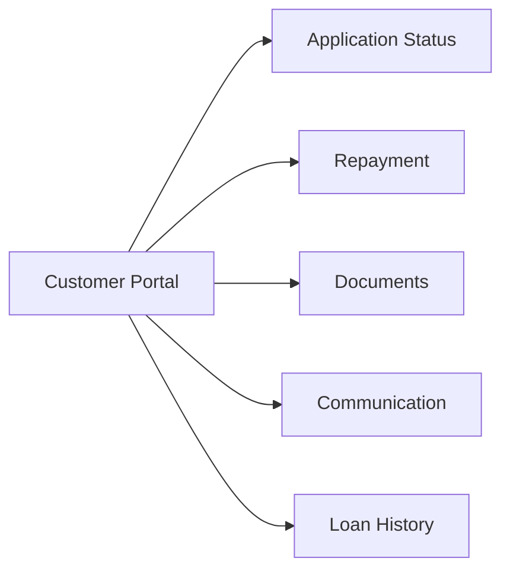
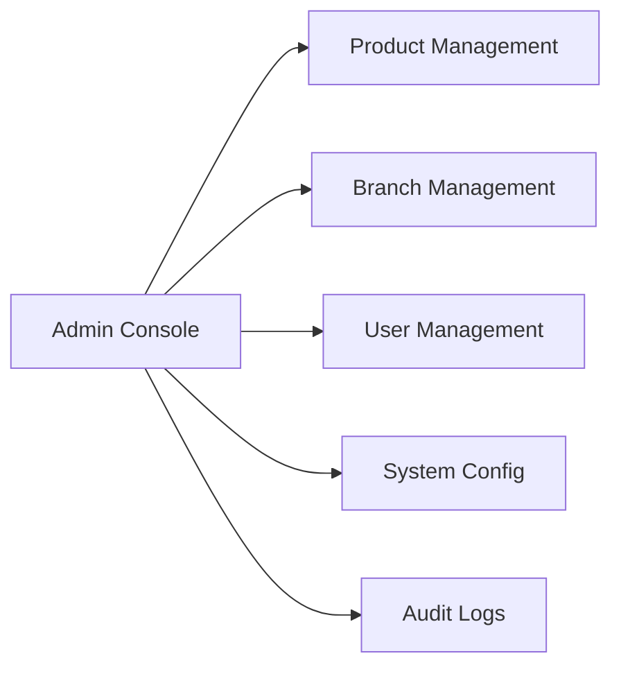
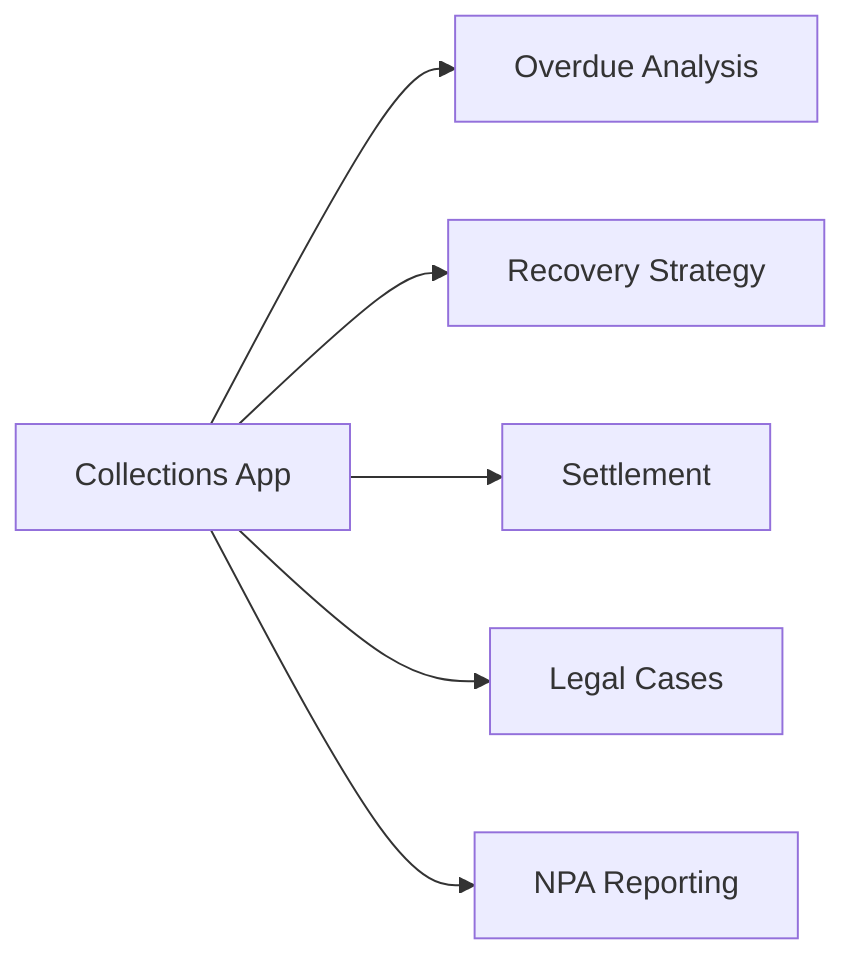
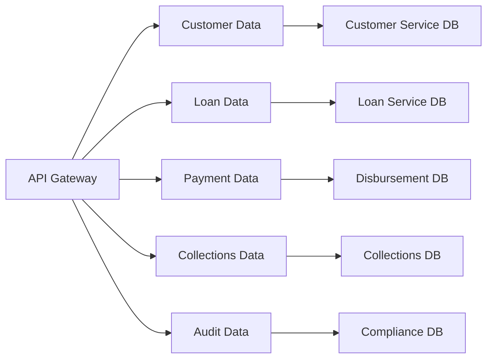

# Enterprise Architecture Design
## MFE & Microservices Architecture for NBFC SaaS Platform

---

## Executive Summary

This document outlines a scalable microservices and micro frontend architecture for an NBFC platform designed to handle 100 branches with ₹2000 Cr annual business volume. The architecture follows domain-driven design principles with role-specific applications for different stakeholders.

### Business Scale Assumptions
| Metric | Value |
|--------|-------|
| Branches | 100 |
| Annual Business Volume | ₹2000 Crores |
| Average Branch Volume | ₹20 Crores |
| Daily Transactions | ~1,000 |
| Concurrent Users | ~1,500 |
| Peak TPS | ~50 |

---

## System Architecture Overview

### Core Architecture Diagram



---

## Microservices Architecture

### Domain Breakdown

| Domain | Service | Responsibilities | Technology |
|--------|---------|------------------|------------|
| **Core** | auth-service | Authentication, Authorization, Session Management | Node.js + JWT |
| **Core** | config-service | Central configuration, feature flags, tenant settings | Node.js + Redis |
| **Customer** | customer-service | Customer onboarding, KYC, profile management | Node.js + PostgreSQL |
| **Loan** | loan-service | Loan product management, application processing | Node.js + PostgreSQL |
| **Loan** | underwriting-service | Risk assessment, credit scoring, document verification | Python + ML Models |
| **Loan** | disbursement-service | Fund transfer, payment gateway integration | Node.js + Stripe/Razorpay |
| **Loan** | document-service | Document storage, OCR, verification | Python + AWS S3 |
| **Recovery** | collections-service | NPA management, recovery process | Node.js + PostgreSQL |
| **Reporting** | reporting-service | RBI reports, analytics, dashboards | Python + Pandas |
| **Compliance** | compliance-service | AML/KYC compliance, audit trail | Java + Elasticsearch |

### Service Communication Patterns

```yaml
# REST API Communication
service-to-service:
  protocol: HTTP/gRPC
  authentication: JWT Bearer Tokens
  encryption: TLS 1.3
  retry: Exponential backoff

# Event-Driven Communication
events:
  message_broker: Apache Kafka
  event_types:
    - customer.onboarded
    - loan.applied
    - loan.approved
    - loan.disbursed
    - payment.received
    - collection.triggered
```

---

## Micro Frontend Applications

### Role-Based MFE Structure

#### 1. Branch Operations Application
**Target Users:** Branch Managers, Loan Officers, Customer Service Executives


**Key Modules:**
- Customer Registration & KYC
- Loan Application Processing
- Document Verification
- Sanction Letter Generation
- Disbursement Processing
- Branch Dashboard

#### 2. Field Agent Application
**Target Users:** Recovery Agents, Field Collectors, Site Agents


**Key Modules:**
- Customer Location Mapping
- Visit Scheduling
- Payment Collection
- Status Updates
- Mobile Offline Mode

#### 3. Customer Portal (Web & Mobile)
**Target Users:** End Customers


**Key Modules:**
- Loan Application
- Status Tracking
- Repayment Portal
- Document Upload
- Communication Center

#### 4. Admin Console
**Target Users:** Super Admin, System Administrators


**Key Modules:**
- Master Data Management
- Role & Permission Management
- System Configuration
- Audit & Compliance
- Report Generation

#### 5. Collections Management Application
**Target Users:** Collections Manager, Recovery Agents


**Key Modules:**
- Overdue Dashboard
- Recovery Workbench
- Settlement Management
- Legal Case Tracking
- NPA Reporting

---

## Data Architecture

### Database Schema Design

```yaml
# PostgreSQL - Primary Database
main_database:
  tables:
    - customers
    - kyc_profiles
    - loan_products
    - loan_applications
    - loan_accounts
    - disbursements
    - repayments
    - collections
    - branches
    - users
    - roles
  
  sharding:
    strategy: Branch-based sharding
    shard_key: branch_id
    shards: 10 (for 100 branches)

# Redis - Cache & Session Store
redis:
  use_cases:
    - session_storage
    - feature_flags
    - rate_limiting
    - temporary_data

# Elasticsearch - Search & Analytics
elasticsearch:
  indices:
    - loan_documents
    - audit_logs
    - compliance_reports
    - customer_search
```

### Data Flow Architecture



---

## Deployment Architecture

### Container Orchestration
```yaml
orchestration: Kubernetes
clusters:
  - name: production
    region: ap-south-1
    nodes: 20
    services:
      - auth-service
      - config-service
      - customer-service
      - loan-service
      - underwriting-service
      - disbursement-service
      - document-service
      - collections-service
      - reporting-service
      - compliance-service

autoscaling:
  min_replicas: 2
  max_replicas: 10
  metrics:
    - cpu_utilization > 70%
    - memory_utilization > 80%
    - request_rate > 100_rps
```

### Load Balancing & CDN
```yaml
load_balancer:
  type: AWS ALB
  listeners:
    - port: 443
      protocol: HTTPS
  target_groups:
    - branch_app
    - field_agent_app
    - customer_portal
    - admin_console
    - collections_app

cdn:
  provider: Cloudflare
  cache_rules:
    - static_assets
    - api_responses
    - report_downloads
```

---

## Security Architecture

### Authentication & Authorization
```yaml
auth_flow:
  protocol: OAuth 2.0 + OpenID Connect
  tokens:
    - access_token (15 min expiry)
    - refresh_token (7 day expiry)
  roles:
    - customer
    - field_agent
    - branch_staff
    - manager
    - admin
    - super_admin

role_permissions:
  customer:
    - view_own_application
    - make_payment
    - upload_document
  
  field_agent:
    - view_assigned_customers
    - update_collection_status
    - add_payment_receipt
  
  branch_staff:
    - full_branch_access
    - process_loan_application
    - verify_documents
  
  admin:
    - system_configuration
    - user_management
    - report_generation
```

---

## Scalability Considerations

### Horizontal Scaling Strategy
```yaml
scaling_plan:
  stateless_services:
    - auto_scale_based_on_cpu
    - replicate_across_zones
  
  database_scaling:
    - read_replicas: 4
    - connection_pooling
    - query_optimization
  
  caching_layer:
    - distributed_cache
    - cdn_for_static_assets
    - api_response_caching
```

### Performance Targets
| Metric | Target |
|--------|--------|
| API Response Time (P95) | < 500ms |
| Page Load Time | < 2 seconds |
| Concurrent Users | 10,000+ |
| Uptime | 99.9% |

---

## Implementation Roadmap

### Phase 1: Core Infrastructure (Weeks 1-4)
- [ ] Setup Kubernetes cluster
- [ ] Deploy Auth & Config services
- [ ] Implement CI/CD pipeline
- [ ] Setup monitoring (Prometheus + Grafana)

### Phase 2: Customer & Loan Services (Weeks 5-8)
- [ ] Customer service implementation
- [ ] Loan service implementation
- [ ] Document storage integration
- [ ] Basic MFE shell setup

### Phase 3: Advanced Features (Weeks 9-12)
- [ ] Underwriting service with ML models
- [ ] Disbursement & payment integration
- [ ] Collections management
- [ ] Reporting engine

### Phase 4: MFE Deployment (Weeks 13-16)
- [ ] Branch application deployment
- [ ] Field agent application
- [ ] Customer portal
- [ ] Admin console

---

## Cost Estimation (Monthly)

| Component | Estimated Cost (INR) |
|-----------|---------------------|
| Compute (20 nodes) | 4,00,000 |
| Database (PostgreSQL) | 1,50,000 |
| Storage & CDN | 1,00,000 |
| Third-party APIs | 50,000 |
| Monitoring & Security | 50,000 |
| **Total** | **7,50,000** |

---

## Next Steps

1. **Review Architecture** - Stakeholder approval
2. **Set up Development Environment** - Local dev cluster
3. **Start Core Service Development** - Auth, Config, Customer services
4. **Design MFE Shell** - Single SPA or Module Federation setup