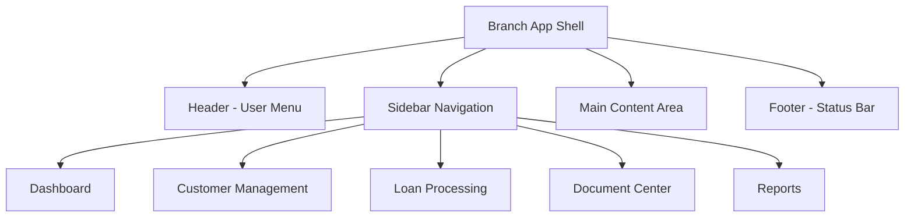
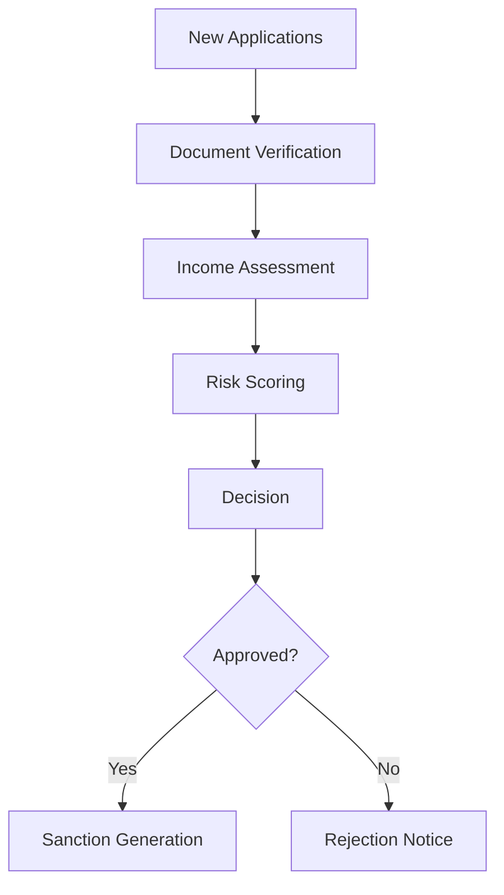
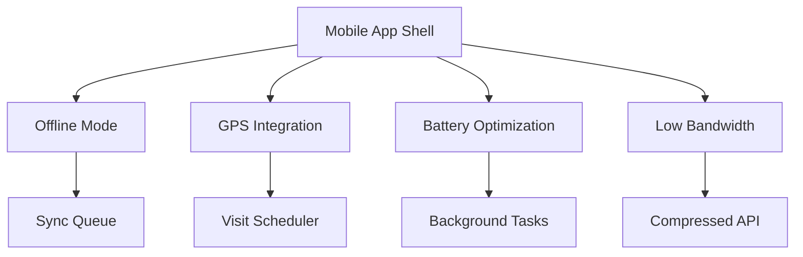
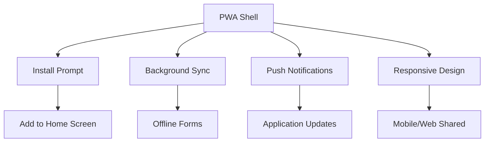
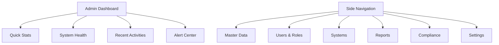
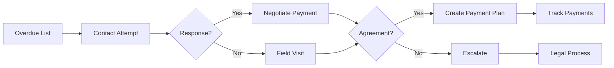

# Role-Specific Applications Design

## Overview

This document details the micro frontend applications designed for different user roles in the NBFC platform. Each application is optimized for its specific use case and user journey.

---

## 1. Branch Operations Application

### Target Audience
- Branch Managers
- Loan Officers
- Customer Service Executives
- Document Verification Staff

### Technology Stack
```
Framework: React + TypeScript
State Management: Redux Toolkit
UI Library: Custom Design System
Build Tool: Vite
Deployment: Docker + Kubernetes
```

### Application Layout



### Feature Modules

#### Module 1: Customer Management
**Path:** `/customers`
**Components:**
- Customer Search & Filter
- Customer Profile View
- KYC Status Tracker
- Document Vault

**Key Features:**
- Real-time customer search across branches
- KYC verification status dashboard
- Document upload and verification tracking
- Customer communication history

#### Module 2: Loan Processing
**Path:** `/loans`
**Components:**
- Loan Application List
- Application Review
- Document Checklist
- Decision Matrix

**Workflow:**


#### Module 3: Disbursement Center
**Path:** `/disbursement`
**Components:**
- Disbursement Queue
- Bank Verification
- Fund Transfer
- Acknowledgment Generator

#### Module 4: Reports & Analytics
**Path:** `/reports`
**Components:**
- Daily Collection Report
- Disbursement Summary
- Branch Performance Dashboard
- RBI Report Generator

### Role-Based Permissions

| Role | Can View | Can Edit | Can Approve | Can Approve Funds |
|------|----------|----------|-------------|-------------------|
| Branch Manager | All | All | All | All |
| Loan Officer | Assigned | Assigned | Up to ₹5L | None |
| Customer Exec | Assigned | Basic Info | None | None |
| Document Verifier | Assigned | Documents | None | None |

---

## 2. Field Agent Application

### Target Audience
- Recovery Agents
- Field Collectors
- Site Inspection Agents

### Mobile-First Design



### Core Features

#### Feature 1: Customer Visit Planner
- GPS-based customer location mapping
- Route optimization
- Visit scheduling
- Offline address book

#### Feature 2: Collection Tracker
- Payment receipt capture
- Cash/bank transfer recording
- Photo documentation
- Signature capture

#### Feature 3: Status Updates
- Real-time status sync
- Escalation triggers
- Communication log
- Activity timeline

### Mobile UI Components

```
Screen: Customer List
- Map view with customer pins
- List view with filters
- Search by name/phone
- Today's visits highlight

Screen: Customer Detail
- Customer information card
- KYC document preview
- Loan summary
- Action buttons (Call, Visit, Message)

Screen: Collection
- Amount input with keyboard
- Payment mode selector
- Photo capture button
- Notes textarea
- Submit/Cancel buttons
```

### Offline Capabilities

| Feature | Offline Support | Sync Strategy |
|---------|-----------------|---------------|
| Customer List | Yes | Local cache + sync |
| Visit Records | Yes | Queue + batch sync |
| Payment Records | Yes | Local storage |
| Communication | Limited | Text only |
| Reports | No | Online only |

---

## 3. Customer Portal (Web & Mobile)

### Target Audience
- Existing Customers
- Prospects
- Loan Applicants

### Progressive Web App Architecture



### Customer Journey

#### Step 1: Registration & KYC
```
1. Mobile/Email verification
2. Document upload (Aadhaar, PAN)
3. OCR processing feedback
4. Manual verification queue
5. KYC completion notification
```

#### Step 2: Loan Application
```
1. Product selection
2. Eligibility check
3. Form filling
4. Document upload
5. E-signature
6. Application submission
```

#### Step 3: Application Tracking
```
- Real-time status updates
- Document verification progress
- Underwriting status
- Sanction letter viewing
- Disbursement tracking
```

#### Step 4: Repayment
```
- EMI schedule view
- Payment history
- Auto-pay setup
- Payment methods (UPI, NEFT, Cards)
- Late payment warnings
```

### UI Components

| Component | Description | Responsive |
|-----------|-------------|------------|
| Loan Card | Quick view of active loans | All screens |
| Status Tracker | Visual progress indicator | All screens |
| Document Vault | Upload/view documents | Desktop + Mobile |
| Payment Portal | Make payments, view history | Desktop + Mobile |
| Chat Support | 24/7 customer support | Mobile optimized |
| Notification Center | Alerts and updates | All screens |

---

## 4. Admin Console

### Target Audience
- System Administrators
- Super Admins
- Compliance Officers

### Feature Areas

#### Area 1: Master Data Management
```
Product Configuration
- Interest rates
- Fee structures
- Eligibility criteria
- Tenure options

Branch Management
- Branch creation
- User assignment
- Territory mapping
- Performance targets
```

#### Area 2: User & Access Management
```
User Lifecycle
- Creation & onboarding
- Role assignment
- Permission matrix
- Password policies

Access Control
- RBAC implementation
- Audit trails
- Session management
- IP restrictions
```

#### Area 3: System Monitoring
```
Health Dashboard
- Service status
- API response times
- Error rates
- Active users

Alert Management
- System alerts
- SLA breaches
- Performance issues
- Security incidents
```

#### Area 4: Compliance & Audit
```
KYC Verification
- Pending KYC status
- Verification logs
- Document expiry alerts

AML Compliance
- Transaction monitoring
- Sanctions screening
- Reporting dashboard

Audit Trail
- User action logs
- Data modification history
- Export capabilities
```

### Admin UI Layout



---

## 5. Collections Management Application

### Target Audience
- Collections Managers
- Recovery Agents
- Legal Team

### Key Modules

#### Module 1: Portfolio Analysis
```
- Portfolio health dashboard
- NPA trend analysis
- Recovery rate metrics
- Branch-wise comparison
```

#### Module 2: Recovery Workbench
```
- Overdue account list
- Priority scoring
- Collection strategy suggestion
- Action logging
```

#### Module 3: Settlement Management
```
- Settlement proposal
- Payment plan creation
- Legal notice generation
- Recovery tracking
```

#### Module 4: Legal Integration
```
- Case assignment
- Court hearing dates
- Document preparation
- Judgment tracking
```

### Collections Workflow UI



---

## Cross-Application Integration

### Shared Components Library

```typescript
// Common UI components
interface SharedComponents {
  DataTable: React.ComponentType;
  FormField: React.ComponentType;
  Modal: React.ComponentType;
  UploadZone: React.ComponentType;
  SignaturePad: React.ComponentType;
  DatePicker: React.ComponentType;
}

// Common utilities
interface Utilities {
  formatCurrency: (amount: number) => string;
  calculateEMI: (data: EMICalculator) => number;
  validateKYC: (documents: Document[]) => boolean;
  sendNotification: (user: User, message: string) => void;
}
```

### Communication Patterns

| Pattern | Use Case | Example |
|---------|----------|---------|
| JWT Authentication | All apps | Token validation |
| Event Bus | Real-time updates | Payment success |
| WebSocket | Live notifications | Chat support |
| REST APIs | Data fetching | Customer details |
| File Upload | Document sharing | KYC documents |

---

## Performance Requirements

### Loading Targets
| Screen | Target Load Time |
|--------|------------------|
| Dashboard | < 1 second |
| Customer List | < 2 seconds |
| Form Load | < 500ms |
| Data Table | < 1 second (pagination) |

### Mobile Performance
| Metric | Target |
|--------|--------|
| First Contentful Paint | < 2s |
| Time to Interactive | < 5s |
| Offline Support | 70% features |
| Bundle Size | < 500KB initial |

---

## Deployment Strategy

### Container Images
```
branch-app:latest
field-agent-app:latest
customer-portal:latest
admin-console:latest
collections-app:latest
```

### CI/CD Pipeline
```yaml
stages:
  - build
  - test
  - deploy-dev
  - deploy-staging
  - deploy-prod

environments:
  - development
  - staging
  - production
```