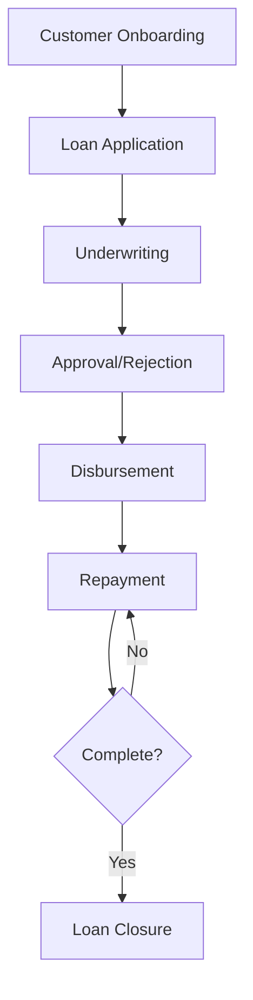
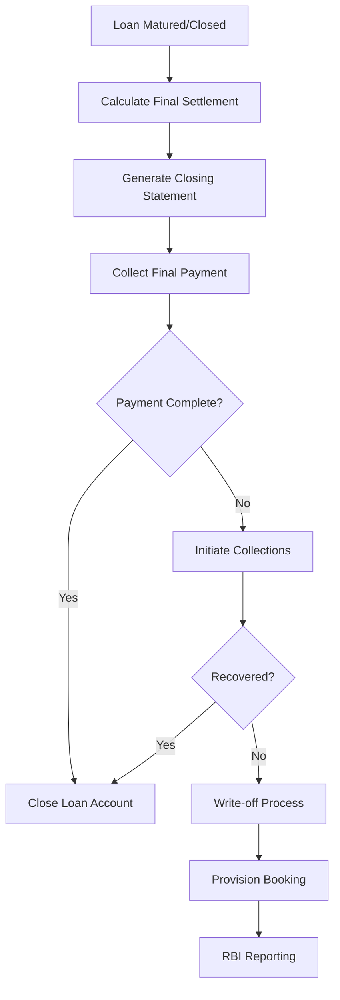
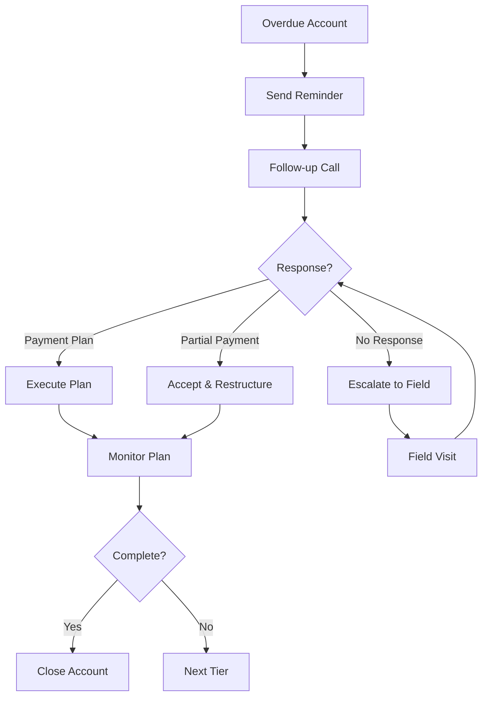
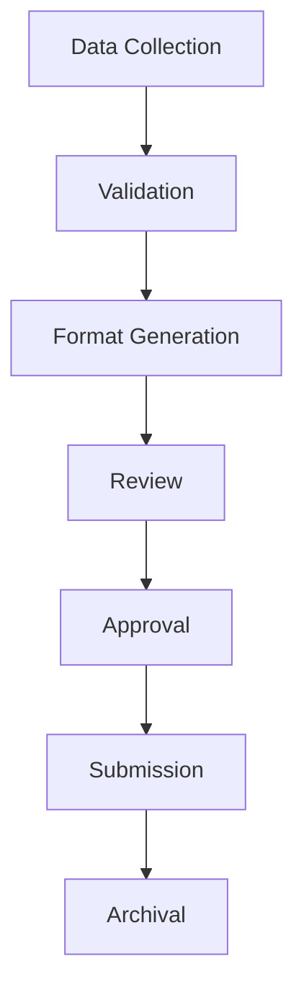

# Business Process Flow Documentation

## Table of Contents

1. [Personal Loan Business Process Flow](#personal-loan-business-process-flow)
2. [Loan Disposal Process](#loan-disposal-process)
3. [Collections Process](#collections-process)
4. [Reporting Process](#reporting-process)
5. [Compliance Process](#compliance-process)

---

## Personal Loan Business Process Flow

### Overview Diagram

### Detailed Steps

#### Phase 1: Customer Acquisition & Onboarding
1. **Customer Registration**
   - Customer visits website/branch
   - Provides basic details (name, mobile, email)
   - OTP verification
   - Initial profile creation

2. **KYC Verification**
   - Document upload (Aadhaar, PAN, Address Proof)
   - OCR-based validation
   - Manual verification (if required)
   - Risk scoring

#### Phase 2: Loan Processing
1. **Product Selection**
   - Customer selects Personal Loan
   -Views eligibility and features

2. **Application Submission**
   - Personal details form
   - Loan details (amount, tenure)
   - Document upload
   - E-signature

3. **Pre-assessment**
   - Income verification
   - CIBIL score check
   - Eligibility validation

4. **Underwriting**
   - Risk assessment
   - Document verification
   - Decision making

5. **Sanction**
   - Generate sanction letter
   - Send for customer approval
   - Collect acceptance

#### Phase 3: Disbursement
1. **Approval Confirmation**
   - Receive acceptance
   - Verify bank details
   - Generate AMC

2. **Fund Transfer**
   - Initiate payment
   - Confirm credit
   - Update loan status

#### Phase 4: Repayment
1. **EMI Generation**
   - Create repayment schedule
   - Send reminders
   - Auto-debit setup

2. **Collection**
   - Daily collection monitoring
   - Late fee application
   - Customer communication

#### Phase 5: Resolution
1. **Completion**
   - Final payment confirmation
   - Loan closure intimation
   - Feedback collection

2. **Post-Closure**
   - Credit score update
   - Relationship management
   - Cross-selling opportunities

---

## Loan Disposal Process

### Types of Loan Disposal

| Disposal Type | Description | Process |
|---------------|-------------|---------|
| **Natural Closure** | Regular repayment completion | Final settlement → Closure certificate |
| **Pre-closure** | Early repayment | Processing fee → Closure certificate |
| **Foreclosure** | Full payment before schedule | Zero-interest option → Closure |
| **Write-off** | Non-recoverable account | Provision booking → NPA reporting |
| **Legal Recovery** | Court-assisted recovery | Suit filing → Auction → Settlement |

### Disposal Workflow

### Closure Documentation
- Closure Certificate
- No Demand Certificate (NDC)
- Account Statement
- Feedback Form

---

## Collections Process

### Tiered Collections System

| Tier | Days Past Due | Action | Team |
|------|---------------|--------|------|
| 1 | 1-15 | Automated SMS/Email | System |
| 2 | 16-30 | Customer Service | CS Team |
| 3 | 31-60 | Field Collection | Field Agent |
| 4 | 61-90 | Recovery Agent | External Agency |
| 5 | 90+ | Legal Notice | Legal Team |
| 6 | 120+ | Legal Suit | Legal Team |

### Collections Workflow

---

## Reporting Process

### Monthly Reports

| Report | Frequency | Deadline | Stakeholder |
|--------|-----------|----------|-------------|
| Portfolio Summary | Monthly | 7th day | Management |
| NPA Report | Monthly | 15th day | RBI, Management |
| Collections Report | Monthly | 10th day | Collections Team |
| Disbursement Report | Monthly | 5th day | Operations |

### RBI Returns

| Form | Description | Submission |
|------|-------------|------------|
| SARDI | Asset Quality | Monthly |
| Schedule III | Balance Sheet | Quarterly |
| Schedule IV | Capital Ratios | Quarterly |
| CSR Returns | Other data | As required |

### Report Generation Process

---

## Compliance Process

### KYC Compliance

1. **Initial KYC**
   - Document verification
   - In-person verification (for high value)
   - Risk categorization

2. **Ongoing KYC**
   - Periodic review (annually)
   - Updated document collection
   - Transaction monitoring

### AML Compliance

1. **Transaction Monitoring**
   - Large transaction flagging
   - Suspicious activity detection
   - Reporting to FinCEN

2. **Sanctions Screening**
   - PEP screening
   - Sanctions list check
   - Ongoing monitoring

### Internal Audit

1. **Process Audit**
   - Monthly process review
   - Control testing
   - Findings reporting

2. **System Audit**
   - Access log review
   - Data integrity check
   - Security assessment