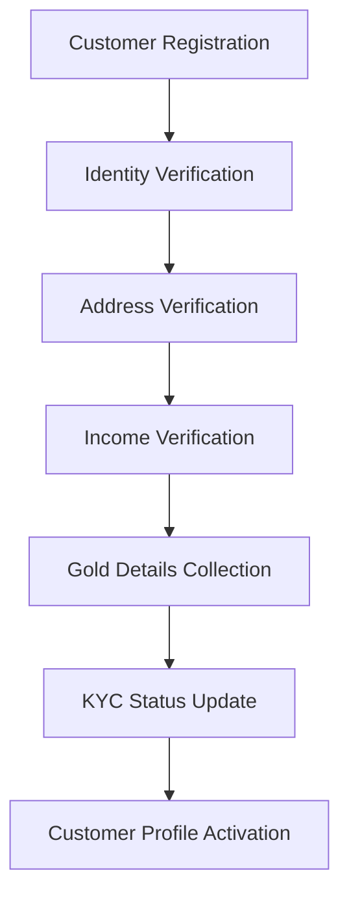
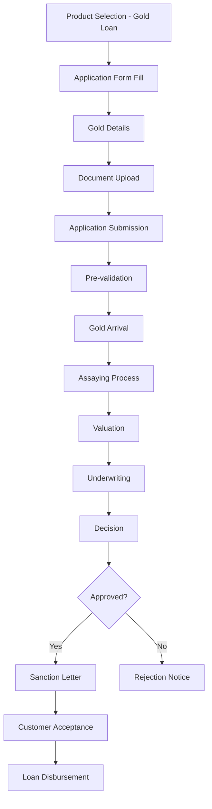
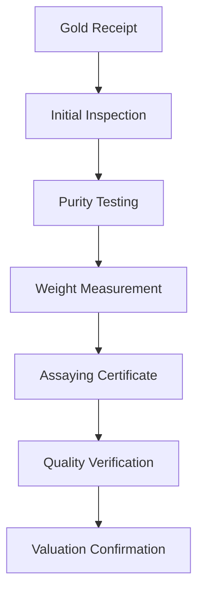
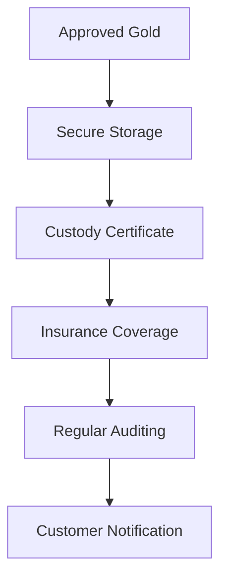
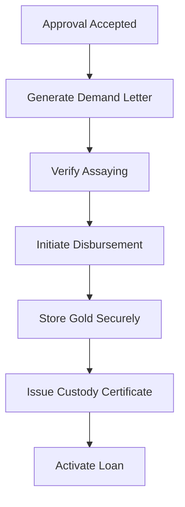
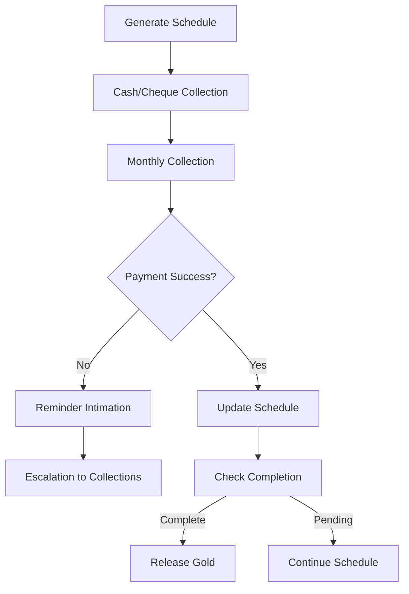
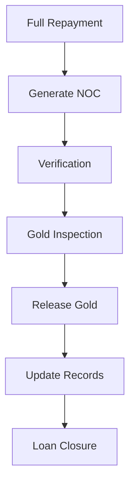
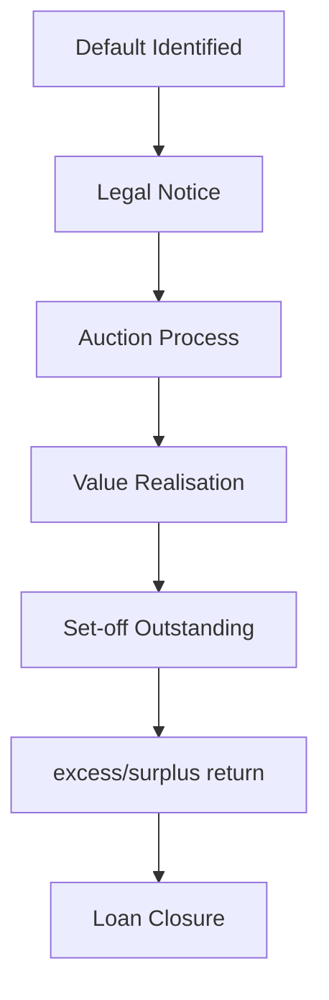

# Gold Loan Business Process Design

## Overview

This document details the complete business process flow for Gold Loan operations within the NBFC SaaS platform. Gold loans are secured loans against gold jewelry, coins, and bars, requiring expert assaying and valuation.

## Table of Contents

1. [Business Process Flow](#business-process-flow)
2. [Gold Loan Specific Features](#gold-loan-specific-features)
3. [Gold Valuation Process](#gold-valuation-process)
4. [Regulatory Compliance](#regulatory-compliance)
5. [Risk Management](#risk-management)
6. [Process Diagrams](#process-diagrams)

---

## Business Process Flow

### 1. Customer Onboarding (KYC)



**Steps:**
1. **Registration** - Customer provides basic details (name, mobile, email, address)
2. **Document Upload** - Aadhaar, PAN, Address Proof, Income Proof
3. **Verification** - Automated + Manual verification
4. **Gold Details** - Type of gold, weight, purity, estimated value
5. **Approval** - KYC status updated to 'verified' or 'rejected'
6. **Profile Completion** - Additional details for gold loan assessment

### 2. Loan Application Process



### 3. Gold Receipt and Assaying Process



### 4. Gold Storage and Security



### 5. Loan Disbursement Process



### 6. Repayment Process



### 7. Gold Release Process



### 8. Gold Loan Closure on Default



---

## Gold Loan Specific Features

### Eligibility Criteria

| Parameter | Minimum | Maximum |
|-----------|---------|---------|
| Age | 18 years | 65 years |
| Employment | Any | - |
| Annual Income | Not mandatory | - |
| CIBIL Score | 550 | - |
| Loan Amount | ₹1,00,000 | ₹5,00,00,000 |
| Tenure | 6 months | 60 months |
| Gold Purity | 22 KT | - |

### Gold Requirements

| Requirement | Details |
|-------------|---------|
| Gold Type | Jewellery, Coins, Bars |
| Purity | Minimum 22 KT |
| Weight | Minimum 5 grams |
| Hallmarking | Preferably hallmarked |
| Cleanliness | Clean and dust-free |
| Packaging | Proper packaging required |

### Gold Valuation Standards

| Purity | Valuation Basis |
|--------|-----------------|
| 24 KT | 100% of hallmark value |
| 22 KT | 92% of 24 KT value |
| 20 KT | 84% of 24 KT value |
| 18 KT | 75% of 24 KT value |
| Unhallmarked | Assayer certificate basis |

### Document Requirements

| Document Type | Description | Verification |
|---------------|-------------|--------------|
| ID Proof | Aadhaar/PAN/Passport | OCR + Manual |
| Address Proof | Utility Bill/Ration Card | OCR + Manual |
| Gold Documents | Purchase receipt, hallmark certificate | Physical Check |
| Bank Statement | Last 3 months | API Verification |

### Processing Workflow

1. **Application Capture**
   - Online or Branch-based
   - Gold details collection

2. **Gold Receipt**
   - Customer brings gold to branch
   - Initial inspection

3. **Assaying and Valuation**
   - Certified assayer testing
   - Purity and weight measurement
   - Value calculation

4. **Underwriting**
   - Gold value vs loan amount analysis (typically 75-80% LTV)
   - Sanction recommendation

5. **Loan Disbursement**
   - Cash/cheque payment to customer
   - Gold stored in secure vault
   - Custody certificate issuance

---

## Gold Valuation Process

### Valuation Formula

```
Loan Amount = Gold Weight × Purity % × Current Gold Rate × LTV Ratio
```

### Current Gold Rate Sources

| Source | Update Frequency | Reliability |
|--------|-----------------|-------------|
| MCX | Real-time | High |
| Local Chandis | Daily | Medium |
| International | Real-time | High |

### Assaying Process

| Test | Accuracy | Time |
|------|----------|------|
| Touch Test | Basic | 5 min |
| Acetylene Test | 95% | 15 min |
| Electronic Test | 99%+ | 30 min |
| XRF Tester | 99.9%+ | 1 hour |

### Assayer Certification

| Document | Description |
|----------|-------------|
| Assayer License | Valid certificate from certified assayer |
| Testing Report | Detailed purity and weight report |
| Lab Seal | Authorized laboratory seal |
| Assayer Signature | Authorized signature |

---

## Regulatory Compliance

### RBI Regulations Applicable

| Regulation | Requirement | Implementation |
|------------|-------------|----------------|
| Fair Practices Code | Clear disclosure of terms | Sanction letter template |
| Credit Information Report | CIBIL/Experian integration | API integration |
| KYC Norms | Document verification | OCR + Manual process |
| Gold Banking | Hallmarking verification | Assayer certification |
| Debt Recovery | SARDI reporting | Automated reporting |
| Data Protection | Encryption at rest/in transit | TLS 1.3, AES-256 |
| NPAR Regulation | NPA identification within 90 days | Daily monitoring |
| Grievance Redress | Complaint handling | Ticket system |

### Reporting Requirements

| Report | Frequency | Format | Destination |
|--------|-----------|--------|-------------|
| SARDI | Monthly | XLSX | RBI |
| Schedule III | Quarterly | XLSX | RBI |
| Gold Valuation | Per loan | PDF | Internal |
| Purity Report | Per loan | PDF | Legal |
| NPA Status | Monthly | XLSX | Internal |

---

## Risk Management

### Credit Risk Categories

| Score Range | Risk Category | Action |
|-------------|---------------|--------|
| 750-800 | Low Risk | Standard rates |
| 700-749 | Low-Medium | Standard + fees |
| 650-699 | Medium | Higher rates |
| 600-649 | Medium-High | Manual approval |
| <600 | High Risk | Refer to manual underwriting |

### Gold-Specific Risk Factors

| Factor | Impact | Mitigation |
|--------|--------|------------|
| Purity Risk | Valuation risk | Assayer certification |
| Theft Risk | Security risk | Vault storage |
| Market Risk | Price volatility | Daily rate updates |
| Tampering | Fraud risk | XRF testing |
| Counterfeit | Fraud risk | Hallmark verification |

### Gold Fraud Detection

| Check | Tool | Threshold |
|-------|------|-----------|
| Purity Testing | XRF/Electronic | Accuracy > 99% |
| Weight Verification | Calibrated scale | ±0.01 gram |
| Hallmark Check | Magnification | Clear marking |
| Duplicate Gold | Unique item code | Item tracking |

---

## Revenue Model

### Fee Structure

| Fee Type | Rate | Waiver Condition |
|----------|------|------------------|
| Processing Fee | 0.5-1% of loan | Minimum ₹500 |
| Assaying Fee | Fixed | ₹200-500 |
| Storage Fee | 0.1-0.25% per month | On loan balance |
| Insurance Fee | 0.15-0.25% | Annual |
| Late Payment Fee | 2-3% per month | On overdue amount |
| Prepayment Fee | 0-2% | On reducing balance |
| Foreclosure Fee | 2-3% | On outstanding |

### Interest Rate Bands

| Customer Type | Base Rate | Spread | Final Rate |
|---------------|-----------|--------|------------|
| Salaried (Best) | 7.50% | -0.50% | 7.00% |
| Salaried (Standard) | 7.50% | +0.50% | 8.00% |
| Self-Employed | 8.00% | +1.00% | 9.00% |
| Co-applicant | 7.50% | Varies | Per evaluation |

### Interest Calculation

```
Monthly Interest = (Loan Amount × Interest Rate) / 12
```

---

## SLA Commitments

| Process | SLA | Measurement |
|---------|-----|-------------|
| Application Acknowledgment | 1 hour | Email/SMS |
| Document Verification | 24 hours | Auto + Manual |
| Gold Valuation | 48 hours | Assayer report |
| Sanction Letter | 24 hours | Email delivery |
| Gold Receipt | Same day | Branch processing |
| Disbursement | 2 hours after acceptance | Bank transfer |

---

## Appendices

### Gold Loan Product Configuration

```yaml
product_id: gold_loan
name: Gold Loan
description: Secured loan against gold jewelry/coins/bars
interest_type: reducing_balance
min_amount: 100000
max_amount: 50000000
min_tenure: 6
max_tenure: 60
eligibility:
  min_age: 18
  max_age: 65
  min_gold_weight: 5
  min_purity: 22
  max_ltv: 80
features:
  - Quick processing
  - No employment verification
  - Immediate cash
  - Secure storage
storage_required: true
insurance_required: true
```

### Status Transitions

```
draft → submitted → under_review → [approved|rejected]
approved → gold_received → valued → disbursed → active → [closed|npa]
active → [closed|npa]
npa → [recovered|written_off]
```

### LTV Calculation Matrix

| Gold Type | Purity | LTV % |
|-----------|--------|-------|
| Jewellery | 24 KT | 75% |
| Jewellery | 22 KT | 70% |
| Jewellery | 20 KT | 65% |
| Coins | Any purity | 80% |
| Bars | 99.9% | 85% |
| Unhallmarked | Assoiler cert | 60% |