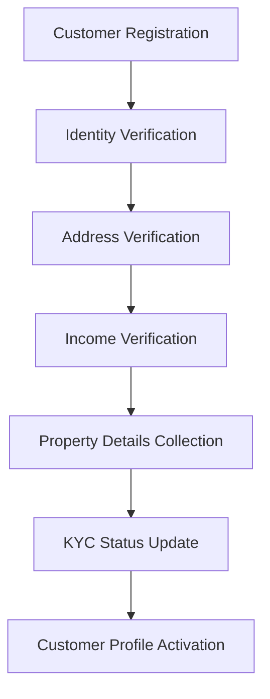
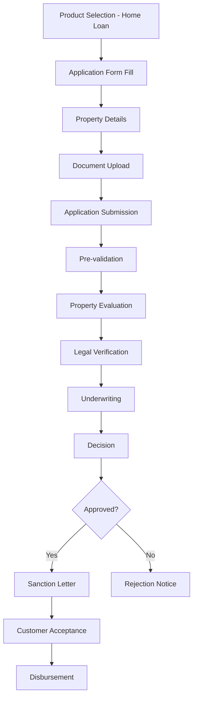
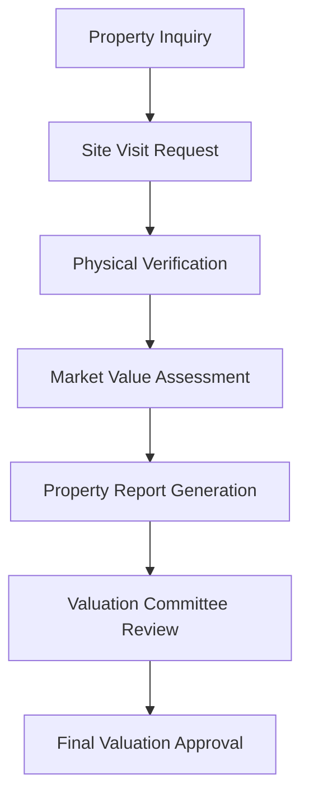
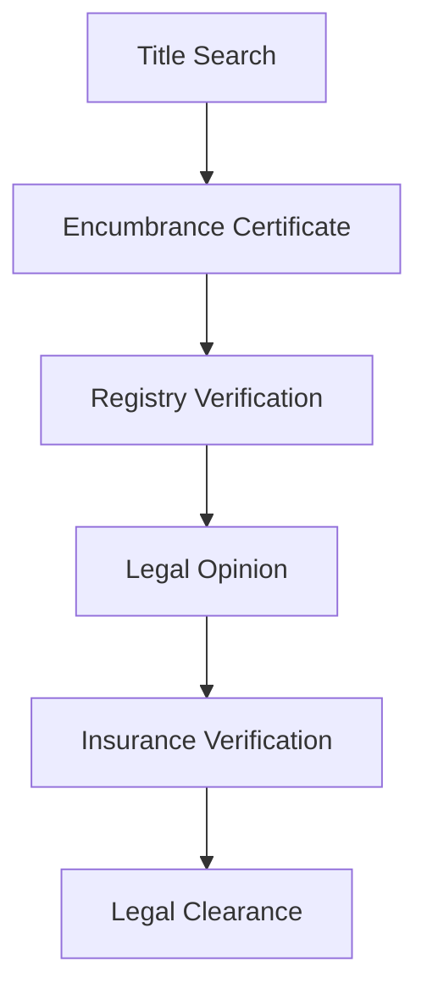
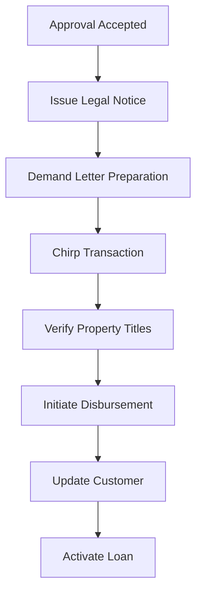
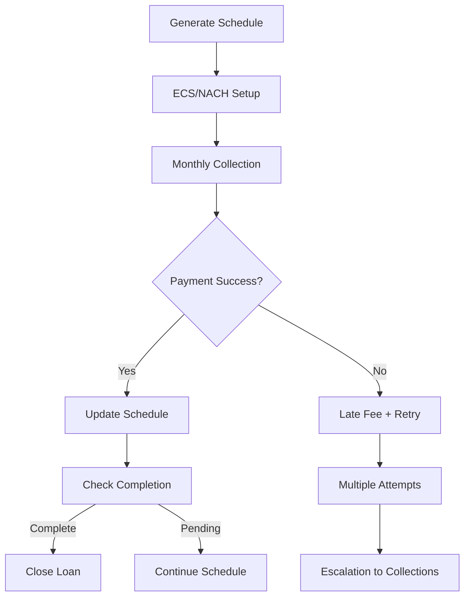
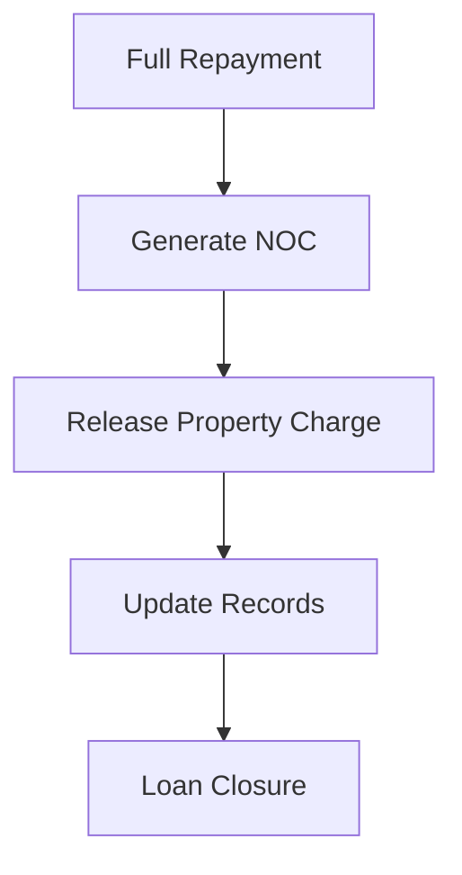

# Home Loan Business Process Design

## Overview

This document details the complete business process flow for Home Loan operations within the NBFC SaaS platform. Home loans are secured loans against residential property, requiring detailed property evaluation and legal verification.

## Table of Contents

1. [Business Process Flow](#business-process-flow)
2. [Home Loan Specific Features](#home-loan-specific-features)
3. [Property Evaluation Process](#property-evaluation-process)
4. [Regulatory Compliance](#regulatory-compliance)
5. [Risk Management](#risk-management)
6. [Process Diagrams](#process-diagrams)

---

## Business Process Flow

### 1. Customer Onboarding (KYC)



**Steps:**
1. **Registration** - Customer provides basic details (name, mobile, email, address)
2. **Document Upload** - Aadhaar, PAN, Address Proof, Income Proof
3. **Verification** - Automated + Manual verification
4. **Property Details** - Property type, location, estimated value
5. **Approval** - KYC status updated to 'verified' or 'rejected'
6. **Profile Completion** - Additional details for home loan assessment

### 2. Loan Application Process



### 3. Property Evaluation Process



### 4. Legal Verification Process



### 5. Disbursement Process



### 6. Repayment Process



### 7. End of Loan Process



---

## Home Loan Specific Features

### Eligibility Criteria

| Parameter | Minimum | Maximum |
|-----------|---------|---------|
| Age | 25 years | 65 years |
| Employment | 24 months | - |
| Annual Income | ₹3,00,000 | - |
| CIBIL Score | 700 | - |
| Loan Amount | ₹5,00,000 | ₹5,00,00,000 |
| Tenure | 12 months | 240 months |

### Property Requirements

| Requirement | Details |
|-------------|---------|
| Property Type | Residential (Self-occupied/Non-self-occupied) |
| Age of Property | Less than 30 years |
| Carpet Area | Minimum 500 sq ft |
| Loan-to-Value (LTV) | Up to 80% for married couples, 75% for individuals |
| Proximity | Within 5 km of branch/workplace preferred |

### Document Requirements

| Document Type | Description | Verification |
|---------------|-------------|--------------|
| ID Proof | Aadhaar/PAN/Passport | OCR + Manual |
| Address Proof | Utility Bill/Ration Card | OCR + Manual |
| Income Proof | Salary Slip/Form 16/Bank Statement | API + Manual |
| Property Documents | Agreement, Sale Deed, Encumbrance Certificate | Legal Verification |
| Approved Plan | Building plan with sanctioning authority | Physical Verification |
| Insurance | Home loan insurance policy | API Integration |

### Processing Workflow

1. **Application Capture**
   - Online or Branch-based
   - Auto-fill from existing customer data

2. **Property Evaluation**
   - Site visit by authorized evaluator
   - Market value assessment
   - Depreciation calculation

3. **Legal Verification**
   - Title search and verification
   - Encumbrance certificate check
   - Legal opinion from advocate

4. **Underwriting**
   - Property value vs loan amount analysis
   - Debt-to-income ratio check
   - Sanction recommendation

5. **Disbursement**
   - Chirp transaction (joint check)
   - Post-dated cheques collection
   - Insurance policy verification

---

## Property Evaluation Process

### Valuation Methods

| Method | Description | Timeline |
|--------|-------------|----------|
| Market Comparison | Compare with similar properties | 2-3 days |
| Depreciation | Calculate age-related depreciation | 1 day |
| Rental Income | Annual rent × 12 × 0.08 | 1 day |
| Approved Plan Value | As per sanctioned plan | Immediate |

### Evaluator Roles

| Role | Responsibilities |
|------|-------------------|
| Field Officer | Physical site visit, photo documentation |
| Valuation Officer | Market analysis, depreciation calculation |
| Legal Officer | Title verification, encumbrance check |
| Committee Head | Final approval, exception handling |

---

## Regulatory Compliance

### RBI Regulations Applicable

| Regulation | Requirement | Implementation |
|------------|-------------|----------------|
| Fair Practices Code | Clear disclosure of terms | Sanction letter template |
| Credit Information Report | CIBIL/Experian integration | API integration |
| KYC Norms | Document verification | OCR + Manual process |
| LTV Ratio | Maximum 80% | System validation |
| Debt Recovery | SARDI reporting | Automated reporting |
| Data Protection | Encryption at rest/in transit | TLS 1.3, AES-256 |
| NPAR Regulation | NPA identification within 90 days | Daily monitoring |
| Housing Finance | Sector-specific regulations | Product configuration |

### Reporting Requirements

| Report | Frequency | Format | Destination |
|--------|-----------|--------|-------------|
| SARDI | Monthly | XLSX | RBI |
| Schedule III | Quarterly | XLSX | RBI |
| Property Valuation | Per application | PDF | Internal |
| Legal Verification | Per application | PDF | Legal Team |
| NPA Status | Monthly | XLSX | Internal |

---

## Risk Management

### Credit Risk Categories

| Score Range | Risk Category | Action |
|-------------|---------------|--------|
| 750-800 | Low Risk | Standard rates |
| 700-749 | Low-Medium | Standard + fees |
| 650-699 | Medium | Higher rates |
| 600-649 | Medium-High | Manual approval |
| <600 | High Risk | Refer to manual underwriting |

### Property Risk Factors

| Factor | Impact | Mitigation |
|--------|--------|------------|
| Location Risk | Price volatility | Location scoring matrix |
| Property Age | Depreciation | Age-based LTV adjustment |
| Construction Quality | Default risk | Physical verification |
| Market Liquidity | Recovery risk | Location preference |

### Fraud Detection

| Check | Tool | Threshold |
|-------|------|-----------|
| Document Forgery | OCR + AI | Confidence < 80% |
| Property Duplication | Registry check | Unique property ID |
| Income Inflation | Bank Statement Analysis | Variance > 20% |
| Title Defects | Legal verification | Advocate certification |

---

## Revenue Model

### Fee Structure

| Fee Type | Rate | Waiver Condition |
|----------|------|------------------|
| Processing Fee | 0.5-1% of loan | Minimum ₹1000 |
| Legal Fee | Fixed | As applicable |
| Insurance Fee | 0.15-0.25% | Annual |
| Late Payment Fee | 2-3% per month | On overdue amount |
| Prepayment Fee | 2-3% | On reducing balance |
| Foreclosure Fee | 3% | On outstanding |

### Interest Rate Bands

| Customer Type | Base Rate | Spread | Final Rate |
|---------------|-----------|--------|------------|
| Salaried (Best) | 8.50% | -0.50% | 8.00% |
| Salaried (Standard) | 8.50% | +0.50% | 9.00% |
| Self-Employed | 9.00% | +1.00% | 10.00% |
| Co-applicant | 8.50% | Varies | Per evaluation |

### Additional Charges

| Charge | Description |
|--------|-------------|
| GST | Applicable on all fees |
| Documentation Charges | Fixed amount |
| Valuation Charges | Based on property value |
| Legal Charges | As per actuals |

---

## SLA Commitments

| Process | SLA | Measurement |
|---------|-----|-------------|
| Application Acknowledgment | 1 hour | Email/SMS |
| Document Verification | 24 hours | Auto + Manual |
| Pre-assessment | 4 hours | System check |
| Property Evaluation | 48 hours | Field officer |
| Legal Verification | 72 hours | Legal team |
| Sanction Letter | 24 hours | Email delivery |
| Disbursement | 2 hours after acceptance | Bank transfer |
| Customer Support Response | 4 hours | Ticket resolution |

---

## Appendices

### Home Loan Product Configuration

```yaml
product_id: home_loan
name: Home Loan
description: Secured loan against residential property
interest_type: reducing_balance
min_amount: 500000
max_amount: 50000000
min_tenure: 12
max_tenure: 240
eligibility:
  min_age: 25
  max_age: 65
  min_income: 300000
  min_cibil: 700
  min_property_age: 0
  max_property_age: 30
features:
  - Low interest rate
  - Long tenure
  - Property valuation assistance
  - Legal assistance
lodr_required: true
insurance_required: true
```

### Status Transitions

```
draft → submitted → under_review → [approved|rejected]
approved → legal_verification → property_evaluation → disbursed → active → [closed|npa]
npa → [recovered|written_off]
```

### LTV Calculation Matrix

| Customer Type | Property Value | Loan Amount | LTV % |
|---------------|----------------|-------------|-------|
| Individual | Up to ₹50L | Up to ₹40L | 80% |
| Joint | Up to ₹1Cr | Up to ₹80L | 80% |
| Individual | Above ₹50L | Proportionally | 75% |
| Joint | Above ₹1Cr | Proportionally | 70% |