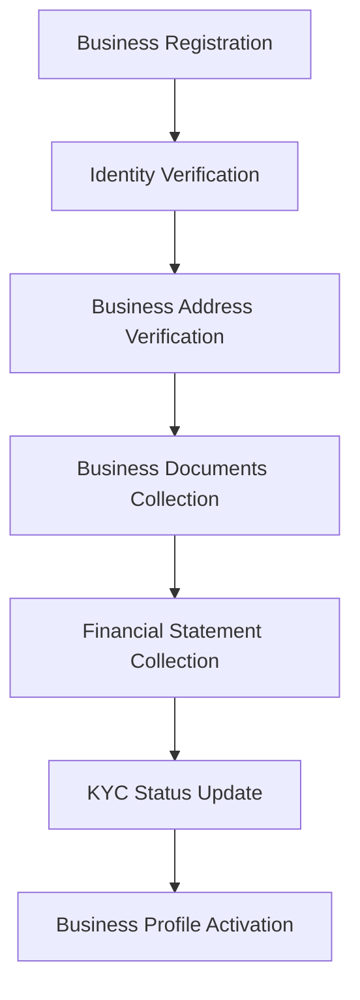
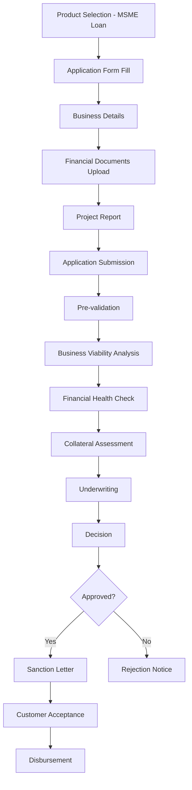
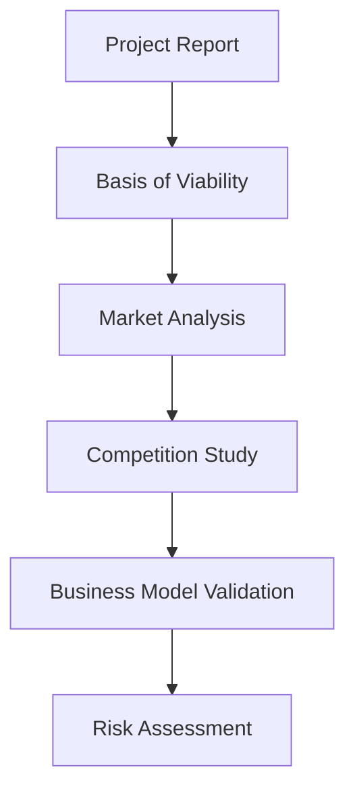
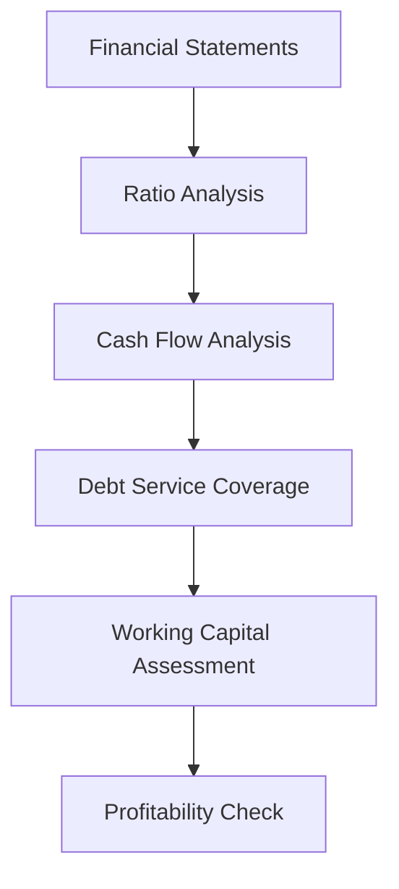
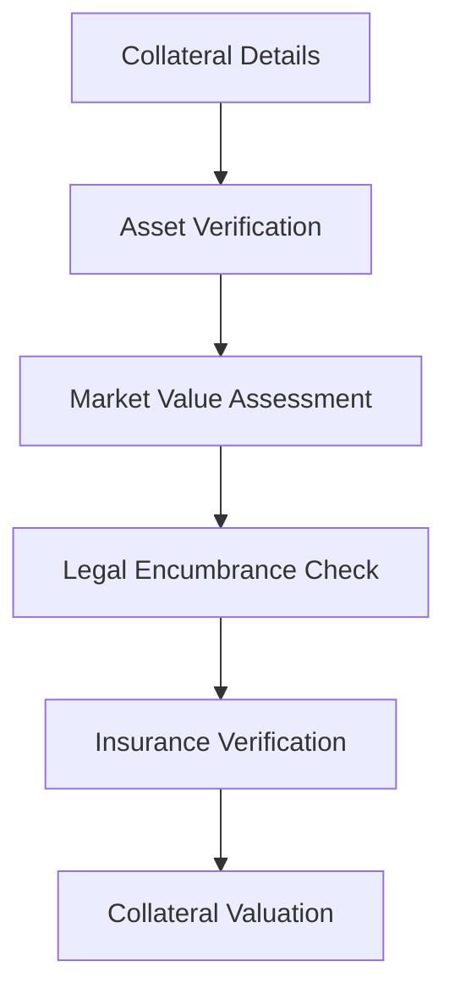
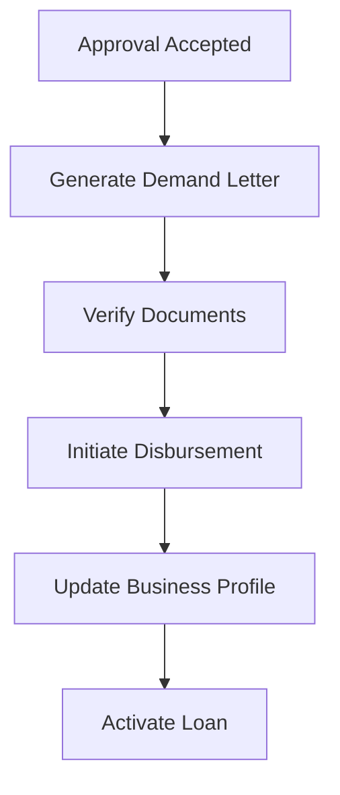
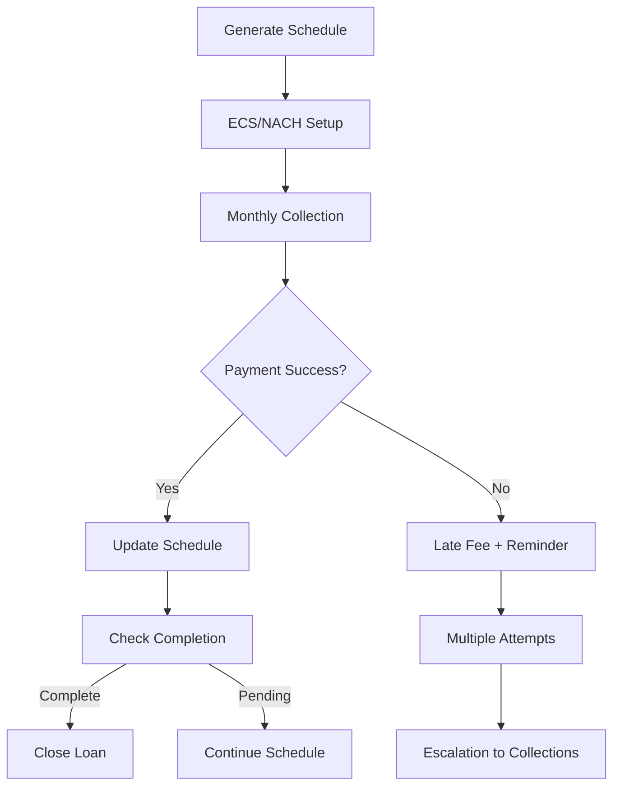
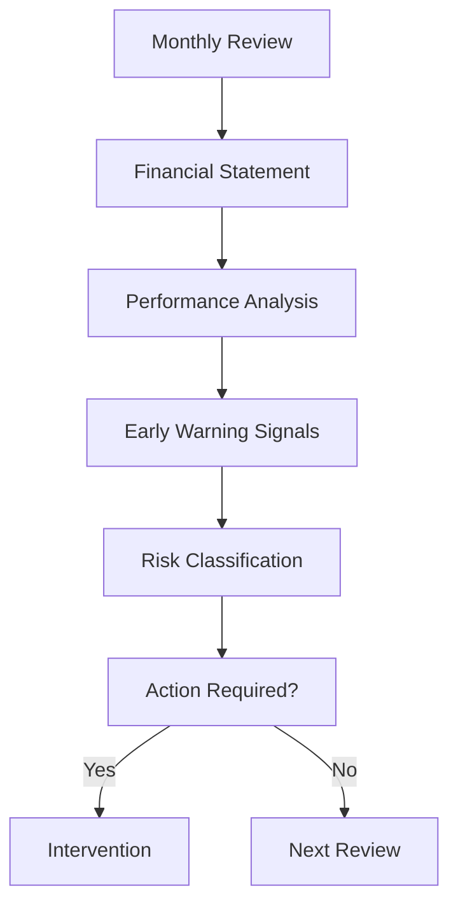

# MSME Loan Business Process Design

## Overview

This document details the complete business process flow for MSME (Micro, Small, and Medium Enterprise) Loan operations within the NBFC SaaS platform. MSME loans are business loans requiring detailed business evaluation, financial analysis, and collateral assessment.

## Table of Contents

1. [Business Process Flow](#business-process-flow)
2. [MSME Loan Specific Features](#msme-loan-specific-features)
3. [Business Evaluation Process](#business-evaluation-process)
4. [Regulatory Compliance](#regulatory-compliance)
5. [Risk Management](#risk-management)
6. [Process Diagrams](#process-diagrams)

---

## Business Process Flow

### 1. Customer Onboarding (KYC)



**Steps:**
1. **Registration** - Business promoter provides details (name, mobile, email, business address)
2. **Document Upload** - PAN, Business Registration, Address Proof, Partnership Deed
3. **Financial Documents** - GST Registration, Bank Statements, Financial Statements
4. **Verification** - Automated + Manual verification
5. **Approval** - KYC status updated to 'verified' or 'rejected'
6. **Profile Completion** - Business details for loan assessment

### 2. Loan Application Process



### 3. Business Viability Assessment



### 4. Financial Health Check



### 5. Collateral Assessment



### 6. Disbursement Process



### 7. Repayment Process



### 8. Monitoring and Review



---

## MSME Loan Specific Features

### Eligibility Criteria

| Parameter | Minimum | Maximum |
|-----------|---------|---------|
| Business Age | 12 months | - |
| Annual Turnover | ₹1,00,000 | - |
| Annual Profit | ₹12,000 | - |
| CIBIL Score | 600 | - |
| Loan Amount | ₹50,000 | ₹5,00,00,000 |
| Tenure | 6 months | 60 months |

### Business Types Covered

| Business Type | Description | Special Considerations |
|---------------|-------------|----------------------|
| Manufacturing | Production units | Udyog Aadhaar |
| Trading | Wholesale/Retail | GST Registration |
| Services | Professional services | Service contracts |
| Retail | Shop-based | Inventory details |
| Online | E-commerce | Bank statement analysis |

### Document Requirements

| Document Type | Description | Verification |
|---------------|-------------|----------------|
| ID Proof | PAN, GST Registration | OCR + Manual |
| Business Proof | Udyog Aadhaar, MSME | Database Check |
| Financials | Bank Statement (6 months) | API + Manual |
|GSTIN | GST Registration | API Verification |
| Business Plan | Project report | Manual review |
| Collateral | Property documents | Legal verification |
| Insurance | Business insurance | Policy check |

### Processing Workflow

1. **Application Capture**
   - Online or Branch-based
   - Business details collection

2. **Document Verification**
   - GST registration validation
   - Bank statement analysis
   - Financial statement review

3. **Business Assessment**
   - Turnover verification
   - Profit analysis
   - Industry risk assessment

4. **Underwriting**
   - Business viability check
   - Collateral evaluation
   - Sanction recommendation

5. **Disbursement**
   - Direct transfer to business account
   - KYC validation

---

## Business Evaluation Process

### Viability Assessment Matrix

| Parameter | Points | Weightage |
|-----------|--------|-----------|
| Turnover Growth | 20 | 25% |
| Profit Margin | 25 | 30% |
| Director Track Record | 15 | 15% |
| Industry Risk | 20 | 20% |
| Market Position | 20 | 10% |

### Financial Ratio Analysis

| Ratio | Ideal Range | Concern Range |
|-------|-------------|---------------|
| Current Ratio | 1.5-2.0 | <1.2 |
| Debt Ratio | 1.0-2.0 | >3.0 |
| ROE | >15% | <5% |
| Operating Margin | >10% | <5% |

### Early Warning Signals

| Signal | Action |
|--------|--------|
| Delayed Repayment | Enhanced monitoring |
| Declining Turnover | Review salary guide |
| Defaulted Other Loans | Credit committee review |
| Industry Downturn | Risk re-classification |

---

## Regulatory Compliance

### RBI Regulations Applicable

| Regulation | Requirement | Implementation |
|------------|-------------|----------------|
| Fair Practices Code | Clear disclosure of terms | Sanction letter template |
| Credit Information Report | CIBIL/Experian integration | API integration |
| KYC Norms | Document verification | OCR + Manual process |
| MSME Promotion | Udyog Aadhaar integration | API integration |
| Debt Recovery | SARDI reporting | Automated reporting |
| Data Protection | Encryption at rest/in transit | TLS 1.3, AES-256 |
| NPAR Regulation | NPA identification within 90 days | Daily monitoring |
| NCLT Compliance | Insolvency regulations | Legal team review |

### Reporting Requirements

| Report | Frequency | Format | Destination |
|--------|-----------|--------|-------------|
| SARDI | Monthly | XLSX | RBI |
| Schedule III | Quarterly | XLSX | RBI |
| MSME Survey | Quarterly | XLSX | Ministry of MSME |
| NPA Status | Monthly | XLSX | Internal |

---

## Risk Management

### Credit Risk Categories

| Score Range | Risk Category | Action |
|-------------|---------------|--------|
| 750-800 | Low Risk | Standard rates |
| 700-749 | Low-Medium | Standard + fees |
| 650-699 | Medium | Higher rates |
| 600-649 | Medium-High | Manual approval |
| <600 | High Risk | Refer to manual underwriting |

### Business-Specific Risk Factors

| Factor | Impact | Mitigation |
|--------|--------|------------|
| Industry Risk | Market vulnerability | Diversification check |
| Owner Risk | Promoter reliability | Personal guarantees |
| Cash Flow Risk | Repayment ability | Monthly monitoring |
| Collateral Risk | Security value | Regular valuation |
| Economic Risk | Macro impact | Sector analysis |

### Fraud Detection

| Check | Tool | Threshold |
|-------|------|-----------|
| Document Forgery | OCR + AI | Confidence < 80% |
| Financial Inflation | Bank Statement Analysis | Variance > 20% |
| Business Duplication | GSTIN check | Unique GSTIN |
| Promoter Default | CIBIL check | No existing defaults |

---

## Revenue Model

### Fee Structure

| Fee Type | Rate | Waiver Condition |
|----------|------|------------------|
| Processing Fee | 1-2% of loan | Minimum ₹2000 |
| Legal Fee | Fixed | As applicable |
| Insurance Fee | 0.25-0.50% | Annual |
| Late Payment Fee | 2-3% per month | On overdue amount |
| Prepayment Fee | 0-3% | On reducing balance |
| Foreclosure Fee | 3% | On outstanding |

### Interest Rate Bands

| Customer Type | Base Rate | Spread | Final Rate |
|---------------|-----------|--------|------------|
| Standard | 11.50% | - | 11.50% |
| Low Risk | 11.50% | -0.50% | 11.00% |
| High Risk | 11.50% | +1.00% | 12.50% |
| Turnover > 1 Crore | 11.50% | -0.75% | 10.75% |

---

## SLA Commitments

| Process | SLA | Measurement |
|---------|-----|-------------|
| Application Acknowledgment | 2 hours | Email/SMS |
| Document Verification | 48 hours | Auto + Manual |
| Business Assessment | 72 hours | Specialist review |
| Sanction Letter | 24 hours | Email delivery |
| Disbursement | 24 hours after acceptance | Bank transfer |

---

## Appendices

### MSME Loan Product Configuration

```yaml
product_id: msme_loan
name: MSME Loan
description: Business loan for micro, small and medium enterprises
interest_type: reducing_balance
min_amount: 50000
max_amount: 50000000
min_tenure: 6
max_tenure: 60
eligibility:
  min_business_age: 12
  min_turnover: 100000
  min_profit: 12000
  min_cibil: 600
features:
  - Business valuation assistance
  - Collateral support
  - Flexible repayment
  - Working capital finance
collateral_required: true
insurance_required: true
```

### Status Transitions

```
draft → submitted → under_review → [approved|rejected]
approved → documentation → disbursed → active → [closed|npa]
npa → [recovered|written_off]
```

### Sector-wise Risk Rating

| Sector | Risk Rating | LTV % |
|--------|-------------|-------|
| IT Services | Low | 80% |
| Manufacturing | Medium | 70% |
| Retail | Medium | 65% |
| Construction | High | 60% |
| Trading | High | 50% |