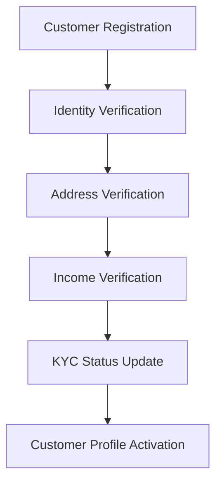
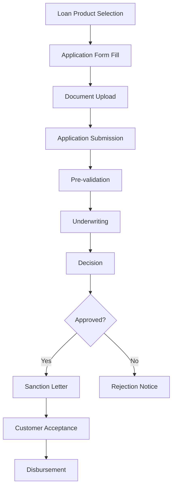
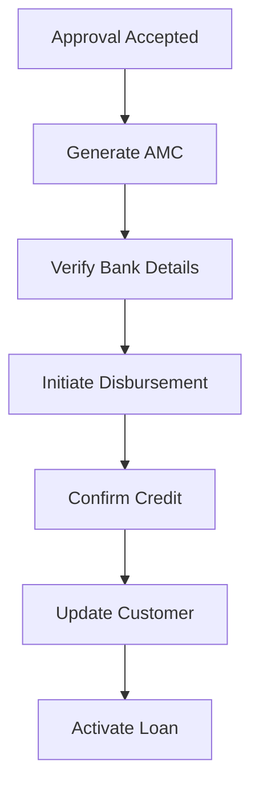
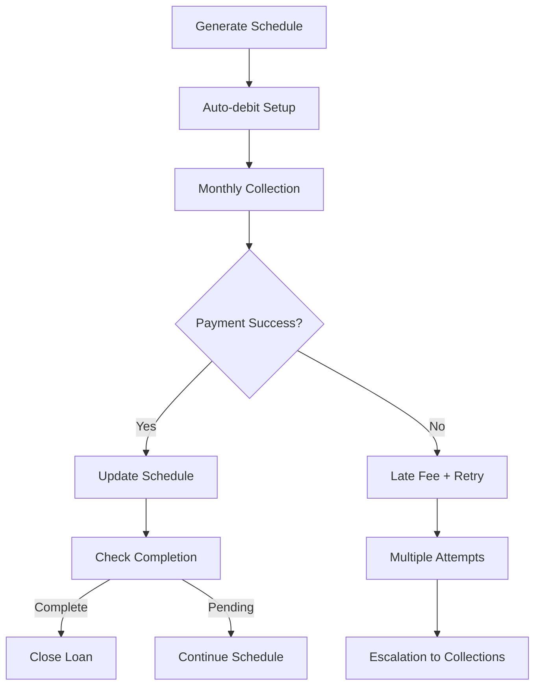
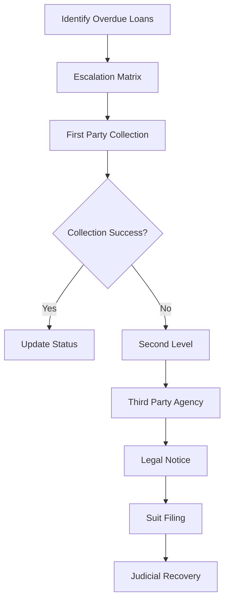

# Personal Loan Business Process Design

## Overview

This document details the complete business process flow for Personal Loan operations within the NBFC SaaS platform. It covers from customer onboarding through loan disposal and includes all regulatory and compliance requirements.

## Table of Contents

1. [Business Process Flow](#business-process-flow)
2. [Personal Loan Specific Features](#personal-loan-specific-features)
3. [Regulatory Compliance](#regulatory-compliance)
4. [Risk Management](#risk-management)
5. [Process Diagrams](#process-diagrams)

---

## Business Process Flow

### 1. Customer Onboarding (KYC)



**Steps:**
1. **Registration** - Customer provides basic details (name, mobile, email, address)
2. **Document Upload** - Aadhaar, PAN, Address Proof, Income Proof
3. **Verification** - Automated + Manual verification
4. **Approval** - KYC status updated to 'verified' or 'rejected'
5. **Profile Completion** - Additional details collected for credit assessment

### 2. Loan Application Process



### 3. Disbursement Process



### 4. Repayment Process



### 5. Collections Process (NPA Management)



---

## Personal Loan Specific Features

### Eligibility Criteria

| Parameter | Minimum | Maximum |
|-----------|---------|---------|
| Age | 21 years | 60 years |
| Employment | 12 months | - |
| Income | ₹15,000/month | - |
| CIBIL Score | 650 | - |
| Loan Amount | ₹50,000 | ₹1,500,000 |
| Tenure | 6 months | 60 months |

### Document Requirements

| Document Type | Description | Verification |
|---------------|-------------|--------------|
| ID Proof | Aadhaar/PAN/Passport | OCR + Manual |
| Address Proof | Utility Bill/Ration Card | OCR + Manual |
| Income Proof | Salary Slip/Bank Statement | API + Manual |
| Bank Statement | Last 3 months | API + Manual |

### Processing Workflow

1. **Application Capture**
   - Online or Branch-based
   - Auto-fill from existing customer data

2. **Pre-assessment**
   - Income-to-loan ratio check
   - CIBIL score fetch
   - Document completeness verification

3. **Underwriting**
   - Automated scoring model
   - Manual review for edge cases
   - Sanction recommendation

4. **Disbursement**
   - Direct transfer to bank account
   - Real-time confirmation

---

## Regulatory Compliance

### RBI Regulations Applicable

| Regulation | Requirement | Implementation |
|------------|-------------|----------------|
| Fair Practices Code | Clear disclosure of terms | Sanction letter template |
| Credit Information Report | CIBIL/Experian integration | API integration |
| KYC Norms | Document verification | OCR + Manual process |
| Debt Recovery | SARDI reporting | Automated reporting |
| Data Protection | Encryption at rest/in transit | TLS 1.3, AES-256 |
| NPAR Regulation | NPA identification within 90 days | Daily monitoring |

### Reporting Requirements

| Report | Frequency | Format | Destination |
|--------|-----------|--------|-------------|
| SARDI | Monthly | XLSX | RBI |
| Schedule III | Quarterly | XLSX | RBI |
| NPA Status | Monthly | XLSX | Internal |
| Cash Flow | Monthly | XLSX | Finance |

---

## Risk Management

### Credit Risk Categories

| Score Range | Risk Category | Action |
|-------------|---------------|--------|
| 750-800 | Low Risk | Standard rates |
| 700-749 | Low-Medium | Standard + fees |
| 650-699 | Medium | Higher rates |
| 600-649 | Medium-High | Manual approval |
| <600 | High Risk | Refer to manual underwriting |

### Fraud Detection

| Check | Tool | Threshold |
|-------|------|-----------|
| Document Forgery | OCR + AI | Confidence < 80% |
| Duplicate Application | Customer matching | Mobile/Email match |
| Income Inflation | Bank Statement Analysis | Variance > 20% |
| Address Mismatch | GPS + Photos | GPS not matching address |

---

## Revenue Model

### Fee Structure

| Fee Type | Rate | Waiver Condition |
|----------|------|------------------|
| Processing Fee | 1-4% of loan | Minimum ₹500 |
| Late Payment Fee | 2-3% per month | On overdue amount |
| Prepayment Fee | 2-3% | On reducing balance |
| Foreclosure Fee | 3% | On outstanding |

### Interest Rate Bands

| Customer Type | Base Rate | Spread | Final Rate |
|---------------|-----------|--------|------------|
| Salaried (Best) | 12.00% | -0.50% | 11.50% |
| Salaried (Standard) | 12.00% | +0.50% | 12.50% |
| Self-Employed | 12.50% | +1.00% | 13.50% |
| Co-applicant | 12.00% | Varies | Per evaluation |

---

## SLA Commitments

| Process | SLA | Measurement |
|---------|-----|-------------|
| Application Acknowledgment | 1 hour | Email/SMS |
| Document Verification | 24 hours | Auto + Manual |
| Pre-assessment | 2 hours | System check |
| Sanction Letter | 4 hours | Email delivery |
| Disbursement | 2 hours after acceptance | Bank transfer |
| Customer Support Response | 4 hours | Ticket resolution |

---

## Appendices

### Personal Loan Product Configuration

```yaml
product_id: personal
name: Personal Loan
description: Unsecured personal loan for life goals
interest_type: reducing_balance
min_amount: 50000
max_amount: 1500000
min_tenure: 6
max_tenure: 60
eligibility:
  min_age: 21
  max_age: 60
  min_income: 15000
  min_cibil: 650
features:
  - Instant approval
  - No collateral required
  - Flexible repayment
  - Transferable
```

### Status Transitions

```
draft → submitted → under_review → [approved|rejected]
approved → disbursed → active → [closed|npa]
npa → [recovered|written_off]
```