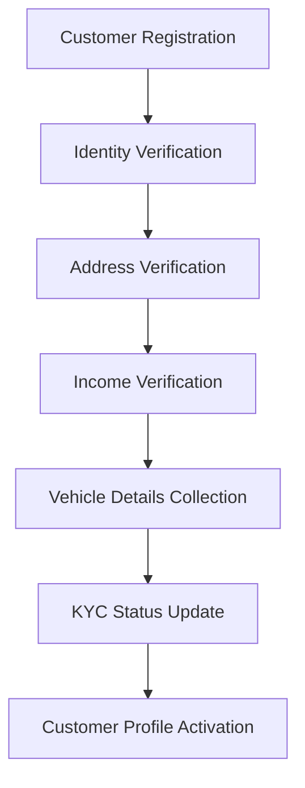
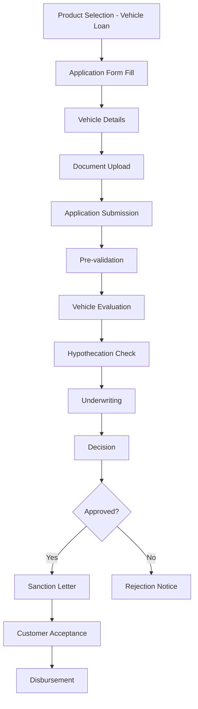
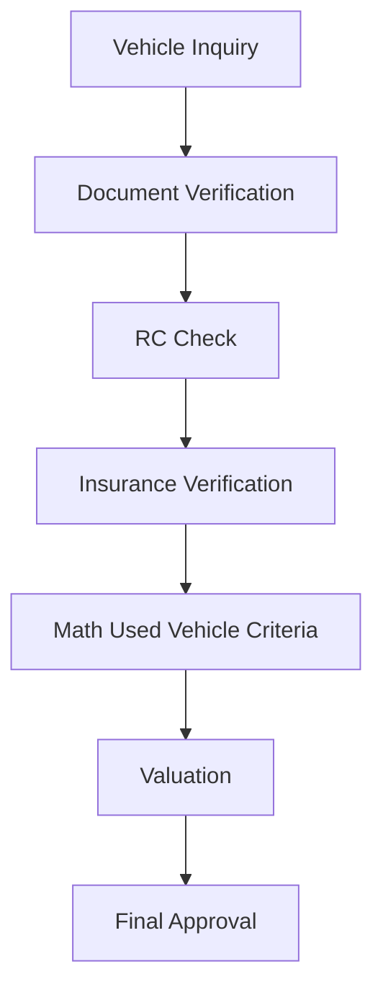
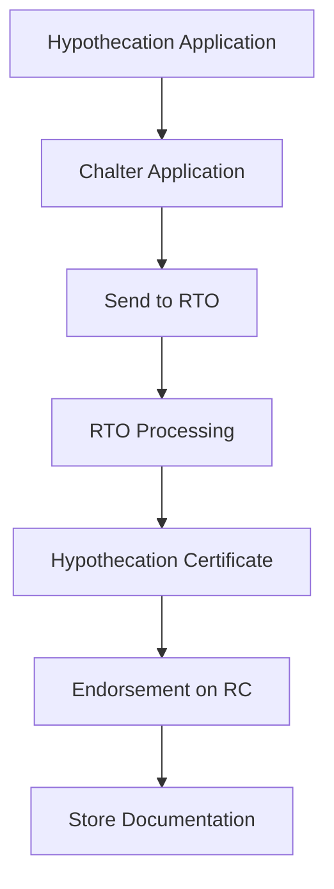
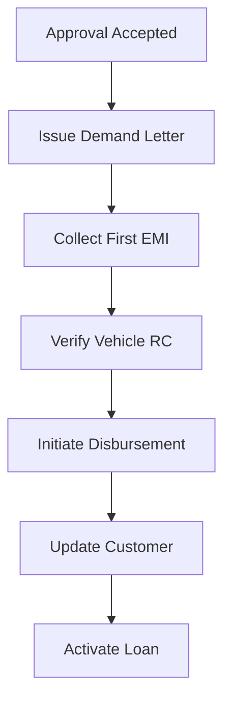
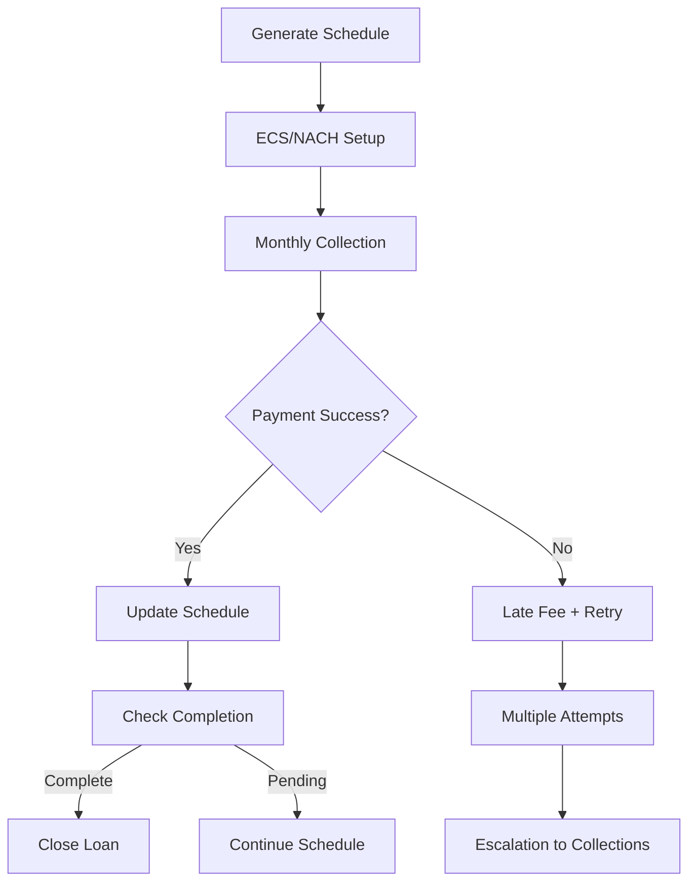
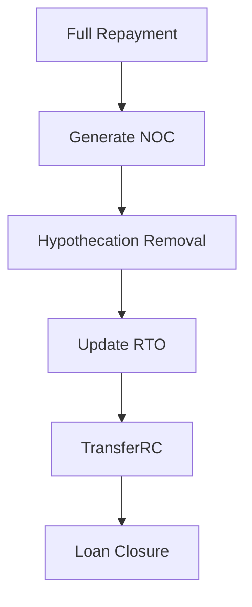

# Vehicle Loan Business Process Design

## Overview

This document details the complete business process flow for Vehicle Loan operations within the NBFC SaaS platform. Vehicle loans are secured loans against automobiles, requiring detailed vehicle evaluation and hypothecation registration.

## Table of Contents

1. [Business Process Flow](#business-process-flow)
2. [Vehicle Loan Specific Features](#vehicle-loan-specific-features)
3. [Vehicle Evaluation Process](#vehicle-evaluation-process)
4. [Regulatory Compliance](#regulatory-compliance)
5. [Risk Management](#risk-management)
6. [Process Diagrams](#process-diagrams)

---

## Business Process Flow

### 1. Customer Onboarding (KYC)



**Steps:**
1. **Registration** - Customer provides basic details (name, mobile, email, address)
2. **Document Upload** - Aadhaar, PAN, Address Proof, Income Proof
3. **Verification** - Automated + Manual verification
4. **Vehicle Details** - Vehicle type, make, model, year, estimated value
5. **Approval** - KYC status updated to 'verified' or 'rejected'
6. **Profile Completion** - Additional details for vehicle loan assessment

### 2. Loan Application Process



### 3. Vehicle Evaluation Process



### 4. Hypothecation Process



### 5. Disbursement Process



### 6. Repayment Process



### 7. Vehicle Transfer on Closure



---

## Vehicle Loan Specific Features

### Eligibility Criteria

| Parameter | Minimum | Maximum |
|-----------|---------|---------|
| Age | 21 years | 65 years |
| Employment | 12 months | - |
| Annual Income | ₹1,80,000 | - |
| CIBIL Score | 650 | - |
| Loan Amount | ₹50,000 | ₹5,00,00,000 |
| Tenure | 6 months | 60 months |
| Vehicle Age | New | 15 years (used) |

### Vehicle Requirements

| Requirement | Details |
|-------------|---------|
| Vehicle Type | 2W, 3W, 4W (Cars, Bikes, Commercial) |
| Manufacturing Year | Not older than 15 years |
| Ownership | Maximum 2nd owner for used vehicles |
| RC Status | No loan encumbrance |
| Insurance | Comprehensive insurance mandatory |
| Hypothecation | Must be registered |

### Document Requirements

| Document Type | Description | Verification |
|---------------|-------------|--------------|
| ID Proof | Aadhaar/PAN/Passport | OCR + Manual |
| Address Proof | Utility Bill/Ration Card | OCR + Manual |
| Income Proof | Salary Slip/Bank Statement | API + Manual |
| Vehicle RC | Registration Certificate | Database Check |
| Insurance | Policy Document | API Verification |
| PUC | Pollution Certificate | Physical Check |
| Road Tax | Receipt | Physical Check |

### Processing Workflow

1. **Application Capture**
   - Online or Branch-based
   - Auto-fill from existing customer data

2. **Vehicle Verification**
   - RC number validation
   - Insurance policy check
   - PUC certificate verification

3. **Hypothecation Registration**
   - Chalter application preparation
   - RTO submission
   - Certificate receipt

4. **Underwriting**
   - Vehicle value vs loan amount analysis
   - Debt-to-income ratio check
   - Sanction recommendation

5. **Disbursement**
   - Direct transfer to dealer account (new vehicle)
   - Direct transfer to customer account (used vehicle)
   - Insurance policy verification

---

## Vehicle Evaluation Process

### Valuation Methods

| Method | Description | Timeline |
|--------|-------------|----------|
| Retail Price | Manufacturer MRP ± depreciation | Immediate |
| Wholesale Price | Dealer buying price | 1 day |
| Market Price | OLX/OLX comparison | 1 day |
| Condition Assessment | Running condition check | 1 day |

### Depreciation Matrix

| Vehicle Age | Depreciation % |
|-------------|----------------|
| 0-1 years | 15% |
| 1-2 years | 25% |
| 2-3 years | 35% |
| 3-5 years | 45% |
| 5-10 years | 60% |
| 10+ years | 70% |

### Evaluator Roles

| Role | Responsibilities |
|------|-------------------|
| Sales Officer | Vehicle details collection |
| Finance Executive | Valuation and depreciation |
| Legal Officer | Hypothecation verification |
| Committee Head | Final approval |

---

## Regulatory Compliance

### RBI Regulations Applicable

| Regulation | Requirement | Implementation |
|------------|-------------|----------------|
| Fair Practices Code | Clear disclosure of terms | Sanction letter template |
| Credit Information Report | CIBIL/Experian integration | API integration |
| KYC Norms | Document verification | OCR + Manual process |
| Hypothecation | Registration mandatory | RTO integration |
| Debt Recovery | SARDI reporting | Automated reporting |
| Data Protection | Encryption at rest/in transit | TLS 1.3, AES-256 |
| NPAR Regulation | NPA identification within 90 days | Daily monitoring |

### Reporting Requirements

| Report | Frequency | Format | Destination |
|--------|-----------|--------|-------------|
| SARDI | Monthly | XLSX | RBI |
| Schedule III | Quarterly | XLSX | RBI |
| Hypothecation Summary | Monthly | XLSX | Legal Team |
| NPA Status | Monthly | XLSX | Internal |

---

## Risk Management

### Credit Risk Categories

| Score Range | Risk Category | Action |
|-------------|---------------|--------|
| 750-800 | Low Risk | Standard rates |
| 700-749 | Low-Medium | Standard + fees |
| 650-699 | Medium | Higher rates |
| 600-649 | Medium-High | Manual approval |
| <600 | High Risk | Refer to manual underwriting |

### Vehicle Risk Factors

| Factor | Impact | Mitigation |
|--------|--------|------------|
| Vehicle Age | Depreciation risk | Age-based LTV adjustment |
| Market Volatility | Recovery risk | Location preference |
| Theft Risk | Security risk | Insurance mandatory |
| Accident Risk | Repair cost | Warranty coverage |

### Fraud Detection

| Check | Tool | Threshold |
|-------|------|-----------|
| Document Forgery | OCR + AI | Confidence < 80% |
| Vehicle Duplication | RC check | Unique chassis number |
| Income Inflation | Bank Statement Analysis | Variance > 20% |
| Odometer Tampering | Inspection report | Mileage variance |

---

## Revenue Model

### Fee Structure

| Fee Type | Rate | Waiver Condition |
|----------|------|------------------|
| Processing Fee | 1-2% of loan | Minimum ₹1000 |
| Hypothecation Fee | Fixed | ₹1000-2000 |
| Insurance Fee | 0.25-0.50% | Annual |
| Late Payment Fee | 2-3% per month | On overdue amount |
| Prepayment Fee | 2-3% | On reducing balance |
| Foreclosure Fee | 3% | On outstanding |

### Interest Rate Bands

| Customer Type | Base Rate | Spread | Final Rate |
|---------------|-----------|--------|------------|
| Salaried (Best) | 9.50% | -0.50% | 9.00% |
| Salaried (Standard) | 9.50% | +0.50% | 10.00% |
| Self-Employed | 10.00% | +1.00% | 11.00% |
| Co-applicant | 9.50% | Varies | Per evaluation |

---

## SLA Commitments

| Process | SLA | Measurement |
|---------|-----|-------------|
| Application Acknowledgment | 1 hour | Email/SMS |
| Document Verification | 24 hours | Auto + Manual |
| Vehicle Evaluation | 24 hours | Field officer |
| Hypothecation | 48 hours | RTO processing |
| Sanction Letter | 24 hours | Email delivery |
| Disbursement | 2 hours after acceptance | Bank transfer |

---

## Appendices

### Vehicle Loan Product Configuration

```yaml
product_id: vehicle_loan
name: Vehicle Loan
description: Secured loan against automobile
interest_type: reducing_balance
min_amount: 50000
max_amount: 5000000
min_tenure: 6
max_tenure: 60
eligibility:
  min_age: 21
  max_age: 65
  min_income: 180000
  min_cibil: 650
  max_vehicle_age: 15
features:
  - Fast processing
  - Low documentation
  - Flexible tenure
  - Hypothecation assistance
hypothecation_required: true
insurance_required: true
```

### Status Transitions

```
draft → submitted → under_review → [approved|rejected]
approved → legal_verification → property_evaluation → disbursed → active → [closed|npa]
npa → [recovered|written_off]
```

### LTV Calculation Matrix

| Vehicle Type | Product Value | Loan Amount | LTV % |
|--------------|---------------|-------------|-------|
| New 2W | Up to ₹2L | Up to ₹1.6L | 80% |
| Used 2W | Up to ₹1.5L | Up to ₹1.12L | 75% |
| New 4W | Up to ₹15L | Up to ₹12L | 80% |
| Used 4W | Up to ₹10L | Up to ₹7.5L | 75% |
| Commercial | Up to ₹20L | Up to ₹15L | 75% |