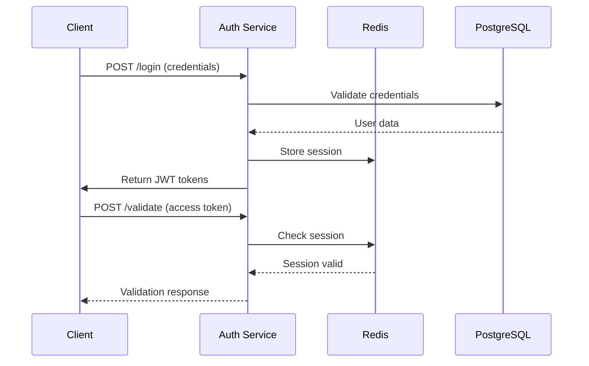

# Auth Service Design

## Service Overview

The Authentication Service is the cornerstone of the NBFC SaaS platform's security infrastructure. It handles all authentication, authorization, and session management operations.

## Technology Stack

| Component | Technology |
|-----------|------------|
| Runtime | Node.js 20 LTS |
| Framework | Express.js |
| Database | PostgreSQL (metadata) |
| Cache | Redis (sessions) |
| Token | JWT (Access & Refresh) |
| Encryption | bcrypt, AES-256 |

## API Endpoints

### Authentication Endpoints

| Method | Path | Description | Access |
|--------|------|-------------|--------|
| POST | `/api/v1/auth/login` | User login | Public |
| POST | `/api/v1/auth/logout` | User logout | Authenticated |
| POST | `/api/v1/auth/refresh` | Token refresh | Public |
| POST | `/api/v1/auth/forgot-password` | Password reset initiation | Public |
| PUT | `/api/v1/auth/reset-password` | Password reset completion | Public |
| POST | `/api/v1/auth/validate` | Token validation | Authenticated |

### User Management Endpoints

| Method | Path | Description | Access |
|--------|------|-------------|--------|
| GET | `/api/v1/users/me` | Get current user | Authenticated |
| GET | `/api/v1/users/:id` | Get user by ID | Admin+ |
| PUT | `/api/v1/users/me` | Update profile | Authenticated |
| PUT | `/api/v1/users/:id/password` | Change password | Admin+ |
| GET | `/api/v1/users` | List users | Admin+ |

## Data Models

### User Entity

```json
{
  "id": "uuid",
  "tenantId": "uuid",
  "employeeId": "string",
  "branchId": "uuid",
  "firstName": "string",
  "lastName": "string",
  "email": "string",
  "phone": "string",
  "passwordHash": "string",
  "role": "enum[customer|field_agent|branch_staff|manager|admin|super_admin]",
  "permissions": ["string"],
  "status": "enum[active|inactive|suspended]",
  "lastLoginAt": "timestamp",
  "createdAt": "timestamp",
  "updatedAt": "timestamp"
}
```

### Session Entity

```json
{
  "id": "uuid",
  "userId": "uuid",
  "tokenId": "string",
  "deviceId": "string",
  "ipAddress": "string",
  "userAgent": "string",
  "expiresAt": "timestamp",
  "createdAt": "timestamp"
}
```

## Authentication Flow



## Token Structure

### Access Token Payload
```json
{
  "sub": "user-id",
  "tenantId": "tenant-id",
  "branchId": "branch-id",
  "role": "user-role",
  "permissions": ["permission1", "permission2"],
  "iat": 1516239022,
  "exp": 1516242622,
  "tokenType": "access"
}
```

### Refresh Token Payload
```json
{
  "sub": "user-id",
  "tokenId": "unique-token-id",
  "iat": 1516239022,
  "exp": 1516257022,
  "tokenType": "refresh"
}
```

## Security Features

### Password Security
- bcrypt hashing with cost factor 12
- Minimum 8 characters, complexity requirements
- Password history (last 5 passwords)
- Account lockout after 5 failed attempts

### Session Management
- Redis-based session storage
- Concurrent session limit (5 per user)
- Device fingerprinting support
- Automatic session cleanup

### Rate Limiting
- Login attempts: 5 per minute per IP
- API calls: 100 per minute per user
- Password reset: 3 per hour per email

## Role-Based Access Control (RBAC)

| Role | Permissions |
|------|-------------|
| **customer** | view_own_profile, view_own_loan, make_payment |
| **field_agent** | view_assigned_customers, update_collection_status, add_payment_receipt |
| **branch_staff** | full_branch_access, process_loan_application, verify_documents |
| **manager** | branch_reports, approve_loan_up_to_10l, manage_branch_users |
| **admin** | system_configuration, user_management, generate_reports |
| **super_admin** | full_system_access, tenant_management, system_settings |

## Error Handling

### Standard Error Response
```json
{
  "error": {
    "code": "INVALID_CREDENTIALS",
    "message": "Invalid username or password",
    "details": null,
    "timestamp": "2026-06-08T09:30:00Z"
  }
}
```

### Error Codes
| Code | HTTP Status | Description |
|------|-------------|-------------|
| INVALID_CREDENTIALS | 401 | Invalid username/password |
| TOKEN_EXPIRED | 401 | JWT token expired |
| TOKEN_INVALID | 401 | JWT token invalid |
| SESSION_EXPIRED | 401 | Session expired |
| ACCESS_DENIED | 403 | Insufficient permissions |
| RATE_LIMITED | 429 | Too many requests |

## Configuration

### Environment Variables
```bash
JWT_SECRET=your-jwt-secret-key
JWT_ACCESS_EXPIRY=15m
JWT_REFRESH_EXPIRY=7d
BCRYPT_SALT_ROUNDS=12
REDIS_URL=redis://localhost:6379
SESSION_EXPIRY=24h
```

## Monitoring & Logging

### Metrics Exposed
- Login success/failure rate
- Token validation latency
- Session creation/termination rate
- Password reset requests

### Log Events
- User login attempts
- Token refresh operations
- Session creation/termination
- Permission violations