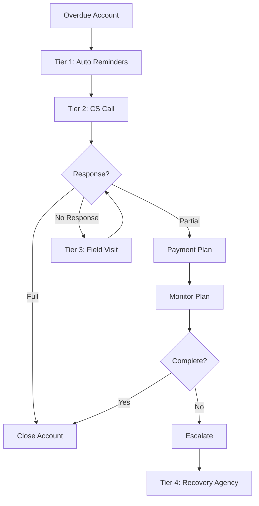

# Collections Service Design

## Service Overview

The Collections Service manages overdue accounts, recovery processes, NPA management, and payment collection operations. It implements tiered collections and integrates with legal processes for recovery.

## Technology Stack

| Component | Technology |
|-----------|------------|
| Runtime | Node.js 20 LTS |
| Framework | Express.js |
| Database | PostgreSQL |
| Messaging | Apache Kafka |
| Search | Elasticsearch |

## API Endpoints

### Collections Management

| Method | Path | Description | Access |
|--------|------|-------------|--------|
| GET | `/api/v1/collections/overdue` | List overdue accounts | Collections Team |
| GET | `/api/v1/collections/:id` | Get collection details | Collections Team |
| POST | `/api/v1/collections/tasks` | Create collection task | System |
| PUT | `/api/v1/collections/:id/payment` | Record payment | Collections Team |
| POST | `/api/v1/collections/:id/escalate` | Escalate collection | Manager |

### NPA Management

| Method | Path | Description | Access |
|--------|------|-------------|--------|
| GET | `/api/v1/npa/accounts` | List NPA accounts | Admin+ |
| POST | `/api/v1/npa/write-off` | Write off account | Admin |
| GET | `/api/v1/npa/reports` | NPA reports | Admin+ |

## Data Models

### Collection Entity
```json
{
  "id": "uuid",
  "accountId": "uuid",
  "customerId": "uuid",
  "assignedTo": "uuid",
  "assignedAt": "timestamp",
  "tier": "number",
  "daysPastDue": "number",
  "outstandingAmount": "number",
  "status": "enum[open|in_progress|partial|closed|escalated]",
  "priorityScore": "number",
  "lastContactedAt": "timestamp",
  "nextActionAt": "timestamp",
  "createdAt": "timestamp",
  "updatedAt": "timestamp"
}
```

### Payment Record Entity
```json
{
  "id": "uuid",
  "collectionId": "uuid",
  "accountId": "uuid",
  "amount": "number",
  "paymentMode": "enum[Cash|Cheque|NEFT|RTGS|UPI|IMPS]",
  "referenceNumber": "string",
  "receivedAt": "timestamp",
  "appliedTo": [
    {
      "installmentId": "uuid",
      "amount": "number"
    }
  ],
  "recordedBy": "uuid",
  "notes": "string"
}
```

### NPA Account Entity
```json
{
  "id": "uuid",
  "accountId": "uuid",
  "writeOffAmount": "number",
  "writeOffDate": "timestamp",
  "reason": "enum[natural|restructuring|legal_recovery]",
  "legalCaseId": "uuid",
  "status": "enum[open|under_legal|recovered|completely_written_off]",
  "provisionAmount": "number",
  "createdAt": "timestamp"
}
```

## Collections Workflow



## Tiered Collections System

### Tier Definition
```yaml
collectionsTier:
  tier1:
    daysPastDue: "1-15"
    action: "Automated SMS/Email"
    team: "System"
    slaHours: 24
    
  tier2:
    daysPastDue: "16-30"
    action: "Customer Service Call"
    team: "CS Team"
    slaHours: 48
    
  tier3:
    daysPastDue: "31-60"
    action: "Field Visit"
    team: "Field Agent"
    slaHours: 72
    
  tier4:
    daysPastDue: "61-90"
    action: "Recovery Agency"
    team: "External"
    slaHours: 168
    
  tier5:
    daysPastDue: "90-120"
    action: "Legal Notice"
    team: "Legal Team"
    slaHours: 168
    
  tier6:
    daysPastDue: "120+"
    action: "Legal Suit"
    team: "Legal Team"
    slaHours: 168
```

## Priority Scoring Algorithm

```javascript
function calculatePriorityScore(collection) {
  let score = 0;
  
  // Age factor
  score += collection.daysPastDue * 10;
  
  // Amount factor
  score += collection.outstandingAmount / 1000;
  
  // Customer history factor
  if (collection.customerHistory === 'repeat_defaulter') {
    score += 100;
  }
  
  // Branch performance factor
  score -= collection.branchSuccessRate;
  
  return Math.max(0, score);
}
```

## Legal Integration

### Legal Case Management
```json
{
  "id": "uuid",
  "caseId": "string",
  "accountIds": ["uuid"],
  "customerId": "uuid",
  "courtName": "string",
  "filingDate": "timestamp",
  "hearingDate": "timestamp",
  "status": "enum[filed|acknowledged|hearing|suspended|disposed]",
  "orderType": "enum[recovery|installation|admission]",
  "judgmentAmount": "number",
  "createdBy": "uuid",
  "createdAt": "timestamp"
}
```

## Integration Events

### Kafka Events Published
- `collection.created` - New collection task
- `collection.payment_received` - Payment recorded
- `collection.escalated` - Escalated to next tier
- `npa.write_off` - Account written off
- `npa.recovered` - NPA recovered

### Kafka Events Consumed
- `loan.disbursed` - Initialize tracking
- `payment.received` - Close account if paid
- `customer.updated` - Priority adjustment

## Reporting

### Standard Reports
| Report | Frequency | Format |
|--------|-----------|--------|
| Daily Collection Report | Daily | PDF |
| NPA Report | Monthly | PDF |
| Recovery Efficiency | Weekly | Excel |
| Branch-wise Collection | Monthly | Excel |

### RBI Compliant Reports
- SARDI (Asset Quality)
- Schedule III (Balance Sheet)
- OCD, CDR, CDR-A (Credit Deposits)

## Configuration

### Environment Variables
```bash
TIER_LEVEL_DEFAULT=1
AUTO_REMINDER_ENABLED=true
REMINDER_CHANNELS=email,sms
LEGAL_NOTICE_THRESHOLD_DAYS=90
```

## SLA Management

### Collection SLAs
| Tier | Response Time | Follow-up Time | Resolution Time |
|------|---------------|----------------|-----------------|
| 1 | 24 hours | 24 hours | 15 days |
| 2 | 48 hours | 24 hours | 30 days |
| 3 | 72 hours | 48 hours | 60 days |
| 4 | 168 hours | 72 hours | 90 days |

## Monitoring & Metrics

### Key Metrics
- Collection efficiency by tier
- Recovery rate
- NPA ratio
- Average resolution time

### Alerts
- High NPA percentage (>5%)
- Collection task backlog
- Legal case delays