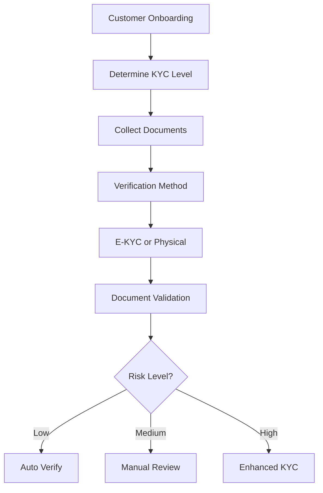

# Compliance Service Design

## Service Overview

The Compliance Service handles KYC/AML compliance, audit trails, regulatory reporting, and all compliance-related operations. It ensures the platform meets RBI and other regulatory requirements.

## Technology Stack

| Component | Technology |
|-----------|------------|
| Runtime | Java 17 |
| Framework | Spring Boot |
| Database | PostgreSQL |
| Search | Elasticsearch |
| Messaging | Apache Kafka |
| Scheduling | Quartz Scheduler |

## API Endpoints

### KYC/AML Operations

| Method | Path | Description | Access |
|--------|------|-------------|--------|
| GET | `/api/v1/compliance/kyc/status` | Get KYC status | Authenticated |
| PUT | `/api/v1/compliance/kyc/review` | Review KYC | Compliance Officer |
| POST | `/api/v1/compliance/aml/screen` | Screen against sanctions | Internal |
| GET | `/api/v1/compliance/aml/results` | Get screening results | Compliance Officer |

### Audit Trail

| Method | Path | Description | Access |
|--------|------|-------------|--------|
| GET | `/api/v1/audit/logs` | Get audit logs | Admin+ |
| GET | `/api/v1/audit/logs/user/:userId` | User activity logs | Admin+ |
| POST | `/api/v1/audit/export` | Export audit data | Admin+ |

## Data Models

### KYC Record Entity
```json
{
  "id": "uuid",
  "customerId": "uuid",
  "status": "enum[pending|in_progress|verified|rejected|expired]",
  "verificationType": "enum[e-kyc|physical|incremental]",
  "verifiedBy": "uuid",
  "verifiedAt": "timestamp",
  "expiryDate": "timestamp",
  "riskCategory": "enum[low|medium|high]",
  " remarks": "string",
  "documents": [
    {
      "type": "string",
      "referenceNumber": "string",
      "verificationStatus": "boolean"
    }
  ],
  "nextReviewDate": "timestamp"
}
```

### AML Screening Entity
```json
{
  "id": "uuid",
  "customerId": "uuid",
  "screeningType": "enum[sanctions|pepper|cibil]",
  "status": "enum[pending|cleared|flagged]",
  "matchedEntities": [
    {
      "name": "string",
      "matchScore": "number",
      "listType": "string"
    }
  ],
  "lastScreenedAt": "timestamp",
  "nextScreeningAt": "timestamp"
}
```

### Audit Log Entity
```json
{
  "id": "uuid",
  "userId": "uuid",
  "entityType": "string",
  "entityId": "string",
  "action": "string",
  "oldValue": "json",
  "newValue": "json",
  "ipAddress": "string",
  "userAgent": "string",
  "timestamp": "timestamp"
}
```

## KYC Compliance Process

### KYC Categories
| Category | Description | frequency |
|----------|-------------|-----------|
| Initial KYC | First-time verification | One-time |
| Incremental KYC | Periodic updates | Annual |
| Enhanced KYC | High-risk customers | Twice yearly |
| On-site Verification | High-value customers | As needed |

### KYC Workflow


## AML Compliance

### Sanctions Screening
```javascript
function screenCustomer(customerData) {
  const checks = [
    {
      name: "UN Sanctions",
      api: "un_sanctions_api",
      fields: ["name", "date_of_birth"]
    },
    {
      name: "EU Sanctions",
      api: "eu_sanctions_api",
      fields: ["name"]
    },
    {
      name: "PEP Screening",
      api: "pep_api",
      fields: ["name"]
    }
  ];
  
  return Promise.all(checks.map(check => runScreening(check, customerData)));
}
```

### Monitoring Rules
| Rule | Trigger | Action |
|------|---------|--------|
| Large Transaction | > ₹10 Lakhs | Report to FinCEN |
| Multiple Small TXNs | > 5 in a day | Flag for review |
| PEP Match | High confidence | Enhanced monitoring |
| Sanctions Match | Any match | Immediate block |

## Audit Trail

### Log Structure
```sql
CREATE TABLE audit_logs (
  id UUID PRIMARY KEY,
  user_id UUID NOT NULL,
  entity_type VARCHAR(50),
  entity_id UUID,
  action VARCHAR(50),
  old_value JSONB,
  new_value JSONB,
  ip_address INET,
  user_agent TEXT,
  created_at TIMESTAMP DEFAULT NOW()
);

CREATE INDEX idx_audit_user_id ON audit_logs(user_id);
CREATE INDEX idx_audit_entity ON audit_logs(entity_type, entity_id);
CREATE INDEX idx_audit_timestamp ON audit_logs(created_at);
```

### Logged Actions
- User login/logout
- Data modifications
- Permission changes
- Report generation
- File uploads/downloads

## Regulatory Reporting

### Monthly Returns
| Return | Description | Submission |
|--------|-------------|------------|
| SARDI | Asset Quality | 15th of month |
| OCD | Credit Deposits | 15th of month |
| CDS | Depositor Services | Quarterly |

### Quarterly Returns
| Return | Description | Submission |
|--------|-------------|------------|
| Schedule III | Balance Sheet | 30th of quarter month |
| Schedule IV | Capital Ratios | 30th of quarter month |

## Transaction Monitoring

### Monitoring Rules
```python
rules = {
    "large_transaction": {
        "condition": "amount > 1000000",
        "action": "report_to_fincen",
        "threshold": 1000000
    },
    "structuring": {
        "condition": "daily_total > 1000000 and count < 3",
        "action": "flag_for_review"
    },
    "velocity_check": {
        "condition": "hourly_count > 10",
        "action": "temporarily_block"
    }
}
```

## Compliance Configuration

### Policy Settings
```yaml
compliancePolicies:
  kyc:
    initialVerification: "e-kyc"
    incrementalReview: "annual"
    highRiskReview: "semi-annual"
    documentsExpiry:
      aadhaar: 60 # months
      pan: 60
      passport: 12
      
  aml:
    sanctionsScreening: "daily"
    pepScreening: "monthly"
    transactionMonitoring: "realtime"
```

## Integration Events

### Kafka Events Consumed
- `customer.created` - Initial KYC trigger
- `payment.received` - Transaction monitoring
- `document.uploaded` - Document verification

### Kafka Events Published
- `kyc.completed` - KYC verification done
- `aml.flagged` - Suspicious activity
- `audit.logged` - Audit entry created

## Reporting

### Compliance Dashboard
```javascript
const complianceDashboard = {
  kycStatus: {
    totalCustomers: "number",
    fullyVerified: "number",
    pendingKYC: "number",
    expiredDocuments: "number"
  },
  amlMetrics: {
    screenedToday: "number",
    matchesFound: "number",
    reportsFiled: "number"
  },
  auditMetrics: {
    logsGenerated: "number",
    anomaliesDetected: "number"
  }
};
```

## Configuration

### Environment Variables
```bash
KYC_REVIEW_DAYS=30
AML_SCREENING_SCHEDULE=daily
AUDIT_LOG_RETENTION_DAYS=365
REPORT_SIGNATURE_ENABLED=true
```

## Monitoring & Alerts

### Key Metrics
- KYC completion rate
- AML false positive rate
- Audit log volume
- Regulatory deadline compliance

### Alerts
- KYC deadline breach
- High AML match score
- Audit log anomalies
- Failed regulatory filing