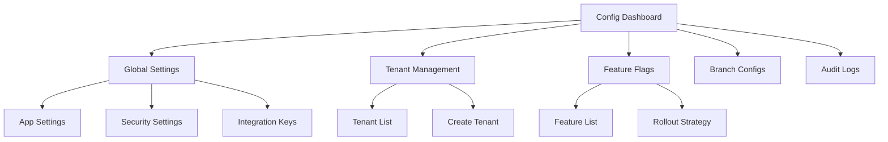

# Config Service Design

## Service Overview

The Config Service provides centralized configuration management, feature flags, and tenant-specific settings for the NBFC SaaS platform.

## Technology Stack

| Component | Technology |
|-----------|------------|
| Runtime | Node.js 20 LTS |
| Framework | Express.js |
| Database | PostgreSQL |
| Cache | Redis |
| Config Source | YAML/JSON files |

## API Endpoints

### Configuration Endpoints

| Method | Path | Description | Access |
|--------|------|-------------|--------|
| GET | `/api/v1/config` | Get all configs for tenant | Admin+ |
| GET | `/api/v1/config/:key` | Get specific config | Admin+ |
| PUT | `/api/v1/config/:key` | Update config | Admin+ |
| DELETE | `/api/v1/config/:key` | Delete config | Admin+ |
| POST | `/api/v1/config/batch` | Batch update configs | Admin+ |

### Feature Flag Endpoints

| Method | Path | Description | Access |
|--------|------|-------------|--------|
| GET | `/api/v1/features` | List all features | Admin+ |
| GET | `/api/v1/features/:key` | Get feature status | Admin+ |
| PUT | `/api/v1/features/:key` | Toggle feature | Admin+ |
| POST | `/api/v1/features/targeting` | Add feature targeting | Admin+ |

## Data Models

### Configuration Entity
```json
{
  "id": "uuid",
  "key": "string",
  "value": "json",
  "category": "enum[general|payment|loan|collections|reporting]",
  "scope": "enum[global|tenant|branch]",
  "scopeId": "uuid",
  "description": "string",
  "isSensitive": "boolean",
  "version": "number",
  "createdBy": "uuid",
  "updatedBy": "uuid",
  "createdAt": "timestamp",
  "updatedAt": "timestamp"
}
```

### Feature Flag Entity
```json
{
  "id": "uuid",
  "key": "string",
  "name": "string",
  "description": "string",
  "isEnabled": "boolean",
  "targeting": {
    "tenants": ["uuid"],
    "branches": ["uuid"],
    "roles": ["role"]
  },
  "createdAt": "timestamp",
  "updatedAt": "timestamp"
}
```

## Configuration Categories

### General Settings
```yaml
app:
  name: "NBFC SaaS Platform"
  version: "1.0.0"
  timezone: "Asia/Kolkata"
  currency: "INR"

pagination:
  defaultSize: 20
  maxSize: 100
```

### Payment Configuration
```yaml
payment:
  providers:
    - name: "razorpay"
      isEnabled: true
      priority: 1
    - name: "stripe"
      isEnabled: false
      priority: 2
  webhookSecret: "secret"
  maxAmount: 5000000
```

### Loan Configuration
```yaml
loan:
  personal:
    minAmount: 10000
    maxAmount: 500000
    minTenure: 6
    maxTenure: 60
    interestRate: 12.5
  home:
    minAmount: 500000
    maxAmount: 5000000
    minTenure: 12
    maxTenure: 240
    interestRate: 9.5
```

### Collections Configuration
```yaml
collections:
  autoTriggerDays: 15
  escalationLevels: 6
  reminderSchedule:
    - day: 1
      channel: "sms"
    - day: 3
      channel: "email"
```

## Feature Flags

| Key | Description | Default |
|-----|-------------|---------|
| `customer_portal` | Enable customer portal access | true |
| `auto_disbursement` | Enable automatic loan disbursement | true |
| `ocr_verification` | Enable OCR document verification | true |
| `advance_payment` | Allow advance loan payments | true |
| `mobile_app` | Enable mobile app features | true |
| `chat_support` | Enable 24/7 chat support | false |

## Caching Strategy

### Cache Keys
```
config:global:{key}
config:tenant:{tenantId}:{key}
config:branch:{branchId}:{key}
feature:{key}
feature:tenant:{tenantId}:{key}
```

### TTL Settings
- Global configs: 1 hour
- Tenant configs: 30 minutes
- Branch configs: 15 minutes
- Features: 5 minutes

## Tenant-Specific Configuration

### Branch Configuration Example
```json
{
  "branchId": "uuid",
  "code": "BR001",
  "name": "Delhi Branch",
  "address": {
    "street": "123 Main Road",
    "city": "New Delhi",
    "state": "Delhi",
    "pincode": "110001"
  },
  "workingHours": {
    "open": "09:00",
    "close": "18:00"
  },
  "staffCount": 25,
  "targetDailyDisbursement": 5000000
}
```

## Admin UI Mockup



## Deployment Configuration

### Kubernetes ConfigMap
```yaml
apiVersion: v1
kind: ConfigMap
metadata:
  name: config-service-config
data:
  NODE_ENV: "production"
  CACHE_TTL: "300"
  CONFIG_VERSION: "1.0"
```

## Health Check Endpoints

| Endpoint | Description |
|----------|-------------|
| GET `/health` | Basic health check |
| GET `/health/alive` | Liveness probe |
| GET `/health/ready` | Readiness probe |

## Performance Requirements

- Response time: < 50ms for cached config
- Response time: < 200ms for database config
- Cache hit ratio: > 95%
- Config update propagation: < 1 second