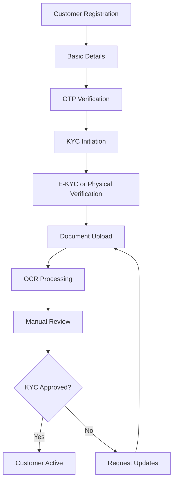

# Customer Service Design

## Service Overview

The Customer Service manages all customer-related operations including onboarding, KYC verification, profile management, and customer lifecycle operations.

## Technology Stack

| Component | Technology |
|-----------|------------|
| Runtime | Node.js 20 LTS |
| Framework | Express.js |
| Database | PostgreSQL |
| Search | Elasticsearch |
| Storage | AWS S3 (documents) |
| Messaging | Apache Kafka |

## API Endpoints

### Customer Management

| Method | Path | Description | Access |
|--------|------|-------------|--------|
| POST | `/api/v1/customers` | Create customer | Branch Staff+ |
| GET | `/api/v1/customers` | List customers | Branch Staff+ |
| GET | `/api/v1/customers/:id` | Get customer details | Branch Staff+ |
| PUT | `/api/v1/customers/:id` | Update customer | Branch Staff+ |
| DELETE | `/api/v1/customers/:id` | Delete customer | Admin+ |

### KYC Operations

| Method | Path | Description | Access |
|--------|------|-------------|--------|
| POST | `/api/v1/customers/:id/kyc` | Initiate KYC | Branch Staff+ |
| PUT | `/api/v1/customers/:id/kyc/documents` | Upload documents | Branch Staff+ |
| POST | `/api/v1/customers/:id/kyc/verify` | Verify KYC | Branch Staff+ |
| GET | `/api/v1/customers/:id/kyc/status` | Get KYC status | Branch Staff+ |

### Customer Search

| Method | Path | Description | Access |
|--------|------|-------------|--------|
| POST | `/api/v1/customers/search` | Search customers | Branch Staff+ |
| GET | `/api/v1/customers/:id/history` | Customer history | Branch Staff+ |

## Data Models

### Customer Entity
```json
{
  "id": "uuid",
  "customerId": "string",
  "tenantId": "uuid",
  "branchId": "uuid",
  "firstName": "string",
  "lastName": "string",
  "middleName": "string",
  "dateOfBirth": "date",
  "gender": "enum[male|female|other]",
  "maritalStatus": "enum[single|married|widowed|separated]",
  "email": "string",
  "phone": "string",
  "alternatePhone": "string",
  "address": {
    "addressLine1": "string",
    "addressLine2": "string",
    "city": "string",
    "state": "string",
    "country": "string",
    "pincode": "string"
  },
  "kycStatus": "enum[pending|in_progress|verified|rejected]",
  "status": "enum[active|inactive|blacklisted]",
  "source": "enum[direct|referral|online|branch]",
  "referralId": "uuid",
  "createdAt": "timestamp",
  "updatedAt": "timestamp"
}
```

### KYC Profile Entity
```json
{
  "id": "uuid",
  "customerId": "uuid",
  "panNumber": "string",
  "aadhaarNumber": "string",
  "passportNumber": "string",
  "voterId": "string",
  "documents": [
    {
      "type": "enum[aadhaar|pan|passport|driving_license]",
      "number": "string",
      "issuedBy": "string",
      "issuedAt": "date",
      "expiresAt": "date",
      "verifiedAt": "timestamp",
      "verifiedBy": "uuid"
    }
  ],
  "incomes": [
    {
      "type": "enum[salary|business|rental|other]",
      "annualIncome": "number",
      "documents": ["document_ids"]
    }
  ],
  "riskScore": "number",
  "cibilScore": "number",
  "verificationNotes": "string",
  "verifiedAt": "timestamp",
  "verifiedBy": "uuid",
  "createdAt": "timestamp"
}
```

## Customer Onboarding Flow



## Services Integration

### Kafka Events Published
- `customer.created` - New customer registered
- `customer.kyc.updated` - KYC status changed
- `customer.document.added` - New document uploaded
- `customer.updated` - Customer profile updated

### Kafka Events Consumed
- `loan.applied` - For customer loan tracking
- `payment.received` - For customer financial history

## Document Management

### Supported Document Types
| Type | Verification Method | Retention |
|------|---------------------|-----------|
| Aadhaar Card | OCR + Manual | 7 years |
| PAN Card | OCR + Manual | 7 years |
| Passport | OCR + Manual | 10 years |
| Driving License | OCR + Manual | 10 years |
| Address Proof | Manual | 3 years |
| Income Proof | Manual | 7 years |

### Storage Structure
```
s3://nbfc-documents/
  ├── customers/
  │   ├── {customerId}/
  │   │   ├── kyc/
  │   │   │   ├── aadhaar_front.jpg
  │   │   │   ├── aadhaar_back.jpg
  │   │   │   └── pan.jpg
  │   │   └── income_proof/
  │   │       └── salary_slip.pdf
  └── temp/
      └── {uploadId}/
```

## Security Features

### PII Handling
- AES-256 encryption for stored documents
- Masked logging of sensitive data
- Access control based on role and branch
- Audit trail for all PII access

### Data Retention Policy
- Active customer data: Permanent
- Inactive customer data: 7 years after last activity
- Document data: As per regulatory requirements
- Audit logs: 10 years

## Validation Rules

### Customer Creation
```javascript
const validations = {
  email: {
    required: true,
    format: 'email',
    unique: true
  },
  phone: {
    required: true,
    format: 'mobile_india',
    unique: true
  },
  dateOfBirth: {
    required: true,
    minAge: 18,
    maxAge: 100
  },
  panNumber: {
    required: true,
    format: 'pan_india',
    unique: true
  }
};
```

## Search & Filtering

### Elasticsearch Index Schema
```json
{
  "properties": {
    "customerId": { "type": "keyword" },
    "name": { "type": "text" },
    "phone": { "type": "keyword" },
    "email": { "type": "keyword" },
    "branchId": { "type": "keyword" },
    "kycStatus": { "type": "keyword" },
    "status": { "type": "keyword" },
    "createdAt": { "type": "date" }
  }
}
```

## Error Handling

### Standard Error Responses
```json
{
  "error": {
    "code": "CUSTOMER_NOT_FOUND",
    "message": "Customer not found",
    "details": { "customerId": "123" }
  }
}
```

## Configuration

### Environment Variables
```bash
S3_BUCKET_NAME=nbfc-documents
S3_REGION=ap-south-1
ELASTICSEARCH_URL=http://elasticsearch:9200
KAFKA_BROKERS=kafka:9092
```

## Monitoring & Metrics

### Key Metrics
- Customer creation rate
- KYC verification time
- Document upload success rate
- Search response time

### Alerts
- High KYC rejection rate (>10%)
- Document processing failures
- Elasticsearch cluster health
- S3 bucket access errors