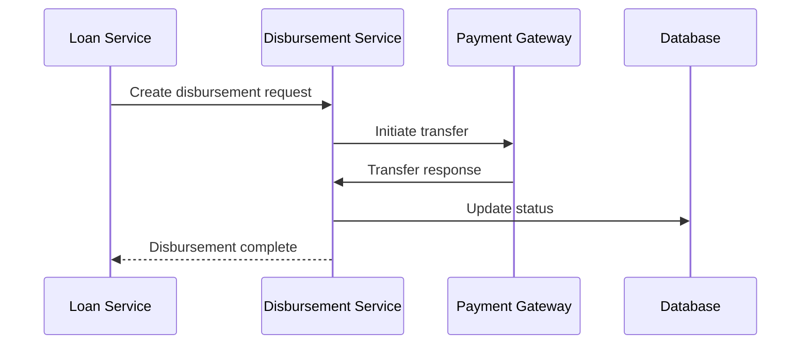
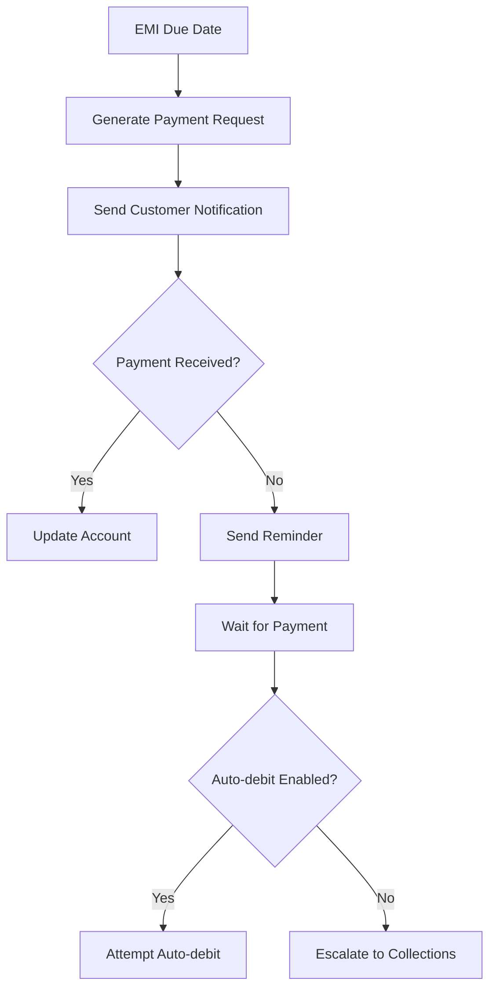
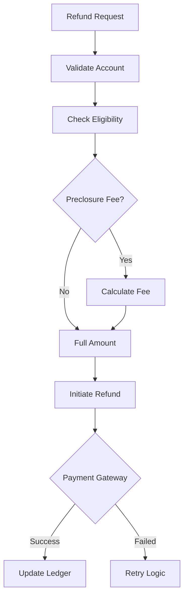

# Disbursement Service Design

## Service Overview

The Disbursement Service handles fund transfer operations, payment gateway integration, and loan disbursement coordination. It supports multiple payment providers and ensures secure, compliant transactions.

## Technology Stack

| Component | Technology |
|-----------|------------|
| Runtime | Node.js 20 LTS |
| Framework | Express.js |
| Database | PostgreSQL |
| Payment Providers | Stripe, Razorpay, Paytm |
| Messaging | Apache Kafka |
| Queue | Bull/BullMQ |

## API Endpoints

### Disbursement Operations

| Method | Path | Description | Access |
|--------|------|-------------|--------|
| POST | `/api/v1/disbursements` | Initiate disbursement | Loan Service |
| GET | `/api/v1/disbursements/:id` | Get disbursement status | Loan Service |
| PUT | `/api/v1/disbursements/:id/confirm` | Confirm disbursement | Admin |
| POST | `/api/v1/disbursements/bank-verify` | Verify bank details | Internal |
| GET | `/api/v1/disbursements/providers` | List providers | Admin |

### Payment Management

| Method | Path | Description | Access |
|--------|------|-------------|--------|
| POST | `/api/v1/payments` | Process payment | Customer |
| GET | `/api/v1/payments/:id` | Get payment details | Authenticated |
| GET | `/api/v1/payments/history` | Payment history | Customer |

## Data Models

### Disbursement Entity
```json
{
  "id": "uuid",
  "disbursementId": "string",
  "accountId": "uuid",
  "applicationId": "uuid",
  "customerId": "uuid",
  "amount": "number",
  "currency": "string",
  "status": "enum[pending|processing|completed|failed|cancelled]",
  "provider": "string",
  "transactionId": "string",
  "bankDetails": {
    "accountNumber": "string",
    "ifscCode": "string",
    "accountHolderName": "string"
  },
  "failureReason": "string",
  "scheduledAt": "timestamp",
  "processedAt": "timestamp",
  "createdAt": "timestamp"
}
```

### Payment Entity
```json
{
  "id": "uuid",
  "paymentId": "string",
  "accountId": "uuid",
  "customerId": "uuid",
  "amount": "number",
  "currency": "string",
  "method": "enum[upi|neft|rtgs|imps|card]",
  "status": "enum[pending|processing|completed|failed|refunded]",
  "providerTransactionId": "string",
  "gateway": "string",
  "fees": "number",
  "processedAt": "timestamp",
  "createdAt": "timestamp"
}
```

## Disbursement Flow



## Payment Gateway Integration

### Provider Configuration
```yaml
paymentProviders:
  razorpay:
    keyId: "rzp_live_xxxxxxxxxxxxxx"
    keySecret: "secret"
    webhookSecret: "webhook_secret"
    isEnabled: true
    priority: 1
    
  stripe:
    secretKey: "sk_live_xxxxxxxxxxxxxx"
    publishableKey: "pk_live_xxxxxxxxxxxxxx"
    webhookSecret: "whsec_xxxxxxxxxxxxxx"
    isEnabled: true
    priority: 2
```

### Supported Payment Methods
| Method | description | Average Time |
|--------|-------------|--------------|
| UPI | Unified Payments Interface | Instant |
| NEFT | National Electronic Funds Transfer | 1-2 hours |
| RTGS | Real Time Gross Settlement | Instant |
| IMPS | Immediate Payment Service | Instant |

## Bank Verification

### Account Validation
```javascript
async function verifyBankAccount(accountNumber, ifscCode) {
  // Validate IFSC code format
  if (!validateIFSC(ifscCode)) {
    return { valid: false, reason: "Invalid IFSC" };
  }
  
  // Verify via API
  const response = await paytmBankDetails({
    accountNumber,
    ifscCode
  });
  
  return {
    valid: response.isValid,
    accountHolderName: response.name,
    branch: response.branch
  };
}
```

## EMI Processing

### EMI Collections


## Webhook Handling

### Provider Webhooks
```typescript
// Webhook signature verification
interface WebhookHandler {
  verifySignature(payload: string, signature: string): boolean;
  processEvent(event: WebHookEvent): Promise<void>;
}

interface WebHookEvent {
  id: string;
  type: string;
  data: any;
  createdAt: string;
}
```

### Event Types
| Event | Provider | Description |
|-------|----------|-------------|
| payment.captured | Razorpay | Payment successful |
| payment.failed | Razorpay | Payment failed |
| charge.succeeded | Stripe | Payment successful |
| charge.failed | Stripe | Payment failed |

## Refund Processing

### Refund Workflow


## Security Features

### PCI Compliance
- No card data stored (tokenized)
- TLS 1.3 for all communications
- Regular security audits
- Penetration testing quarterly

### Fraud Prevention
- Velocity checks
- IP monitoring
- Device fingerprinting
- Anomaly detection

## Configuration

### Environment Variables
```bash
PAYMENT_GATEWAY=razorpay
RAZORPAY_KEY_ID=rzp_live_xxxxxxxxxxxxxx
RAZORPAY_KEY_SECRET=xxxxxxxxxxxxxx
STRIPE_SECRET_KEY=sk_live_xxxxxxxxxxxxxx
WEBHOOK_SECRET=whsec_xxxxxxxxxxxxxx
```

## Retry Logic

### Payment Retry Policy
```yaml
retryPolicy:
  maxAttempts: 3
  backoff:
    initialDelay: 5s
    multiplier: 2
    maxDelay: 60s
  conditions:
    - network_error
    - timeout
    - gateway_unavailable
```

## Monitoring & Metrics

### Key Metrics
- Transaction success rate
- Average processing time
- Failed transaction reasons
- Refund processing time

### Alerts
- High failure rate (>5%)
- Gateway downtime
- Refund queue buildup