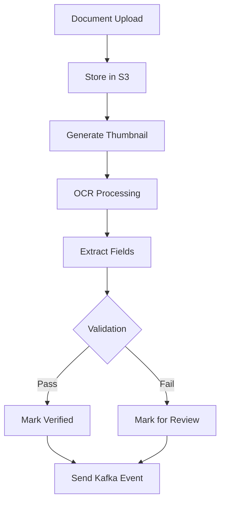

# Document Service Design

## Service Overview

The Document Service manages document storage, processing, OCR extraction, and verification for all customer and loan-related documents. It provides secure, compliant storage with audit trails.

## Technology Stack

| Component | Technology |
|-----------|------------|
| Runtime | Python 3.11 |
| Framework | FastAPI |
| Storage | AWS S3 |
| OCR | Tesseract, Google Vision API |
| Database | PostgreSQL |
| Messaging | Apache Kafka |

## API Endpoints

### Document Management

| Method | Path | Description | Access |
|--------|------|-------------|--------|
| POST | `/api/v1/documents/upload` | Upload document | Authenticated |
| GET | `/api/v1/documents/:id` | Get document | Authenticated |
| DELETE | `/api/v1/documents/:id` | Delete document | Authenticated |
| POST | `/api/v1/documents/verify` | Verify document | Branch Staff+ |

### OCR Processing

| Method | Path | Description | Access |
|--------|------|-------------|--------|
| POST | `/api/v1/documents/ocr` | Extract text from document | Internal |
| POST | `/api/v1/documents/validate` | Validate document format | Internal |

## Data Models

### Document Entity
```json
{
  "id": "uuid",
  "documentId": "string",
  "customerId": "uuid",
  "applicationId": "uuid",
  "accountId": "uuid",
  "type": "enum[aadhaar|pan|passport|driving_license|address_proof|income_proof|property_doc|loan_agreement]",
  "category": "string",
  "fileName": "string",
  "fileSize": "number",
  "mimeType": "string",
  "storagePath": "string",
  "thumbnailPath": "string",
  "status": "enum[uploaded|processing|verified|rejected]",
  "extractedData": "json",
  "verifications": [
    {
      "type": "enum[ocr|manual|api]",
      "result": "enum[pass|fail]",
      "confidence": "number",
      "verifiedBy": "uuid",
      "verifiedAt": "timestamp"
    }
  ],
  "expiresAt": "timestamp",
  "createdAt": "timestamp",
  "updatedAt": "timestamp"
}
```

## Storage Architecture

### S3 Bucket Structure
```
s3://nbfc-documents/
  ├── customers/
  │   ├── {customerId}/
  │   │   ├── kyc/
  │   │   │   ├── {documentId}_front.jpg
  │   │   │   ├── {documentId}_back.jpg
  │   │   │   └── {documentId}_profile.jpg
  │   │   └── income_proof/
  │   │       └── {documentId}.pdf
  ├── applications/
  │   └── {applicationId}/
  │       └── {documentId}.pdf
  ├── temp/
  │   └── {uploadId}/
  │       └── {documentId}.tmp
  └── processed/
      └── {documentId}/
          ├── extracted.json
          └── thumbnail.jpg
```

### Folder Structure
| Folder | Purpose | Retention |
|--------|---------|-----------|
| customers | Customer KYC documents | 7 years |
| applications | Loan application docs | 7 years |
| temp | Temporary uploads | 24 hours |
| processed | OCR-processed docs | 30 days |

## Document Processing Pipeline



## OCR Processing

### Supported Document Types

| Document | Fields Extracted |
|----------|-----------------|
| PAN Card | PAN Number, Name, DOB, Father's Name |
| Aadhaar | Name, DOB, Address, Gender, UID |
| Passport | Passport Number, Name, DOB, Expiry, Nationality |
| Voter ID | EPIC Number, Name, DOB, Constituency |
| Driving License | DL Number, Name, DOB, Expires, Vehicle Class |

### Extraction Process
```python
def extractDocumentData(document_type, file_path):
    # Preprocess image
    processed = preprocess_image(file_path)
    
    # OCR extraction
    text = pytesseract.image_to_string(processed)
    
    # Field-specific extraction
    if document_type == 'pan':
        return extract_pan_fields(text)
    elif document_type == 'aadhaar':
        return extract_aadhaar_fields(text)
    
    return {'raw_text': text}
```

## Security & Compliance

### Access Control
- Role-based access (customer, branch_staff, admin)
- Branch-level data segregation
- Audit trail for all access

### Encryption
- Server-side encryption (SSE-S3)
- Client-side encryption for sensitive docs
- Secure token generation for uploads

### Compliance
- GDPR compliant storage
- RBI KYC/AML guidelines
- Data retention policies
- Regular audit logs

## File Validation

### Supported Formats
| Format | Mime Type | Max Size |
|--------|-----------|----------|
| JPEG | image/jpeg | 10MB |
| PNG | image/png | 10MB |
| PDF | application/pdf | 20MB |
| Aadhaar XML | application/xml | 5MB |

### Validation Rules
```javascript
const validationRules = {
  aadhaar: {
    requiredFields: ['uid', 'name', 'dob'],
    format: 'image',
    maxSize: 10 * 1024 * 1024
  },
  pan: {
    requiredFields: ['pan_number', 'name'],
    format: 'image/pdf',
    maxSize: 5 * 1024 * 1024
  }
};
```

## Integration Events

### Kafka Events Published
- `document.uploaded` - New document added
- `document.verified` - Document verified
- `document.rejected` - Document rejected

### Kafka Events Consumed
- `customer.created` - Initialize customer folder
- `loan.disbursed` - Archive documents

## Error Handling

### Error Responses
```json
{
  "error": {
    "code": "INVALID_DOCUMENT_TYPE",
    "message": "Unsupported document type",
    "details": { "type": "invalid_type" }
  }
}
```

## Configuration

### Environment Variables
```bash
S3_BUCKET_NAME=nbfc-documents
S3_REGION=ap-south-1
S3_ACCESS_KEY=xxxxxxxxxxxxxx
S3_SECRET_KEY=xxxxxxxxxxxxxx
 OCR_PROVIDER=google  # or 'tesseract'
GOOGLE_VISION_API_KEY=xxxxxxxxxxxxxx
```

## Monitoring & Metrics

### Key Metrics
- Upload success rate
- OCR processing time
- Verification accuracy
- Storage utilization

### Alerts
- High failure rate (>2%)
- S3 bucket issues
- OCR processing lag