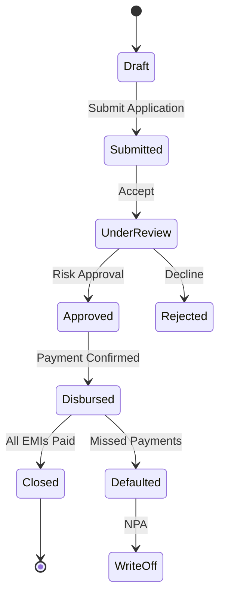

# Loan Service Design

## Service Overview

The Loan Service manages loan products, applications, accounts, and all loan lifecycle operations including application processing, account management, and disbursement coordination.

## Technology Stack

| Component | Technology |
|-----------|------------|
| Runtime | Node.js 20 LTS |
| Framework | Express.js |
| Database | PostgreSQL |
| Messaging | Apache Kafka |
| Cache | Redis |

## API Endpoints

### Loan Product Management

| Method | Path | Description | Access |
|--------|------|-------------|--------|
| POST | `/api/v1/products` | Create loan product | Admin+ |
| GET | `/api/v1/products` | List loan products | Public |
| GET | `/api/v1/products/:id` | Get product details | Public |
| PUT | `/api/v1/products/:id` | Update product | Admin+ |

### Loan Application

| Method | Path | Description | Access |
|--------|------|-------------|--------|
| POST | `/api/v1/applications` | Submit application | Customer |
| GET | `/api/v1/applications` | List applications | Branch Staff+ |
| GET | `/api/v1/applications/:id` | Get application details | Branch Staff+ |
| PUT | `/api/v1/applications/:id/status` | Update status | Branch Staff+ |

### Loan Account

| Method | Path | Description | Access |
|--------|------|-------------|--------|
| GET | `/api/v1/accounts` | List accounts | Branch Staff+ |
| GET | `/api/v1/accounts/:id` | Get account details | Branch Staff+ |
| GET | `/api/v1/accounts/:id/schedule` | Get repayment schedule | Branch Staff+ |
| POST | `/api/v1/accounts/:id/emergency-close` | Emergency closure | Admin |

## Data Models

### Loan Product Entity
```json
{
  "id": "uuid",
  "code": "PERSONAL_LOAN",
  "name": "Personal Loan",
  "description": "Unsecured personal loan for various needs",
  "category": "enum[personal|home|vehicle|gold|msme]",
  "interestRateType": "enum[fixed|floating]",
  "interestRate": "number",
  "minInterestRate": "number",
  "maxInterestRate": "number",
  "minLoanAmount": "number",
  "maxLoanAmount": "number",
  "minTenure": "number",
  "maxTenure": "number",
  "processingFee": "number",
  "processingFeeType": "enum[fixed|percentage]",
  "prepaymentFee": "number",
  "isAvailable": "boolean",
  "eligibilityCriteria": "json",
  "createdAt": "timestamp"
}
```

### Loan Application Entity
```json
{
  "id": "uuid",
  "applicationId": "string",
  "customerId": "uuid",
  "productId": "uuid",
  "tenantId": "uuid",
  "branchId": "uuid",
  "loanAmount": "number",
  "tenure": "number",
  "emi": "number",
  "interestRate": "number",
  "processingFee": "number",
  "totalLoanAmount": "number",
  "status": "enum[draft|submitted|under_review|approved|rejected|disbursed|cancelled]",
  "rejectionReason": "string",
  "documents": [
    {
      "type": "string",
      "url": "string",
      "verified": "boolean"
    }
  ],
  "answers": [
    {
      "questionId": "uuid",
      "answer": "string"
    }
  ],
  "createdAt": "timestamp",
  "updatedAt": "timestamp"
}
```

### Loan Account Entity
```json
{
  "id": "uuid",
  "accountId": "string",
  "applicationId": "uuid",
  "customerId": "uuid",
  "productId": "uuid",
  "disbursementDate": "timestamp",
  "loanAmount": "number",
  "tenure": "number",
  "emi": "number",
  "interestRate": "number",
  "totalInterest": "number",
  "processingFee": "number",
  "totalAmount": "number",
  " startDate": "timestamp",
  "endDate": "timestamp",
  "status": "enum[active|closed|defaulted|write_off]",
  "currentBalance": "number",
  "npaStatus": "enum[regular|rerw|loss]",
  " createdAt": "timestamp"
}
```

### Repayment Schedule Entity
```json
{
  "id": "uuid",
  "accountId": "uuid",
  "installmentNumber": "number",
  "dueDate": "timestamp",
  "principal": "number",
  "interest": "number",
  "totalAmount": "number",
  "paidAmount": "number",
  "status": "enum[pending|partial|paid|missed]",
  "paymentId": "uuid"
}
```

## Loan Lifecycle Flow



## EMI Calculation

### EMI Formula
```
EMI = P * R * (1+R)^N / [(1+R)^N - 1]

Where:
P = Principal Loan Amount
R = Monthly Interest Rate (Annual Rate / 12)
N = Number of Monthly Installments
```

### Example Calculation
```javascript
function calculateEMI(principal, annualRate, tenureMonths) {
  const monthlyRate = annualRate / 12 / 100;
  const emi = principal * monthlyRate * Math.pow(1 + monthlyRate, tenureMonths) / 
              (Math.pow(1 + monthlyRate, tenureMonths) - 1);
  return Math.round(emi);
}
```

## Integration Events

### Kafka Events Published
- `loan.application.submitted` - New loan application
- `loan.approved` - Loan approved
- `loan.disbursed` - Loan disbursed
- `loan.rejected` - Application rejected
- `loan.closed` - Loan fully repaid
- `loan.defaulted` - Loan went into default

### Kafka Events Consumed
- `payment.received` - For updating account status
- `customer.kyc.updated` - For eligibility check
- `disbursement.completed` - For account activation

## Document Requirements by Loan Type

| Loan Type | Required Documents |
|-----------|-------------------|
| Personal | PAN, Aadhaar, Salary Slip, Bank Statement |
| Home | PAN, Aadhaar, Property Documents, NOC, Tax Returns |
| Vehicle | PAN, Aadhaar, RC Book, Insurance, PUC |
| Gold | PAN, Aadhaar, Gold Details, Valuation Report |
| MSME | PAN, Aadhaar, GST Registration, Financial Statements |

## Status Transitions

| From Status | To Status | Allowed By | Notes |
|-------------|-----------|------------|-------|
| Draft | Submitted | Customer | On application submit |
| Submitted | Under Review | System | Auto-assignment |
| Under Review | Approved | Loan Officer | Risk approval |
| Under Review | Rejected | Loan Officer | Provide reason |
| Approved | Disbursed | System | After payment confirmation |
| Disbursed | Closed | System | All EMIs paid |
| Disbursed | Defaulted | System | After grace period |
| Defaulted | Write-off | System | After legal process |

## Risk Checklist

### Personal Loan
- [ ] Income verification
- [ ] Employment stability
- [ ] CIBIL score check
- [ ] Debt-to-income ratio
- [ ] Existing loans status

### Home Loan
- [ ] Property valuation
- [ ] Title verification
- [ ] Encumbrance certificate
- [ ] Age proof

### Vehicle Loan
- [ ] RC book verification
- [ ] Insurance validity
- [ ] Engine/Chassis number
- [ ] Loan against vehicle

## Configuration

### Loan Terms by Type
```yaml
loanTerms:
  personal:
    maxInterestRate: 24
    maxTenure: 60
    minLoanAmount: 10000
    maxLoanAmount: 500000
  home:
    maxInterestRate: 15
    maxTenure: 240
    minLoanAmount: 500000
    maxLoanAmount: 5000000
```

## Error Handling

### Common Errors
| Code | HTTP Status | Description |
|------|-------------|-------------|
| INSUFFICIENTdocuments | 400 | Missing required documents |
| ELIGIBILITY_FAILED | 400 | Customer not eligible |
| PRODUCT_UNAVAILABLE | 404 | Loan product not available |
| APPLICATION_EXPIRED | 410 | Application timed out |