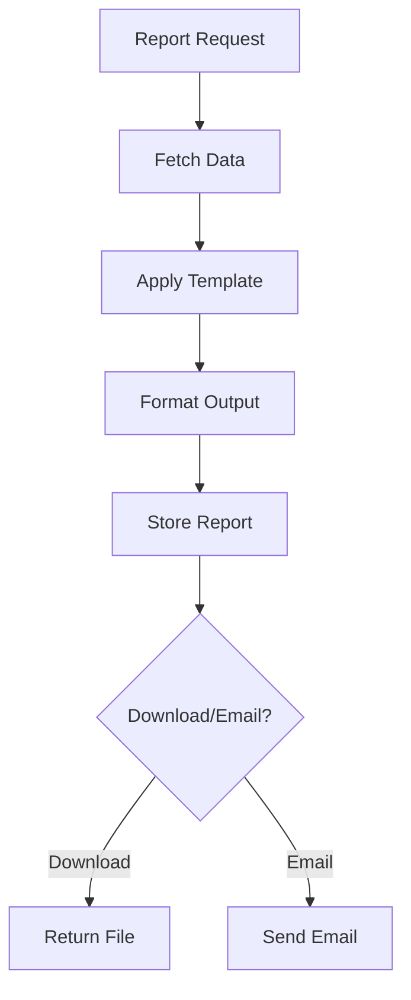

# Reporting Service Design

## Service Overview

The Reporting Service generates internal dashboards, analytics, and RBI-compliant regulatory reports. It aggregates data from multiple services and provides scheduled report generation.

## Technology Stack

| Component | Technology |
|-----------|------------|
| Runtime | Python 3.11 |
| Framework | FastAPI |
| Database | PostgreSQL |
| Analytics | Pandas, NumPy |
| Reporting | Jinja2, WeasyPrint |
| Scheduling | Celery + Redis |

## API Endpoints

### Report Management

| Method | Path | Description | Access |
|--------|------|-------------|--------|
| GET | `/api/v1/reports` | List available reports | Authenticated |
| POST | `/api/v1/reports/generate` | Generate report | Authenticated |
| GET | `/api/v1/reports/:id` | Get report details | Authenticated |
| GET | `/api/v1/reports/:id/download` | Download report | Authenticated |

### Dashboard APIs

| Method | Path | Description | Access |
|--------|------|-------------|--------|
| GET | `/api/v1/dashboards/summary` | Get summary data | Authenticated |
| GET | `/api/v1/dashboards/portfolio` | Portfolio analytics | Authenticated |
| GET | `/api/v1/dashboards/collections` | Collections dashboard | Authenticated |

## Data Models

### Report Template Entity
```json
{
  "id": "uuid",
  "name": "string",
  "type": "enum[rbi|internal|dashboard|custom]",
  "frequency": "enum[realtime|daily|weekly|monthly|quarterly|yearly]",
  "format": "enum[pdf|excel|csv|json]",
  "templatePath": "string",
  "parameters": "json",
  "rbiForm": "string",
  "isActive": "boolean",
  "createdAt": "timestamp"
}
```

### Generated Report Entity
```json
{
  "id": "uuid",
  "templateId": "uuid",
  "generatedBy": "uuid",
  "parameters": "json",
  "filePath": "string",
  "fileSize": "number",
  "status": "enum[generated|failed]",
  "errorMessage": "string",
  "startedAt": "timestamp",
  "completedAt": "timestamp",
  "createdAt": "timestamp"
}
```

## RBI Reports

### Standard Regulatory Forms
| Form | Description | Frequency | Deadline |
|------|-------------|-----------|----------|
| SARDI | Asset Quality | Monthly | 15th |
| Schedule III | Balance Sheet | Quarterly | 30th |
| Schedule IV | Capital Ratios | Quarterly | 30th |
| OCD | Credit Deposits | Monthly | 15th |
| CDR | Central Deposit Registry | Monthly | 15th |
| CDR-A | CDR Annexure | As required | As required |

### SARDI Report Structure
```yaml
sardiReport:
  reportingDate: "date"
  assetClassification:
    standard: 
      amount: "number"
      percentage: "number"
    substandard:
      amount: "number"
      percentage: "number"
    doubtful:
      amount: "number"
      percentage: "number"
    loss:
      amount: "number"
      percentage: "number"
  npaStatistics:
    grossNpa: "number"
    netNpa: "number"
    capitalAdequacyRatio: "number"
```

## Dashboard Definitions

### Summary Dashboard
```javascript
const summaryDashboard = {
  kpi: [
    { name: "Total Customers", value: "number", trend: "percentage" },
    { name: "Active Loans", value: "number", trend: "count" },
    { name: "Portfolio Value", value: "currency", trend: "percentage" },
    { name: "Collection Efficiency", value: "percentage", trend: "percentage" }
  ],
  charts: [
    { type: "line", title: "Loan Disbursement Trend" },
    { type: "bar", title: "Branch-wise Performance" },
    { type: "pie", title: "Loan Type Distribution" }
  ]
};
```

### Portfolio Dashboard
```javascript
const portfolioDashboard = {
  summary: {
    totalSanctioned: "currency",
    totalDisbursed: "currency",
    outstanding: "currency",
    portfolioAtRisk: "currency"
  },
  breakdowns: [
    { by: "branch", data: [] },
    { by: "loan_type", data: [] },
    { by: "risk_grade", data: [] }
  ]
};
```

## Report Generation Flow



## Data Aggregation

### Data Sources
```python
sources = {
    'customers': 'customer-service-db',
    'loans': 'loan-service-db',
    'payments': 'disbursement-service-db',
    'collections': 'collections-service-db',
    'users': 'auth-service-db'
}
```

### Aggregation Pipeline
```python
def generate_portfolio_report(start_date, end_date):
    # Fetch data from all services
    customers = fetch_customers()
    loans = fetch_loans(start_date, end_date)
    payments = fetch_payments(start_date, end_date)
    
    # Calculate metrics
    df = pd.DataFrame(loans)
    summary = {
        'total_sanctioned': df['sanctioned_amount'].sum(),
        'total_disbursed': df[df['status'] == 'disbursed']['disbursed_amount'].sum(),
        'active_loans': len(df[df['status'] == 'active']),
        'avg_interest_rate': df['interest_rate'].mean()
    }
    
    return summary
```

## Scheduled Jobs

### Celery Tasks
```python
@app.task
def generate_monthly_rbi_reports():
    # Generate SARDI, Schedule III, etc.
    pass

@app.task
def send_collection_report():
    # Email collection dashboard to managers
    pass

@app.task
def archive_old_reports():
    # Clean up reports older than 2 years
    pass
```

## Export Formats

### PDF Generation
```python
def generate_pdf(template, data):
    html = render_template(template, data)
    pdf = weasyprint.HTML(string=html).write_pdf()
    return pdf
```

### Excel Export
```python
def generate_excel(data, columns):
    df = pd.DataFrame(data, columns=columns)
    output = BytesIO()
    writer = pd.ExcelWriter(output, engine='openpyxl')
    df.to_excel(writer, index=False)
    return output.getvalue()
```

## Compliance

### RBI Guidelines
- Data retention: 8 years
- Audit trail for all reports
- Digital signature for regulatory reports
- Access logging

### Security
- Row-level security for branch data
- Encryption at rest
- Secure report delivery

## Configuration

### Environment Variables
```bash
REPORT_STORAGE_PATH=/reports
TEMP_STORAGE_PATH=/temp
EMAIL_HOST=smtp.company.com
EMAIL_PORT=587
DEFAULT_RECIPIENTS=reports@company.com
```

## Monitoring & Metrics

### Key Metrics
- Report generation time
- Download frequency
- Export format distribution
- Scheduled job success rate

### Alerts
- Failed report generation
- Long-running jobs
- Storage threshold (>80%)