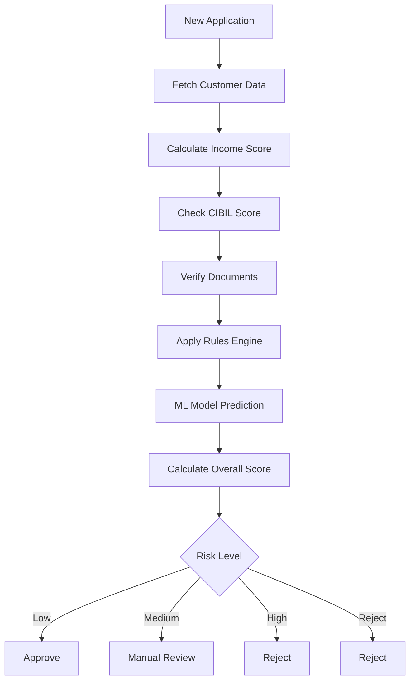
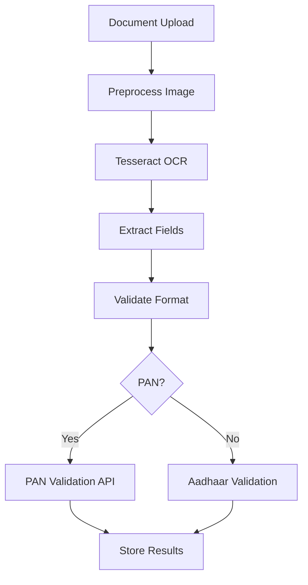

# Underwriting Service Design

## Service Overview

The Underwriting Service handles risk assessment, credit scoring, document verification, and automated decision-making for loan applications. This service combines rule-based engines with machine learning models.

## Technology Stack

| Component | Technology |
|-----------|------------|
| Runtime | Python 3.11 |
| Framework | FastAPI |
| ML Framework | Scikit-learn, TensorFlow |
| Database | PostgreSQL |
| Cache | Redis |
| Messaging | Apache Kafka |
| OCR | Tesseract, Google Vision API |

## API Endpoints

### Underwriting Operations

| Method | Path | Description | Access |
|--------|------|-------------|--------|
| POST | `/api/v1/assessments` | Create underwriting assessment | Loan Service |
| GET | `/api/v1/assessments/:id` | Get assessment details | Loan Service |
| PUT | `/api/v1/assessments/:id/documents` | Verify documents | Branch Staff+ |
| POST | `/api/v1/assessments/:id/decision` | Make decision | Loan Officer+ |
| POST | `/api/v1/assessments/batch` | Batch assessment | Admin |

### Risk Scoring

| Method | Path | Description | Access |
|--------|------|-------------|--------|
| POST | `/api/v1/risk-score` | Calculate risk score | Internal |
| GET | `/api/v1/risk-models` | List risk models | Admin |
| POST | `/api/v1/risk-models` | Create risk model | Admin |

## Data Models

### Underwriting Assessment Entity
```json
{
  "id": "uuid",
  "applicationId": "uuid",
  "customerId": "uuid",
  "productId": "uuid",
  "assessmentType": "enum[auto|manual]",
  "status": "enum[pending|in_progress|completed|rejected]",
  "scores": {
    "incomeScore": "number",
    "employmentScore": "number",
    "cibilScore": "number",
    "documentScore": "number",
    "overallScore": "number"
  },
  "riskLevel": "enum[low|medium|high|reject]",
  "recommendation": "enum[approve|reject|refer]",
  "decisionMaker": "uuid",
  "decisionAt": "timestamp",
  "factors": [
    {
      "name": "string",
      "weight": "number",
      "score": "number",
      "notes": "string"
    }
  ],
  "createdAt": "timestamp",
  "updatedAt": "timestamp"
}
```

### Document Verification Record
```json
{
  "id": "uuid",
  "assessmentId": "uuid",
  "documentId": "uuid",
  "documentType": "string",
  "verificationMethod": "enum[ocr|manual|api]",
  "isValid": "boolean",
  "confidence": "number",
  "extractedText": "string",
  "issues": ["string"],
  "verifiedBy": "uuid",
  "verifiedAt": "timestamp"
}
```

## Risk Assessment Flow



## Credit Scoring Model

### Model Features
```python
features = [
    'cibil_score',
    'annual_income',
    'employment_years',
    'existing_loans_count',
    'existing_loans_balance',
    'dti_ratio',  # Debt-to-Income
    'age',
    'education_score',
    'address_stability_years',
    'document_verification_score'
]
```

### Scoring Algorithm
```python
def calculate_risk_score(customer_data):
    # Normalize features
    normalized = normalize_features(customer_data)
    
    # Apply weights
    income_score = normalized['annual_income'] * 0.25
    cibil_score = normalized['cibil_score'] * 0.30
    employment_score = normalized['employment_years'] * 0.20
    dti_score = (1 - normalized['dti_ratio']) * 0.15
    document_score = normalized['document_verification_score'] * 0.10
    
    # Calculate overall
    overall = income_score + cibil_score + employment_score + dti_score + document_score
    return overall
```

## Decision Rules Engine

### Rule Definitions
```yaml
decisionRules:
  - name: "Low CIBIL"
    condition: "cibil_score < 650"
    action: "reject"
    reason: "Low credit score"
    
  - name: "High Income"
    condition: "annual_income > 1000000 and cibil_score > 750"
    action: "approve"
    reason: "High income profile"
    
  - name: "Document Issues"
    condition: "document_score < 0.7"
    action: "refer"
    reason: "Document verification required"
    
  - name: "High DTI"
    condition: "dti_ratio > 0.5"
    action: "reject"
    reason: "High debt-to-income ratio"
```

## Document Verification

### OCR Processing Pipeline


### Supported Document Types
| Document | Fields Extracted | Validation |
|----------|-----------------|------------|
| PAN Card | PAN, Name, DOB, Father's Name | NSDL/TIN |
| Aadhaar | Name, DOB, Address, Gender | UIDAI |
| Passport | Passport No, Name, DOB, Expiry | MEA |
| Voter ID | EPIC No, Name, DOB | EC |

## Integration Events

### Kafka Events Published
- `underwriting.assessment.created` - New assessment
- `underwriting.decision.made` - Decision reached
- `underwriting.approved` - Loan approved
- `underwriting.rejected` - Application rejected

### Kafka Events Consumed
- `loan.application.submitted` - Trigger assessment
- `payment.received` - Update risk profile
- `customer.kyc.updated` - Re-assess

## Risk Categories

| Category | Score Range | Action |
|----------|-------------|--------|
| Excellent | 900-1000 | Auto-approve |
| Good | 750-899 | Fast-track approval |
| Fair | 650-749 | Manual review |
| Poor | 600-649 | Document verification |
| Bad | < 600 | Reject |

## Configuration

### Risk Weights
```yaml
riskWeights:
  incomeWeight: 0.25
  cibilWeight: 0.30
  employmentWeight: 0.20
  dtiWeight: 0.15
  documentWeight: 0.10
```

### Age Groups for Scoring
```yaml
ageGroups:
  young: { min: 18, max: 25, adjustment: -0.05 }
  prime: { min: 26, max: 45, adjustment: 0.10 }
  senior: { min: 46, max: 60, adjustment: 0.05 }
  retiree: { min: 61, max: 100, adjustment: -0.10 }
```

## Monitoring & Metrics

### Key Metrics
- Assessment completion time
- Approval/rejection rates
- False positive/negative rates
- Document verification accuracy
- Model prediction drift

### Alerts
- Model accuracy drops below threshold
- High rejection rate (>30%)
- Processing time exceeds SLA